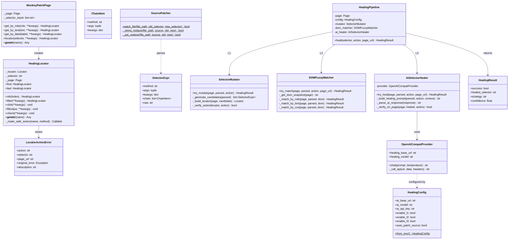
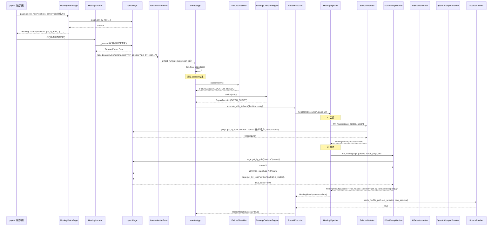
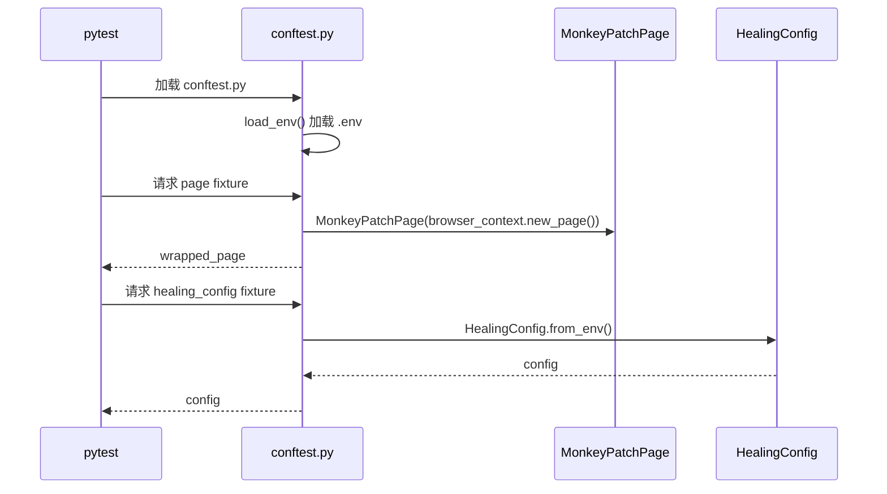
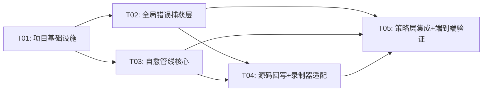

# 自建自愈架构设计方案

## TL;DR

抛弃 playwright-healer 框架，自建一条纯同步的自愈管线：通过 monkey-patch `page.get_by_role/get_by_text/get_by_label` 等方法，让录制生成的 raw Playwright API 调用也能被统一捕获为结构化错误（selector + action + page_url）；自愈引擎按 L1 启发式变异 → L2 DOM 模糊匹配 → L3 AI 语义修复三级链路逐级尝试，全部使用同步 Playwright API，无需异步桥接；AI Provider 统一切换为公司 AI 平台的 OpenAI 兼容协议（`Authorization: Bearer` + `/compatible-mode/v1/chat/completions`），消除 Anthropic 协议耦合；修复成功后通过 AST 精准回写源码，支持 `get_by_role("textbox", name="xxx").nth(1).fill("yyy")` 等链式表达式的完整改写。

---

## 1. 架构总览

```mermaid
graph TB
    subgraph 录制生成的PO代码
        RP[raw Playwright API<br/>page.get_by_role/get_by_text]
    end

    subgraph 全局错误捕获层
        MP[MonkeyPatchPage<br/>拦截page定位方法]
        LAE[LocatorActionError<br/>结构化异常]
    end

    subgraph 错误采集与分类
        CONF[conftest.py<br/>pytest_runtest_makereport]
        FC[FailureClassifier<br/>细粒度分类]
    end

    subgraph 策略决策与执行
        SDE[StrategyDecisionEngine<br/>决策引擎]
        RE[RepairExecutor<br/>修复执行器]
    end

    subgraph 自愈管线<br/>HealingPipeline
        L1[L1: 启发式变异<br/>SelectorMutator]
        L2[L2: DOM模糊匹配<br/>DOMFuzzyMatcher]
        L3[L3: AI语义修复<br/>AISelectorHealer]
    end

    subgraph AI服务层
        OAI[OpenAI兼容Provider<br/>公司AI平台]
    end

    subgraph 源码回写
        SP[SourcePatcher<br/>AST精准回写]
    end

    RP -->|调用| MP
    MP -->|失败时| LAE
    LAE -->|写入report| CONF
    CONF -->|分类| FC
    FC -->|决策| SDE
    SDE -->|执行| RE
    RE -->|调用| L1
    L1 -->|失败| L2
    L2 -->|失败| L3
    L3 -->|请求| OAI
    RE -->|成功则回写| SP
```

---

## 2. 详细设计

### 2.1 全局错误捕获层 — MonkeyPatchPage

**问题**：录制生成的 PO 代码直接调用 `self.page.get_by_role(...)` / `self.page.get_by_text(...)` 等 raw Playwright API，这些调用绕过了 `BasePage._safe_*` 方法的 `@capture_locator_error` 装饰器，无法生成 `LocatorActionError`。

**方案**：在 `conftest.py` 的 `page` fixture 中，用 `MonkeyPatchPage` 包装器拦截所有定位方法，在定位操作失败时自动包装为 `LocatorActionError`。

**文件**：`self_healing/monkey_patch_page.py`

```python
class MonkeyPatchPage:
    """包装 sync Page，拦截定位方法以捕获结构化错误信息"""

    # 需要拦截的定位方法列表
    LOCATOR_METHODS = [
        "get_by_role", "get_by_text", "get_by_label",
        "get_by_placeholder", "get_by_test_id", "get_by_title",
        "locator",
    ]

    # 需要拦截的终端操作方法列表（在 Locator 上）
    ACTION_METHODS = [
        "click", "fill", "check", "uncheck", "select_option",
        "type", "press", "hover", "dblclick",
    ]

    def __init__(self, page: Page):
        self._page = page
        self._selector_stack: list[str] = []  # 记录当前链式调用

    def __getattr__(self, name):
        # 代理所有非拦截方法到原始 page
        attr = getattr(self._page, name)
        return attr

    def get_by_role(self, role, **kwargs):
        selector = _serialize_locator_call("get_by_role", role, **kwargs)
        locator = self._page.get_by_role(role, **kwargs)
        return HealingLocator(locator, selector, self._page)

    def get_by_text(self, text, **kwargs):
        selector = _serialize_locator_call("get_by_text", text, **kwargs)
        locator = self._page.get_by_text(text, **kwargs)
        return HealingLocator(locator, selector, self._page)

    def locator(self, selector, **kwargs):
        hl = HealingLocator(self._page.locator(selector, **kwargs), selector, self._page)
        return hl

    # ... 其他 get_by_* 方法同理


class HealingLocator:
    """包装 sync Locator，拦截终端操作以捕获错误"""

    def __init__(self, locator: Locator, selector: str, page: Page):
        self._locator = locator
        self._selector = selector
        self._page = page

    def __getattr__(self, name):
        # 代理非拦截方法
        attr = getattr(self._locator, name)
        if name in MonkeyPatchPage.ACTION_METHODS:
            return self._make_safe_action(name, attr)
        if name in ("first", "last"):
            return HealingLocator(attr, f"{self._selector}.{name}", self._page)
        return attr

    def nth(self, index: int):
        inner = self._locator.nth(index)
        return HealingLocator(inner, f"{self._selector}.nth({index})", self._page)

    def filter(self, **kwargs):
        inner = self._locator.filter(**kwargs)
        selector = f"{self._selector}.filter({_serialize_kwargs(kwargs)})"
        return HealingLocator(inner, selector, self._page)

    def _make_safe_action(self, action_name, original_method):
        """生成安全拦截的终端操作方法"""
        def safe_action(*args, **kwargs):
            try:
                return original_method(*args, **kwargs)
            except LocatorActionError:
                raise
            except Exception as e:
                page_url = ""
                try:
                    page_url = self._page.url
                except Exception:
                    pass
                raise LocatorActionError(
                    action=action_name,
                    selector=self._selector,
                    page_url=page_url,
                    original_error=e,
                ) from e
        return safe_action
```

**关键设计点**：

1. `HealingLocator` 维护完整的链式选择器表达式字符串，如在 `get_by_role("textbox", name="请输入").nth(1)` 中，`_selector` 值为 `get_by_role("textbox", name="请输入").nth(1)`
2. 终端操作（click/fill/check 等）失败时，自动构造 `LocatorActionError`
3. 链式调用方法（`.nth()`, `.first`, `.filter()`）返回新的 `HealingLocator`，传递选择器栈
4. 非拦截方法（如 `wait_for`, `count`, `is_visible` 等）直接代理到底层 Locator，零开销

### 2.2 选择器序列化与解析

**文件**：`self_healing/selector_parser.py`

```python
@dataclass
class SelectorExpr:
    """解析后的选择器表达式"""
    raw: str                         # 完整原始表达式
    method: str                      # 首个定位方法名: get_by_role / locator / ...
    args: tuple                      # 首个方法的参数
    kwargs: dict                     # 首个方法的 keyword 参数
    chain: list[SelectorChainItem]   # 链式调用项: .nth(1), .first, .filter(...)


@dataclass
class SelectorChainItem:
    """链式调用项"""
    method: str      # nth / first / last / filter / locator
    args: tuple      # 参数
    kwargs: dict     # keyword 参数


def parse_selector(raw: str) -> SelectorExpr:
    """解析链式选择器表达式

    示例输入:
      'get_by_role("textbox", name="请输入").nth(1)'
      'locator(".btn-entrance").first'
      'get_by_text("提交")'

    解析策略: 用正则逐步匹配方法调用
    """
    ...


def serialize_selector(expr: SelectorExpr) -> str:
    """将 SelectorExpr 序列化回字符串"""
    ...
```

### 2.3 自愈管线 — HealingPipeline

**文件**：`self_healing/pipeline.py`

```python
class HealingPipeline:
    """三级自愈管线 — 同步实现，直接操作当前 page 对象"""

    def __init__(self, page: Page, config: HealingConfig):
        self.page = page
        self.config = config
        self.mutator = SelectorMutator()
        self.dom_matcher = DOMFuzzyMatcher()
        self.ai_healer = AISelectorHealer(config.ai_provider)

    def heal(self, selector: str, action: str, page_url: str) -> HealingResult:
        """尝试修复失效选择器

        返回 HealingResult:
          - success: bool
          - healed_selector: str  (修复后的完整链式表达式)
          - strategy: str         (L1/L2/L3)
          - confidence: float
        """
        parsed = parse_selector(selector)

        # L1: 启发式变异
        result = self.mutator.try_mutate(self.page, parsed, action)
        if result.success:
            return result

        # L2: DOM 模糊匹配
        result = self.dom_matcher.try_match(self.page, parsed, action, page_url)
        if result.success:
            return result

        # L3: AI 语义修复
        result = self.ai_healer.try_heal(self.page, parsed, action, page_url)
        return result
```

#### 2.3.1 L1: 启发式变异 — SelectorMutator

**文件**：`self_healing/mutator.py`

```python
class SelectorMutator:
    """L1: 启发式选择器变异

    策略（按优先级）:
      1. CSS选择器微调: 移除/替换伪类、调整层级
      2. role选择器属性放松: name精确→包含、去掉exact
      3. text选择器模糊化: exact=True → exact=False
      4. nth偏移: nth(1) → nth(0) 或 nth(2)
      5. 父子关系调整: 去掉中间层级
    """

    def try_mutate(self, page: Page, parsed: SelectorExpr, action: str) -> HealingResult:
        candidates = self._generate_candidates(parsed)
        for candidate in candidates:
            try:
                locator = self._build_locator(page, candidate)
                locator.wait_for(state="visible", timeout=3000)
                # 验证元素可用
                if self._verify_action(locator, action):
                    return HealingResult(
                        success=True,
                        healed_selector=serialize_selector(candidate),
                        strategy="L1",
                        confidence=0.9,
                    )
            except Exception:
                continue
        return HealingResult(success=False)

    def _generate_candidates(self, parsed: SelectorExpr) -> list[SelectorExpr]:
        """生成变异候选列表"""
        candidates = []
        # 策略1: name属性放松（精确→包含）
        if parsed.method == "get_by_role" and "name" in parsed.kwargs:
            variant = _deep_copy(parsed)
            variant.kwargs["exact"] = False
            candidates.append(variant)

        # 策略2: nth偏移
        for item in parsed.chain:
            if item.method == "nth":
                for offset in [-1, 1, 2]:
                    new_index = item.args[0] + offset
                    if new_index >= 0:
                        variant = _deep_copy(parsed)
                        # 修改对应chain item
                        ...
                        candidates.append(variant)

        # 策略3: CSS选择器变体（仅 locator() 类型）
        if parsed.method == "locator":
            css_variants = self._css_mutations(parsed.args[0])
            for css in css_variants:
                variant = _deep_copy(parsed)
                variant.args = (css,)
                candidates.append(variant)

        return candidates
```

#### 2.3.2 L2: DOM模糊匹配 — DOMFuzzyMatcher

**文件**：`self_healing/dom_matcher.py`

```python
class DOMFuzzyMatcher:
    """L2: 基于当前页面 DOM 的模糊匹配

    核心思路:
      1. 获取页面 DOM 快照（innerHTML 精简版）
      2. 根据 selector 语义提取搜索条件（role+name / text / css结构）
      3. 在 DOM 中模糊搜索匹配元素（rapidfuzz 文本相似度 > 0.8）
      4. 用 Playwright 评估匹配结果是否真实可见
    """

    def try_match(self, page: Page, parsed: SelectorExpr,
                  action: str, page_url: str) -> HealingResult:
        # 1. 获取精简 DOM 快照
        dom = self._get_dom_snapshot(page)

        # 2. 按 selector 类型分发
        if parsed.method == "get_by_role":
            return self._match_by_role(page, parsed, dom, action)
        elif parsed.method == "get_by_text":
            return self._match_by_text(page, parsed, dom, action)
        elif parsed.method == "locator":
            return self._match_by_css(page, parsed, dom, action)
        else:
            return HealingResult(success=False)

    def _match_by_role(self, page, parsed, dom, action):
        """role + name 模糊匹配

        步骤:
          a. 用 page.get_by_role(role) 获取所有同 role 元素
          b. 遍历每个元素的 aria-label / title / text_content
          c. 与目标 name 做 rapidfuzz 匹配
          d. 取相似度最高且 > 0.8 的
        """
        role = parsed.args[0]
        target_name = parsed.kwargs.get("name", "")

        all_elements = page.get_by_role(role)
        count = all_elements.count()

        best_match = None
        best_score = 0.0

        for i in range(count):
            el = all_elements.nth(i)
            try:
                # 收集元素的多个文本属性
                texts = []
                for attr in ["aria-label", "title", "placeholder", "name"]:
                    val = el.get_attribute(attr, timeout=500)
                    if val:
                        texts.append(val)
                text_content = el.text_content(timeout=500) or ""
                if text_content:
                    texts.append(text_content.strip())

                # 与目标 name 做模糊匹配
                for text in texts:
                    score = fuzz.ratio(text, target_name) / 100.0
                    if score > best_score:
                        best_score = score
                        best_match = i
            except Exception:
                continue

        if best_match is not None and best_score >= 0.8:
            # 构造修复后的选择器
            healed = _build_healed_selector(parsed, best_match)
            return HealingResult(
                success=True,
                healed_selector=healed,
                strategy="L2",
                confidence=best_score,
            )

        return HealingResult(success=False)
```

#### 2.3.3 L3: AI语义修复 — AISelectorHealer

**文件**：`self_healing/ai_healer.py`

```python
class AISelectorHealer:
    """L3: AI 语义修复

    使用公司 AI 平台 OpenAI 兼容协议：
      - Base URL: https://ai-platform.cai-inc.com/api/biz-ai/ai-model/api/11/compatible-mode/v1
      - Model: glm-5.1
      - Auth: Authorization: Bearer ${ANTHROPIC_AUTH_TOKEN}
    """

    def __init__(self, provider: OpenAICompatProvider):
        self.provider = provider

    def try_heal(self, page: Page, parsed: SelectorExpr,
                 action: str, page_url: str) -> HealingResult:
        # 1. 获取页面上下文
        dom_snippet = self._get_relevant_dom(page, parsed)
        page_context = {
            "url": page_url,
            "title": page.title(),
            "dom_snippet": dom_snippet[:3000],  # 截断避免超长
        }

        # 2. 构造提示词
        prompt = self._build_healing_prompt(parsed, action, page_context)

        # 3. 调用 AI
        response = self.provider.chat(prompt)

        # 4. 解析响应，提取修复后的选择器
        healed = self._parse_ai_response(response)

        # 5. 验证修复后的选择器在页面上可用
        if healed and self._verify_on_page(page, healed, action):
            return HealingResult(
                success=True,
                healed_selector=healed,
                strategy="L3",
                confidence=0.75,
            )

        return HealingResult(success=False)

    def _build_healing_prompt(self, parsed, action, context):
        return f"""你是一个 Playwright 自动化测试修复专家。

当前测试执行失败，选择器已失效：
- 失效选择器: {serialize_selector(parsed)}
- 执行操作: {action}
- 页面URL: {context['url']}
- 页面标题: {context['title']}
- 页面DOM片段:
{context['dom_snippet']}

请分析页面 DOM，找到与原始选择器语义最接近的元素，返回修复后的 Playwright 选择器表达式。
只返回选择器表达式字符串，不要返回其他内容。

修复规则：
1. 保持 Playwright API 语法正确
2. 优先使用 get_by_role / get_by_text 等语义定位器
3. 如果有同名元素，使用 .nth(index) 或 .filter() 消歧义
4. 返回格式示例: get_by_role("textbox", name="需求单名称")
"""
```

### 2.4 AI Provider — OpenAI兼容协议

**文件**：修改 `ai/provider.py`

**核心变更**：新增 `chat()` 方法用于自愈管线，使用 OpenAI 兼容协议替代当前 Anthropic 协议。

```python
class OpenAICompatProvider(AIProvider):
    """OpenAI 兼容接口 Provider — 同时支持 Anthropic 和 OpenAI 协议"""

    def __init__(self, model_id=None, api_key=None, base_url=None):
        # ... 现有初始化逻辑保持不变 ...
        # 用于自愈的新配置
        self.healing_base_url = os.environ.get(
            "OPENAI_COMPAT_BASE_URL",
            "https://ai-platform.cai-inc.com/api/biz-ai/ai-model/api/11/compatible-mode/v1"
        )
        self.healing_model = os.environ.get("OPENAI_COMPAT_MODEL", "glm-5.1")

    def chat(self, prompt: str, temperature: float = 0.3) -> str:
        """OpenAI 兼容协议调用（用于自愈管线）

        协议:
          POST {base_url}/chat/completions
          Header: Authorization: Bearer {api_key}
          Body: { model, messages, max_tokens, temperature }
          Response: { choices: [{message: {content: "..."}}] }
        """
        url = f"{self.healing_base_url}/chat/completions".rstrip("/")

        data = {
            "model": self.healing_model,
            "messages": [{"role": "user", "content": prompt}],
            "max_tokens": 4096,
            "temperature": temperature,
        }
        headers = {
            "Content-Type": "application/json",
            "Authorization": f"Bearer {self.api_key}",
        }

        req = urllib.request.Request(
            url,
            data=json.dumps(data).encode("utf-8"),
            headers=headers,
            method="POST",
        )
        with urllib.request.urlopen(req, timeout=120) as response:
            result = json.loads(response.read().decode("utf-8"))
            # OpenAI 响应格式: { choices: [{message: {content: "..."}}] }
            choices = result.get("choices", [])
            if choices:
                return choices[0].get("message", {}).get("content", "")
            return str(result)
```

**.env 新增**：

```bash
# OpenAI 兼容协议（自愈管线使用）
OPENAI_COMPAT_BASE_URL=https://ai-platform.cai-inc.com/api/biz-ai/ai-model/api/11/compatible-mode/v1
OPENAI_COMPAT_MODEL=glm-5.1
```

### 2.5 链式选择器解析器

**文件**：`self_healing/selector_parser.py`

```python
import re
from dataclasses import dataclass, field

@dataclass
class ChainItem:
    method: str          # "nth", "first", "last", "filter"
    args: tuple = ()
    kwargs: dict = field(default_factory=dict)

@dataclass
class SelectorExpr:
    method: str          # "get_by_role", "locator", "get_by_text", etc.
    args: tuple = ()
    kwargs: dict = field(default_factory=dict)
    chain: list[ChainItem] = field(default_factory=list)
    raw: str = ""        # 原始字符串

# 正则：匹配方法调用 method_name(arg1, arg2, key=val)
_METHOD_CALL_RE = re.compile(
    r'(\w+)\(([^)]*)\)'   # 简化版，支持嵌套需要更复杂解析
)

def parse_selector(raw: str) -> SelectorExpr:
    """解析链式选择器表达式

    示例:
      'get_by_role("textbox", name="请输入").nth(1)'
      → SelectorExpr(
          method="get_by_role",
          args=("textbox",),
          kwargs={"name": "请输入"},
          chain=[ChainItem(method="nth", args=(1,))]
        )
    """
    parts = _split_chain(raw)

    # 第一部分是主定位方法
    main_method, main_args, main_kwargs = _parse_method_call(parts[0])

    # 后续部分是链式调用
    chain = []
    for part in parts[1:]:
        m, a, k = _parse_method_call(part)
        chain.append(ChainItem(method=m, args=a, kwargs=k))

    return SelectorExpr(
        method=main_method,
        args=main_args,
        kwargs=main_kwargs,
        chain=chain,
        raw=raw,
    )


def _split_chain(raw: str) -> list[str]:
    """按 . 分割链式调用（处理括号嵌套）"""
    parts = []
    depth = 0
    start = 0
    for i, ch in enumerate(raw):
        if ch == '(':
            depth += 1
        elif ch == ')':
            depth -= 1
        elif ch == '.' and depth == 0:
            parts.append(raw[start:i])
            start = i + 1
    parts.append(raw[start:])
    return parts


def _parse_method_call(expr: str) -> tuple[str, tuple, dict]:
    """解析单个方法调用: method_name(arg1, "arg2", key=val)"""
    match = re.match(r'(\w+)\((.*)\)$', expr.strip(), re.DOTALL)
    if not match:
        return expr.strip(), (), {}

    method_name = match.group(1)
    args_str = match.group(2).strip()

    if not args_str:
        return method_name, (), {}

    args, kwargs = _parse_args(args_str)
    return method_name, tuple(args), kwargs


def _parse_args(args_str: str) -> tuple[list, dict]:
    """解析参数列表，区分位置参数和关键字参数

    输入: '"textbox", name="请输入", exact=False'
    输出: (["textbox"], {"name": "请输入", "exact": False})
    """
    # 按逗号分割（处理引号内的逗号）
    tokens = _split_args(args_str)
    args = []
    kwargs = {}
    for token in tokens:
        token = token.strip()
        if '=' in token and not token.startswith('"') and not token.startswith("'"):
            # keyword argument
            key, val = token.split('=', 1)
            key = key.strip()
            val = _eval_literal(val.strip())
            kwargs[key] = val
        else:
            args.append(_eval_literal(token))
    return args, kwargs


def _eval_literal(s: str):
    """评估字面量: "string" → str, True → bool, 1 → int"""
    s = s.strip()
    if (s.startswith('"') and s.endswith('"')) or (s.startswith("'") and s.endswith("'")):
        return s[1:-1]
    if s.lower() == 'true':
        return True
    if s.lower() == 'false':
        return False
    try:
        return int(s)
    except ValueError:
        try:
            return float(s)
        except ValueError:
            return s


def serialize_selector(expr: SelectorExpr) -> str:
    """将 SelectorExpr 序列化为字符串"""
    parts = [_format_method_call(expr.method, expr.args, expr.kwargs)]
    for item in expr.chain:
        parts.append(_format_method_call(item.method, item.args, item.kwargs))
    return ".".join(parts)


def _format_method_call(method: str, args: tuple, kwargs: dict) -> str:
    """格式化方法调用"""
    all_parts = []
    for a in args:
        all_parts.append(_format_value(a))
    for k, v in kwargs.items():
        all_parts.append(f"{k}={_format_value(v)}")
    return f"{method}({', '.join(all_parts)})"


def _format_value(v) -> str:
    """格式化值"""
    if isinstance(v, str):
        return f'"{v}"'
    if isinstance(v, bool):
        return str(v)
    return str(v)
```

### 2.6 源码回写 — SourcePatcher

**文件**：`self_healing/source_patcher.py`

```python
import ast
import astunparse
from pathlib import Path

class SourcePatcher:
    """AST 精准回写：将失效选择器替换为修复后的选择器

    核心难点：role/text 类型选择器的回写需要完整改写方法调用链，
    如 page.get_by_role("textbox", name="旧名").nth(1).fill("xxx")
    →  page.get_by_role("textbox", name="新名").nth(0).fill("xxx")

    策略：用 AST 精确定位到对应的方法调用节点，替换参数。
    """

    @staticmethod
    def patch_file(file_path: str, old_selector: str, new_selector: str) -> bool:
        """在源文件中替换失效选择器

        Args:
            file_path: 源文件路径
            old_selector: 失效的完整选择器表达式 (如 'get_by_role("textbox", name="旧名").nth(1)')
            new_selector: 修复后的完整选择器表达式

        Returns:
            bool: 是否成功替换
        """
        source = Path(file_path).read_text(encoding="utf-8")

        # 策略1：直接字符串替换（覆盖大部分简单场景）
        if old_selector in source:
            return SourcePatcher._string_replace(file_path, source, old_selector, new_selector)

        # 策略2：AST 精准查找与替换（处理格式差异）
        return SourcePatcher._ast_replace(file_path, source, old_selector, new_selector)

    @staticmethod
    def _string_replace(file_path, source, old_sel, new_sel) -> bool:
        """直接字符串替换 + 备份"""
        Path(file_path + ".bak").write_text(source, encoding="utf-8")
        new_source = source.replace(old_sel, new_sel)
        Path(file_path).write_text(new_source, encoding="utf-8")
        return True

    @staticmethod
    def _ast_replace(file_path, source, old_sel, new_sel) -> bool:
        """AST 级别替换：解析选择器匹配 AST 节点"""
        old_parsed = parse_selector(old_sel)
        new_parsed = parse_selector(new_sel)

        tree = ast.parse(source)
        patcher = _SelectorASTPatcher(old_parsed, new_parsed)
        new_tree = patcher.visit(tree)

        if patcher.patched_count > 0:
            ast.fix_missing_locations(new_tree)
            new_source = astunparse.unparse(new_tree)
            Path(file_path + ".bak").write_text(source, encoding="utf-8")
            Path(file_path).write_text(new_source, encoding="utf-8")
            return True
        return False


class _SelectorASTPatcher(ast.NodeTransformer):
    """AST 访问器：定位匹配的选择器调用并替换"""

    def __init__(self, old_parsed: SelectorExpr, new_parsed: SelectorExpr):
        self.old_parsed = old_parsed
        self.new_parsed = new_parsed
        self.patched_count = 0

    def visit_Call(self, node):
        # 递归处理子节点
        self.generic_visit(node)

        # 检查是否匹配目标选择器的链式调用
        if self._matches_selector_chain(node):
            # 替换为新选择器的 AST
            new_node = self._build_new_chain(node)
            self.patched_count += 1
            return new_node

        return node

    def _matches_selector_chain(self, node: ast.Call) -> bool:
        """检查 AST Call 节点是否匹配 old_parsed 的链式调用"""
        # ... 实现链式调用匹配逻辑
        ...
```

### 2.7 配置 — HealingConfig

**文件**：`self_healing/healing_config.py`（替换原有文件）

```python
@dataclass
class HealingConfig:
    """自愈配置 — 不再依赖 playwright-healer 的 HealerConfig"""
    # AI Provider 配置（OpenAI 兼容协议）
    ai_base_url: str = "https://ai-platform.cai-inc.com/api/biz-ai/ai-model/api/11/compatible-mode/v1"
    ai_model: str = "glm-5.1"
    ai_api_key: str = ""  # 从 ANTHROPIC_AUTH_TOKEN 环境变量读取

    # 管线开关
    enable_l1_mutation: bool = True
    enable_l2_dom_match: bool = True
    enable_l3_ai_heal: bool = True

    # 回写配置
    auto_patch_source: bool = True
    patch_backup: bool = True

    # 超时配置
    l1_timeout_ms: int = 3000
    l2_timeout_ms: int = 5000
    l3_timeout_ms: int = 30000

    @staticmethod
    def from_env() -> "HealingConfig":
        """从环境变量加载配置"""
        load_env()
        return HealingConfig(
            ai_api_key=os.environ.get("ANTHROPIC_AUTH_TOKEN", ""),
            ai_base_url=os.environ.get("OPENAI_COMPAT_BASE_URL",
                "https://ai-platform.cai-inc.com/api/biz-ai/ai-model/api/11/compatible-mode/v1"),
            ai_model=os.environ.get("OPENAI_COMPAT_MODEL", "glm-5.1"),
            auto_patch_source=os.environ.get("PH_AUTO_PATCH_SOURCE", "true").lower() == "true",
            patch_backup=os.environ.get("PH_PATCH_SOURCE_BACKUP", "true").lower() == "true",
        )
```

### 2.8 conftest.py 变更

**核心变更**：

1. **移除** `healing_page` fixture 及 `SyncHealingPage` 包装类
2. **修改** `page` fixture，注入 `MonkeyPatchPage` 包装
3. **移除** `healing_config` fixture 对 `playwright-healer` 的依赖
4. **保留** `pytest_runtest_makereport` hook，但增加从 `HealingLocator` 错误中提取选择器的逻辑
5. **修改** `pytest_sessionfinish` 中的自愈触发逻辑，调用新的 `HealingPipeline` 替代 `_call_healer`

```python
# conftest.py 关键修改

@pytest.fixture
def page(browser_context_args, playwright, browser):
    """注入 MonkeyPatchPage 以捕获结构化错误"""
    context = browser.new_context(**browser_context_args)
    p = context.new_page()
    # 用 MonkeyPatchPage 包装，捕获定位失败
    wrapped = MonkeyPatchPage(p)
    yield wrapped
    context.close()


@pytest.fixture(scope="session")
def healing_config():
    """自愈配置 — 使用新的 HealingConfig"""
    from self_healing.healing_config import HealingConfig
    return HealingConfig.from_env()


# pytest_sessionfinish 中替换 _call_healer:
def _auto_heal(failures: list):
    """使用自建 HealingPipeline 修复选择器"""
    from self_healing.healing_config import HealingConfig
    from self_healing.pipeline import HealingPipeline

    config = HealingConfig.from_env()
    # 注意：这里需要一个可用的 sync Page 来运行管线
    # 策略：启动独立浏览器实例
    from playwright.sync_api import sync_playwright
    with sync_playwright() as pw:
        browser = pw.chromium.launch(headless=True, args=["--no-sandbox", "--ignore-certificate-errors"])
        storage_state = "login_state/storage_state.json"
        ctx_args = {"viewport": {"width": 1366, "height": 768}, "ignore_https_errors": True}
        if os.path.exists(storage_state):
            ctx_args["storage_state"] = storage_state
        context = browser.new_context(**ctx_args)
        page = context.new_page()

        pipeline = HealingPipeline(page, config)

        for entry in failures:
            selector = entry.get("selector", "")
            page_url = entry.get("page_url", "")
            file_path = entry.get("file", "")
            action = entry.get("action", "")
            test_name = entry.get("test_name", "")

            if not selector:
                continue

            # 导航到目标页面
            if page_url and page_url != "about:blank":
                try:
                    page.goto(page_url, wait_until="domcontentloaded", timeout=30000)
                    page.wait_for_timeout(2000)
                except Exception as e:
                    print(f"  ⚠️ 导航失败: {e}")
                    continue

            result = pipeline.heal(selector, action, page_url)

            if result.success:
                print(f"  ✅ [{test_name}] 修复: {selector!r} → {result.healed_selector!r} ({result.strategy})")
                if file_path and config.auto_patch_source:
                    SourcePatcher.patch_file(file_path, selector, result.healed_selector)
            else:
                print(f"  ❌ [{test_name}] 未能修复: {selector!r}")

        browser.close()
```

### 2.9 录制生成器变更 — script_transformer.py

**核心变更**：

1. **移除** `_async_compat_transform` 方法（不再需要 async/await 转换）
2. **移除** `healing_page` 替换逻辑（改为直接使用 `page` fixture）
3. **移除** `SyncHealingPage` fixture 注入
4. **生成器输出的 BasePage** 改为继承自 `core.base_page.BasePage`（有 `_safe_*` 方法）

**generate_po_layers 变更**：

```python
# 生成的 BasePage 代码变更：
# 旧: 使用 healing_page fixture
# 新: 使用注入了 MonkeyPatchPage 的 page fixture

base_page_code = f'''#!/usr/bin/env python3
# -*- coding: utf-8 -*-
"""
BasePage — 页面基础类

封装常用 UI 操作，所有业务 Page 类继承此类。
自愈通过 MonkeyPatchPage 全局拦截 raw Playwright API 调用实现。
"""

import re
from playwright.sync_api import expect


class BasePage:
    """页面基础类，封装常用 UI 操作"""

    def __init__(self, page):
        self.page = page

    # ... 与当前 output 的 base_page.py 相同，
    # 但不再提及 healing_page / playwright-healer
'''
```

**test 用例生成变更**：

```python
# 旧:
# def test_xxx(healing_page) -> None:
#     page = XxxPage(healing_page)

# 新:
# def test_xxx(page) -> None:
#     page = XxxPage(page)
```

---

## 3. 文件列表

| 相对路径 | 说明 | 状态 |
|---------|------|------|
| `self_healing/__init__.py` | 模块初始化 | 修改 |
| `self_healing/monkey_patch_page.py` | MonkeyPatchPage + HealingLocator | 新增 |
| `self_healing/selector_parser.py` | 链式选择器解析与序列化 | 新增 |
| `self_healing/pipeline.py` | 三级自愈管线 HealingPipeline | 新增 |
| `self_healing/mutator.py` | L1 启发式变异 | 新增 |
| `self_healing/dom_matcher.py` | L2 DOM 模糊匹配 | 新增 |
| `self_healing/ai_healer.py` | L3 AI 语义修复 | 新增 |
| `self_healing/source_patcher.py` | AST 精准源码回写 | 新增 |
| `self_healing/healing_config.py` | 自愈配置（替换旧版） | 重写 |
| `self_healing/healer_config.py` | 旧 playwright-healer 配置 | 删除 |
| `core/locator_error.py` | LocatorActionError 异常 | 保留 |
| `core/base_page.py` | 全局 BasePage | 保留 |
| `ai/provider.py` | AI Provider（新增 chat 方法） | 修改 |
| `ai/models_config.json` | 模型配置（新增 OpenAI 兼容端点） | 修改 |
| `conftest.py` | pytest 配置（移除 healing_page） | 重写 |
| `recorder/script_transformer.py` | 录制转换器（移除 async 转换） | 修改 |
| `.env` | 环境变量（新增 OpenAI 兼容配置） | 修改 |
| `requirements.txt` | 依赖（移除 playwright-healer） | 修改 |

---

## 4. 数据结构



---

## 5. 程序调用流程

### 5.1 错误捕获与修复流程



### 5.2 初始化流程



---

## 6. 任务分解

### 6.1 所需新增包

```
- astunparse>=1.6.0: AST 反序列化（Python 3.12+ 可用 ast.unparse）
- rapidfuzz>=3.0.0: 已在 requirements.txt，用于 L2 模糊匹配
```

注意：从 requirements.txt 移除 `playwright-healer[ai]`

### 6.2 任务列表

| Task ID | Task Name | Source Files | Dependencies | Priority |
|---------|-----------|-------------|-------------|----------|
| T01 | 项目基础设施 | `requirements.txt`, `.env`, `self_healing/__init__.py`, `self_healing/healing_config.py`, `self_healing/selector_parser.py` | 无 | P0 |
| T02 | 全局错误捕获层 | `self_healing/monkey_patch_page.py`, `conftest.py`, `core/locator_error.py` | T01 | P0 |
| T03 | 自愈管线核心 | `self_healing/mutator.py`, `self_healing/dom_matcher.py`, `self_healing/ai_healer.py`, `self_healing/pipeline.py`, `ai/provider.py`, `ai/models_config.json` | T01 | P0 |
| T04 | 源码回写 + 录制器适配 | `self_healing/source_patcher.py`, `recorder/script_transformer.py`, `output/modules/*/po/base_page.py` | T02, T03 | P1 |
| T05 | 策略层集成 + 端到端验证 | `scheduler/strategy.py`, `conftest.py`(pytest_sessionfinish), 集成测试 | T02, T03, T04 | P1 |

### 6.3 任务依赖图



---

## 7. 共享知识/跨文件约定

```
- 所有选择器表达式使用 Playwright 语义定位器语法: get_by_role/get_by_text/get_by_label/locator(...)
- 选择器序列化格式: 'method(arg1, key=val).chain_method(arg)'
- LocatorActionError 是唯一允许的自愈触发异常类型
- 错误报告 JSON 格式: {timestamp, failures: [{test_name, category, action, selector, page_url, file, line, screenshot, error_message}]}
- AI Provider 统一使用 OpenAI 兼容协议: POST /chat/completions, Authorization: Bearer ${apiKey}
- 所有修复操作在独立浏览器实例中执行（headless=True），使用已有登录态
- 源码回写前必须创建 .bak 备份
- MonkeyPatchPage 仅在 pytest fixture 中实例化，不用于业务代码
- 环境变量命名: OPENAI_COMPAT_BASE_URL, OPENAI_COMPAT_MODEL, ANTHROPIC_AUTH_TOKEN（复用已有）
- 自愈管线所有方法为同步，不允许 async/await
```

---

## 8. 待明确事项

1. **MonkeyPatchPage 与 BasePage 共存**：录制生成的 PO 代码使用 `self.page.get_by_role(...)` 的 raw API，这些调用由 MonkeyPatchPage 拦截。但同时 BasePage 的 `_safe_click(self, locator)` 也接受一个 HealingLocator（或 raw Locator），需要确认 `_safe_*` 方法是否仍需保留 `@capture_locator_error` 装饰器——建议保留，作为双重保险。

2. **L2 DOM 模糊匹配的性能**：遍历 `page.get_by_role(role)` 的所有元素并调用 `text_content()` 可能会比较慢（特别是大型表单页面），需要设置合理的 count 上限（如最多遍历 50 个元素）。

3. **AST 回写的边界情况**：当同一文件中有多处相同的选择器字符串时，是否全部替换？建议全部替换（因为是同一个失效选择器），但需要人工 review `.bak` 对比。

4. **AI prompt 的 DOM 截断策略**：当前截断到 3000 字符，可能不够覆盖大型表单。是否需要智能截取（只取包含目标元素的 DOM 子树）？——建议第一步用 `page.evaluate()` 获取目标元素周围 3 层 DOM，而非全页 DOM。

5. **healing_page fixture 清理**：当前 conftest.py 中 `healing_page` fixture 注册了 `playwright-healer` 的插件。移除后需要确保没有其他代码引用此 fixture。需要全局搜索 `healing_page` 的使用。

6. **旧录制脚本的兼容**：已生成的 enhanced_script.py 使用了 `healing_page` fixture 和 async 语法。这些脚本需要重新生成或手动修改。建议提供一个迁移脚本来自动化转换。

7. **playwright-healer 包的彻底移除时机**：建议在 T01 中从 requirements.txt 移除，但在 `.venv` 中保留直到整个自建管线稳定运行后再做 `pip uninstall`。
