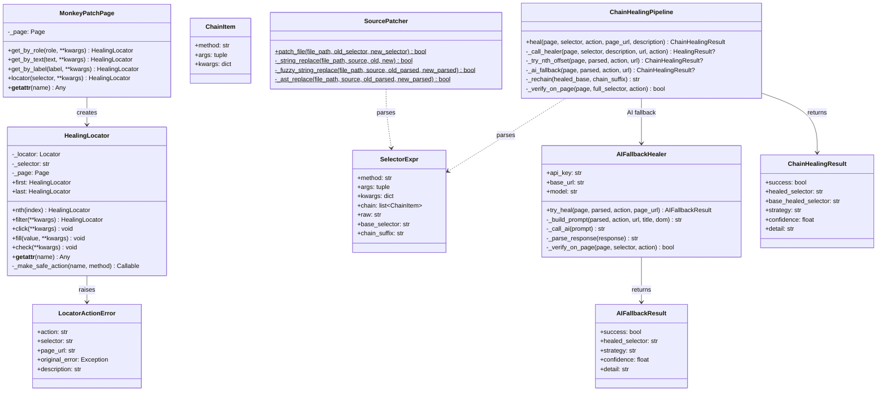
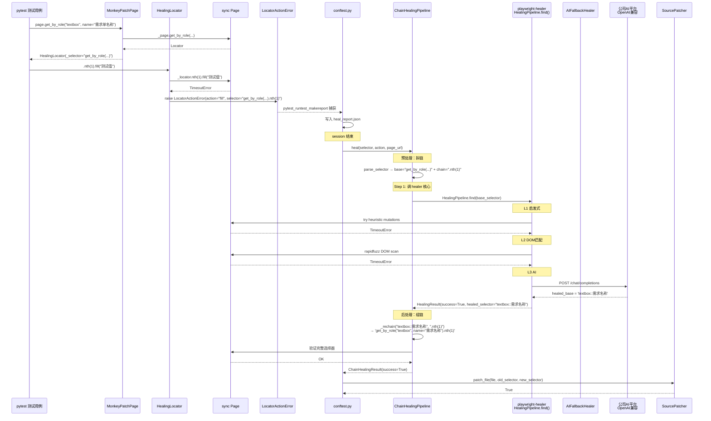
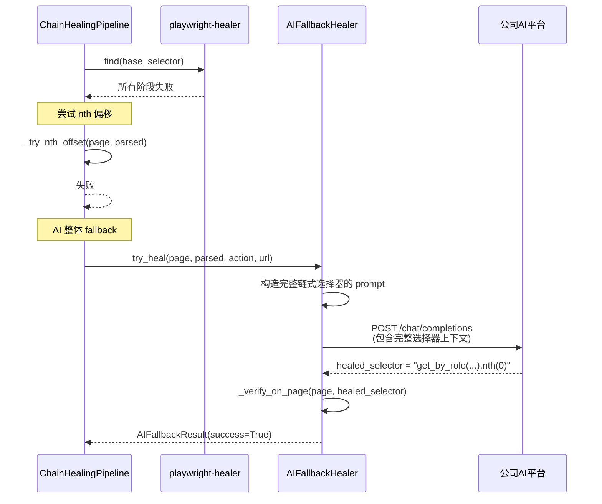
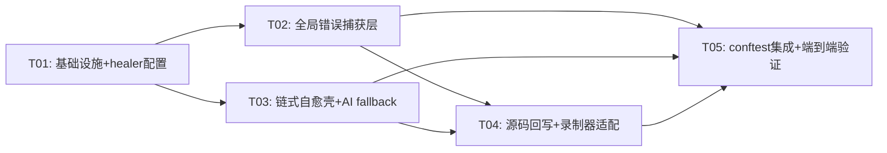

# 自愈架构设计方案（方案C：保留 healer 核心 + 扩展壳）

## TL;DR

保留 playwright-healer 的核心引擎（L1~L3 启发式/DOM匹配/AI 修复），仅通过5行配置切换将 AI Provider 从 Anthropic 协议改为 OpenAI 兼容协议（公司 AI 平台 `glm-5.1`）；自建三个扩展模块解决 healer 不覆盖的痛点：**MonkeyPatchPage + HealingLocator** 统一捕获 raw Playwright API 调用的结构化错误，**ChainHealingPipeline** 预处理拆链→调 healer.find()→后处理组链，**SourcePatcher** 实现 role/text 类型选择器的 AST 精准回写。新增代码约1200行，复用 healer 约600行引擎代码。

---

## 1. 与方案B的核心差异

| 模块 | 方案B（全自建） | 方案C（保留+扩展） |
|------|----------------|-------------------|
| L1-L3 启发式/DOM匹配引擎 | 自己重写 ~600行 | **直接用 playwright-healer 的 HealingPipeline.find()** |
| AI Provider | 自己写 OpenAI 兼容 | **切到 healer 的 OPENAI provider，改5行配置** |
| MonkeyPatchPage | 都需要 ~400行 | 都需要 ~400行 |
| SelectorParser | 都需要 ~300行 | 都需要 ~300行 |
| ChainHealingPipeline | 自建 L1-L3+AI ~600行 | **预处理拆链 → 调 healer.find() → 后处理组链** ~200行 |
| SourcePatcher | 自己实现 ~300行 | 自己实现 ~300行（healer不支持role/text回写） |
| async/sync | 全同步 | post-session `asyncio.run()` 调 healer（已验证可行） |
| 新增代码总量 | ~1800行 | ~1200行 |
| requirements.txt | 移除 playwright-healer | **保留 playwright-healer[ai]** |

---

## 2. 架构总览

```mermaid
graph TB
    subgraph 录制生成的PO代码
        RP[raw Playwright API<br/>page.get_by_role/get_by_text]
    end

    subgraph 全局错误捕获层 — 自建
        MP[MonkeyPatchPage<br/>拦截page定位方法]
        HL[HealingLocator<br/>拦截终端操作+维护选择器栈]
        LAE[LocatorActionError<br/>结构化异常]
    end

    subgraph 错误采集与分类
        CONF[conftest.py<br/>pytest_runtest_makereport]
        FC[FailureClassifier<br/>细粒度分类]
    end

    subgraph 策略决策与执行
        SDE[StrategyDecisionEngine<br/>决策引擎]
        RE[RepairExecutor<br/>修复执行器]
    end

    subgraph 自愈管线 — 核心壳自建
        CHP[ChainHealingPipeline<br/>拆链→healer→组链]
    end

    subgraph playwright-healer核心引擎 — 复用
        HP[HealingPipeline.find<br/>L1启发式/L2DOM匹配/L3AI]
    end

    subgraph AI服务层 — healer内置
        OAI[OpenAICompatibleProvider<br/>公司AI平台 glm-5.1]
    end

    subgraph 自建AI Fallback
        AFB[AIFallbackHealer<br/>处理拆链后的单步修复]
    end

    subgraph 源码回写 — 自建
        SP[SourcePatcher<br/>AST精准回写role/text]
    end

    RP -->|调用| MP
    MP -->|返回| HL
    HL -->|失败时| LAE
    LAE -->|写入report| CONF
    CONF -->|分类| FC
    FC -->|决策| SDE
    SDE -->|执行| RE
    RE -->|调用| CHP
    CHP -->|base_selector| HP
    HP -->|AI请求| OAI
    CHP -->|healer失败时| AFB
    AFB -->|AI请求| OAI
    RE -->|成功则回写| SP
```

---

## 3. 详细设计

### 3.1 全局错误捕获层 — MonkeyPatchPage + HealingLocator

**与方案B完全一致**，这是两个方案共同需要的核心模块。

**问题**：录制生成的 PO 代码直接调用 `self.page.get_by_role(...)` / `self.page.get_by_text(...)` 等 raw Playwright API，这些调用绕过了 `BasePage._safe_*` 方法的 `@capture_locator_error` 装饰器，无法生成 `LocatorActionError`。

**方案**：在 conftest.py 的 page fixture 中注入 MonkeyPatchPage 包装器。

**文件**：`self_healing/monkey_patch_page.py`

```python
from playwright.sync_api import Page, Locator
from core.locator_error import LocatorActionError


def _serialize_locator_call(method: str, *args, **kwargs) -> str:
    """将方法调用序列化为字符串表达式
    
    示例: _serialize_locator_call("get_by_role", "textbox", name="请输入")
    → 'get_by_role("textbox", name="请输入")'
    """
    parts = [f'"{a}"' if isinstance(a, str) else str(a) for a in args]
    parts += [f'{k}="{v}"' if isinstance(v, str) else f'{k}={v}' for k, v in kwargs.items()]
    return f'{method}({", ".join(parts)})'


class MonkeyPatchPage:
    """包装 sync Page，拦截定位方法以捕获结构化错误信息
    
    核心职责:
    1. 拦截所有 get_by_* / locator 方法，返回 HealingLocator
    2. HealingLocator 维护完整链式选择器表达式字符串
    3. 终端操作失败时抛出 LocatorActionError
    4. 所有非拦截方法零开销代理到原始 page
    """

    LOCATOR_METHODS = frozenset({
        "get_by_role", "get_by_text", "get_by_label",
        "get_by_placeholder", "get_by_test_id", "get_by_title",
        "get_by_alt_text", "locator",
    })

    ACTION_METHODS = frozenset({
        "click", "fill", "check", "uncheck", "select_option",
        "type", "press", "hover", "dblclick", "set_input_files",
    })

    def __init__(self, page: Page):
        object.__setattr__(self, '_page', page)

    def __getattr__(self, name):
        # 代理所有非拦截方法到原始 page
        return getattr(object.__getattribute__(self, '_page'), name)

    # ── 拦截的定位方法 ──────────────────────────────────────

    def get_by_role(self, role, **kwargs):
        selector = _serialize_locator_call("get_by_role", role, **kwargs)
        locator = self._page.get_by_role(role, **kwargs)
        return HealingLocator(locator, selector, self._page)

    def get_by_text(self, text, **kwargs):
        selector = _serialize_locator_call("get_by_text", text, **kwargs)
        locator = self._page.get_by_text(text, **kwargs)
        return HealingLocator(locator, selector, self._page)

    def get_by_label(self, label, **kwargs):
        selector = _serialize_locator_call("get_by_label", label, **kwargs)
        locator = self._page.get_by_label(label, **kwargs)
        return HealingLocator(locator, selector, self._page)

    def get_by_placeholder(self, text, **kwargs):
        selector = _serialize_locator_call("get_by_placeholder", text, **kwargs)
        locator = self._page.get_by_placeholder(text, **kwargs)
        return HealingLocator(locator, selector, self._page)

    def locator(self, selector, **kwargs):
        sel = _serialize_locator_call("locator", selector, **kwargs)
        return HealingLocator(self._page.locator(selector, **kwargs), sel, self._page)

    # ── 属性代理 ──────────────────────────────────────

    @property
    def url(self):
        return self._page.url

    # ... 其他 get_by_* 方法同理


class HealingLocator:
    """包装 sync Locator，拦截终端操作以捕获错误
    
    核心职责:
    1. 维护完整的链式选择器表达式字符串 (_selector)
    2. 链式方法 (.nth/.first/.filter) 返回新 HealingLocator，拼接选择器
    3. 终端操作失败时构造 LocatorActionError
    4. 非拦截方法零开销代理到原始 Locator
    """

    def __init__(self, locator: Locator, selector: str, page: Page):
        object.__setattr__(self, '_locator', locator)
        object.__setattr__(self, '_selector', selector)
        object.__setattr__(self, '_page', page)

    @property
    def _selector(self):
        return object.__getattribute__(self, '_selector')

    def __getattr__(self, name):
        attr = getattr(object.__getattribute__(self, '_locator'), name)

        # 终端操作：包装安全拦截
        if name in MonkeyPatchPage.ACTION_METHODS:
            return self._make_safe_action(name, attr)

        # 链式属性
        if name in ("first", "last"):
            new_selector = f"{self._selector}.{name}"
            return HealingLocator(attr, new_selector, self._page)

        # 其他方法/属性直接代理
        return attr

    # ── 链式定位方法 ──────────────────────────────────────

    def nth(self, index: int):
        inner = self._locator.nth(index)
        new_selector = f"{self._selector}.nth({index})"
        return HealingLocator(inner, new_selector, self._page)

    def filter(self, **kwargs):
        inner = self._locator.filter(**kwargs)
        # 序列化 filter 参数
        kw_parts = []
        for k, v in kwargs.items():
            if isinstance(v, str):
                kw_parts.append(f'{k}="{v}"')
            else:
                kw_parts.append(f'{k}={v}')
        new_selector = f"{self._selector}.filter({', '.join(kw_parts)})"
        return HealingLocator(inner, new_selector, self._page)

    def locator(self, selector, **kwargs):
        inner = self._locator.locator(selector, **kwargs)
        sel_str = _serialize_locator_call("locator", selector, **kwargs)
        new_selector = f"{self._selector}.{sel_str}"
        return HealingLocator(inner, new_selector, self._page)

    # ── 安全终端操作 ──────────────────────────────────────

    def _make_safe_action(self, action_name: str, original_method):
        """生成安全拦截的终端操作方法"""
        def safe_action(*args, **kwargs):
            try:
                return original_method(*args, **kwargs)
            except LocatorActionError:
                raise  # 已经是 LocatorActionError
            except Exception as e:
                page_url = ""
                try:
                    page_url = object.__getattribute__(self, '_page').url
                except Exception:
                    pass
                raise LocatorActionError(
                    action=action_name,
                    selector=self._selector,
                    page_url=page_url,
                    original_error=e,
                ) from e
        return safe_action
```

**关键设计点**（与方案B一致）：
1. `HealingLocator` 维护完整的链式选择器字符串，如 `get_by_role("textbox", name="请输入").nth(1)`
2. 终端操作失败时自动构造 `LocatorActionError`（含 selector + page_url + action）
3. 链式方法返回新 `HealingLocator`，传递选择器栈
4. 非拦截方法零开销代理到底层 Locator

### 3.2 链式选择器解析器 — SelectorParser

**与方案B完全一致**，这是两个方案共同需要的模块。

**文件**：`self_healing/selector_parser.py`

```python
import re
from dataclasses import dataclass, field
from typing import Optional


@dataclass
class ChainItem:
    """链式调用项"""
    method: str          # "nth", "first", "last", "filter", "locator"
    args: tuple = ()
    kwargs: dict = field(default_factory=dict)


@dataclass
class SelectorExpr:
    """解析后的选择器表达式"""
    method: str          # 主定位方法: "get_by_role", "locator", "get_by_text"
    args: tuple = ()     # 主方法的位置参数
    kwargs: dict = field(default_factory=dict)  # 主方法的 keyword 参数
    chain: list = field(default_factory=list)   # ChainItem 列表
    raw: str = ""        # 原始字符串

    @property
    def base_selector(self) -> str:
        """返回主定位方法部分（不含链式调用）"""
        return _format_method_call(self.method, self.args, self.kwargs)

    @property
    def chain_suffix(self) -> str:
        """返回链式调用部分的字符串"""
        parts = []
        for item in self.chain:
            parts.append(_format_method_call(item.method, item.args, item.kwargs))
        return ".".join(parts) if parts else ""


def parse_selector(raw: str) -> SelectorExpr:
    """解析链式选择器表达式

    示例:
      'get_by_role("textbox", name="请输入").nth(1)'
      → SelectorExpr(
          method="get_by_role",
          args=("textbox",),
          kwargs={"name": "请输入"},
          chain=[ChainItem(method="nth", args=(1,))]
        )
    """
    parts = _split_chain(raw)

    # 第一部分是主定位方法
    main_method, main_args, main_kwargs = _parse_method_call(parts[0])

    # 后续部分是链式调用
    chain = []
    for part in parts[1:]:
        m, a, k = _parse_method_call(part)
        chain.append(ChainItem(method=m, args=a, kwargs=k))

    return SelectorExpr(
        method=main_method,
        args=tuple(main_args),
        kwargs=main_kwargs,
        chain=chain,
        raw=raw,
    )


def serialize_selector(expr: SelectorExpr) -> str:
    """将 SelectorExpr 序列化回字符串"""
    parts = [_format_method_call(expr.method, expr.args, expr.kwargs)]
    for item in expr.chain:
        parts.append(_format_method_call(item.method, item.args, item.kwargs))
    return ".".join(parts)


# ── 内部辅助函数 ──────────────────────────────────────

def _split_chain(raw: str) -> list:
    """按 . 分割链式调用（处理括号嵌套）"""
    parts = []
    depth = 0
    start = 0
    for i, ch in enumerate(raw):
        if ch == '(':
            depth += 1
        elif ch == ')':
            depth -= 1
        elif ch == '.' and depth == 0:
            parts.append(raw[start:i])
            start = i + 1
    parts.append(raw[start:])
    return parts


def _parse_method_call(expr: str) -> tuple:
    """解析单个方法调用: method_name(arg1, "arg2", key=val)"""
    match = re.match(r'(\w+)\((.*)\)$', expr.strip(), re.DOTALL)
    if not match:
        return expr.strip(), (), {}

    method_name = match.group(1)
    args_str = match.group(2).strip()

    if not args_str:
        return method_name, [], {}

    args, kwargs = _parse_args(args_str)
    return method_name, args, kwargs


def _parse_args(args_str: str) -> tuple:
    """解析参数列表，区分位置参数和关键字参数"""
    tokens = _split_args(args_str)
    args = []
    kwargs = {}
    for token in tokens:
        token = token.strip()
        # 判断是否是 keyword argument（排除引号开头的字符串）
        if '=' in token and not token.startswith('"') and not token.startswith("'"):
            key, val = token.split('=', 1)
            key = key.strip()
            val = _eval_literal(val.strip())
            kwargs[key] = val
        else:
            args.append(_eval_literal(token))
    return args, kwargs


def _split_args(args_str: str) -> list:
    """按逗号分割参数（处理引号内的逗号）"""
    tokens = []
    depth = 0
    in_string = None
    start = 0
    for i, ch in enumerate(args_str):
        if in_string:
            if ch == in_string and (i == 0 or args_str[i-1] != '\\'):
                in_string = None
        elif ch in ('"', "'"):
            in_string = ch
        elif ch == '(':
            depth += 1
        elif ch == ')':
            depth -= 1
        elif ch == ',' and depth == 0 and not in_string:
            tokens.append(args_str[start:i])
            start = i + 1
    tokens.append(args_str[start:])
    return tokens


def _eval_literal(s: str):
    """评估字面量: "string" → str, True → bool, 1 → int"""
    s = s.strip()
    if (s.startswith('"') and s.endswith('"')) or (s.startswith("'") and s.endswith("'")):
        return s[1:-1]
    if s.lower() == 'true':
        return True
    if s.lower() == 'false':
        return False
    try:
        return int(s)
    except ValueError:
        try:
            return float(s)
        except ValueError:
            return s


def _format_method_call(method: str, args, kwargs) -> str:
    """格式化方法调用"""
    all_parts = []
    for a in args:
        all_parts.append(_format_value(a))
    for k, v in kwargs.items():
        all_parts.append(f"{k}={_format_value(v)}")
    return f"{method}({', '.join(all_parts)})"


def _format_value(v) -> str:
    """格式化值"""
    if isinstance(v, str):
        return f'"{v}"'
    if isinstance(v, bool):
        return str(v)
    return str(v)
```

### 3.3 核心壳 — ChainHealingPipeline（方案C独有）

这是方案C的核心差异化模块。不重写 L1~L3 引擎，而是通过预处理/后处理适配 healer 的接口。

**文件**：`self_healing/chain_pipeline.py`

```python
import asyncio
import logging
import os
from dataclasses import dataclass
from typing import Optional

from self_healing.selector_parser import SelectorExpr, parse_selector, serialize_selector
from self_healing.healer_config import get_healer_config

logger = logging.getLogger(__name__)


@dataclass
class ChainHealingResult:
    """链式自愈结果"""
    success: bool
    healed_selector: str = ""        # 完整的修复后选择器（含链式调用）
    base_healed_selector: str = ""   # healer 修复的 base 部分
    strategy: str = ""               # HEALER / AI_FALLBACK
    confidence: float = 0.0
    detail: str = ""


class ChainHealingPipeline:
    """链式自愈管线 — 预处理拆链 → 调 healer.find() → 后处理组链 → AI fallback

    核心逻辑:
    1. 预处理：用 SelectorParser 把链式选择器拆解为 base + chain
       - 输入: 'get_by_role("textbox", name="请输入").nth(1)'
       - base = 'get_by_role("textbox", name="请输入")'
       - chain = ['.nth(1)']

    2. 调用 healer：把 base 传给 playwright-healer 的 HealingPipeline.find()
       - healer 内部跑 L1启发式 → L2 DOM匹配 → L3 AI
       - 使用 asyncio.run() 在 post-session 同步调用（已验证可行）

    3. 后处理组链：把 healer 返回的 healed_base + chain_suffix 重新组合
       - 如果 healer 全部失败且 chain 中有 .nth()，尝试偏移 nth 作为自建 fallback

    4. AI fallback：对 base + chain 整体调用公司 AI 平台修复（healer 不理解链式语义时的兜底）
    """

    async def heal(
        self,
        page,          # async Page（healer 需要）
        selector: str,
        action: str = "",
        page_url: str = "",
        description: str = "",
    ) -> ChainHealingResult:
        """执行链式自愈

        Args:
            page: async Page 实例（playwright-healer 需要 async Page）
            selector: 完整的链式选择器表达式
            action: 终端操作类型
            page_url: 页面 URL
            description: 选择器描述
        """
        parsed = parse_selector(selector)
        base_sel = parsed.base_selector
        chain_suffix = parsed.chain_suffix

        # ── Step 1: 调用 healer 核心 ──
        healer_result = await self._call_healer(page, base_sel, description, page_url, action)

        if healer_result and healer_result.success:
            healed_base = healer_result.healed_selector
            # 组合 base + chain
            full_healed = self._rechain(healed_base, chain_suffix)

            # 验证完整选择器在页面上是否可用
            if await self._verify_on_page(page, full_healed, action):
                return ChainHealingResult(
                    success=True,
                    healed_selector=full_healed,
                    base_healed_selector=healed_base,
                    strategy=f"HEALER_{healer_result.stage}",
                    confidence=healer_result.confidence,
                    detail=f"healer修复base: {base_sel} → {healed_base}, chain: {chain_suffix}",
                )
            else:
                logger.warning("healer修复了base，但完整选择器验证失败: %s", full_healed)

        # ── Step 2: healer 失败，尝试 nth 偏移 fallback ──
        nth_result = await self._try_nth_offset(page, parsed, action, page_url)
        if nth_result and nth_result.success:
            return nth_result

        # ── Step 3: AI 整体 fallback ──
        ai_result = await self._ai_fallback(page, parsed, action, page_url)
        return ai_result

    # ── healer 核心调用 ──────────────────────────────────────

    async def _call_healer(self, page, selector, description, url, action):
        """调用 playwright-healer 的 HealingPipeline.find()"""
        try:
            from playwright_healer.pipeline import HealingPipeline
            config = get_healer_config(inner_strategy="SMART")
            # 每次创建新的 pipeline 实例（异步安全）
            pipeline = HealingPipeline(page, config, test_name="chain_heal")
            try:
                locator = await pipeline.find(selector, description=description, action=action)
                # 从 session_report 获取修复后的选择器
                for event in reversed(pipeline.session_report.events):
                    if event.selector == selector and event.healed_selector:
                        from playwright_healer.pipeline import HealingResult
                        return HealingResult(
                            locator=locator,
                            healed_selector=event.healed_selector,
                            stage=event.stage,
                            confidence=event.confidence or 0.0,
                            success=True,
                        )
                # healer 找到了元素但没有记录 healed_selector（可能是 ORIGINAL 阶段）
                return None
            finally:
                try:
                    await pipeline.shutdown()
                except Exception:
                    pass
        except ImportError:
            logger.warning("playwright-healer 不可用，跳过 healer 核心")
            return None
        except Exception as e:
            logger.warning("healer 调用异常: %s", e)
            return None

    # ── nth 偏移 fallback ──────────────────────────────────────

    async def _try_nth_offset(self, page, parsed: SelectorExpr, action: str, page_url: str):
        """如果链式中有 .nth()，尝试偏移索引"""
        nth_items = [(i, item) for i, item in enumerate(parsed.chain) if item.method == "nth"]
        if not nth_items:
            return None

        nth_idx, nth_item = nth_items[0]
        current_n = nth_item.args[0] if nth_item.args else 0

        for offset in [-1, 1, 2, -2]:
            new_n = current_n + offset
            if new_n < 0:
                continue

            # 修改 nth 值
            variant_chain = []
            for i, item in enumerate(parsed.chain):
                if i == nth_idx:
                    variant_chain.append(ChainItem(method="nth", args=(new_n,)))
                else:
                    variant_chain.append(item)

            variant = SelectorExpr(
                method=parsed.method,
                args=parsed.args,
                kwargs=parsed.kwargs,
                chain=variant_chain,
            )

            full_sel = serialize_selector(variant)
            if await self._verify_on_page(page, full_sel, action):
                return ChainHealingResult(
                    success=True,
                    healed_selector=full_sel,
                    strategy="NTH_OFFSET",
                    confidence=0.7,
                    detail=f"nth偏移: {current_n} → {new_n}",
                )

        return None

    # ── AI 整体 fallback ──────────────────────────────────────

    async def _ai_fallback(self, page, parsed: SelectorExpr, action: str, page_url: str):
        """使用公司 AI 平台对完整选择器做语义修复"""
        from self_healing.ai_fallback import AIFallbackHealer
        healer = AIFallbackHealer()
        return await healer.try_heal(page, parsed, action, page_url)

    # ── 辅助方法 ──────────────────────────────────────

    def _rechain(self, healed_base: str, chain_suffix: str) -> str:
        """将 healer 修复的 base 与 chain_suffix 重新组合
        
        注意：healer 返回的 healed_base 可能是以下格式之一：
        - 内部格式: 'textbox::请输入' (role::name)
        - CSS 格式: '.btn-primary'
        - text 格式: 内部 text 选择器
        
        需要统一转换为 Playwright API 格式后再拼接 chain
        """
        if not chain_suffix:
            return healed_base

        # healer 内部的 role::name 格式 → 转换为 get_by_role 格式
        if "::" in healed_base and not healed_base.startswith((".", "#", "[", "/")):
            parts = healed_base.split("::", 1)
            role = parts[0].strip()
            name = parts[1].strip() if len(parts) > 1 else ""
            if name:
                api_base = f'get_by_role("{role}", name="{name}")'
            else:
                api_base = f'get_by_role("{role}")'
        elif healed_base.startswith("text="):
            text_content = healed_base[5:]
            api_base = f'get_by_text("{text_content}", exact=False)'
        else:
            # CSS/XPath 格式保持原样
            api_base = f'locator("{healed_base}")'

        return f"{api_base}.{chain_suffix}"

    async def _verify_on_page(self, page, full_selector: str, action: str = "") -> bool:
        """验证完整选择器在页面上是否可用"""
        try:
            from playwright_healer.utils import detect_selector_type, SelectorType
            sel_type = detect_selector_type(full_selector)

            if sel_type == SelectorType.ROLE:
                parts = full_selector.split("::", 1)
                role = parts[0].strip()
                name = parts[1].strip() if len(parts) > 1 else ""
                loc = page.get_by_role(role, name=name) if name else page.get_by_role(role)
            elif sel_type == SelectorType.TEXT:
                loc = page.get_by_text(full_selector, exact=False)
            elif sel_type == SelectorType.LABEL:
                loc = page.get_by_label(full_selector)
            elif sel_type == SelectorType.PLACEHOLDER:
                loc = page.get_by_placeholder(full_selector)
            else:
                loc = page.locator(full_selector)

            await loc.wait_for(state="attached", timeout=3000)
            count = await loc.count()
            if count == 0:
                return False

            # 如果指定了 action，验证元素兼容性
            if action:
                from playwright_healer.pipeline import HealingPipeline
                cfg = get_healer_config()
                pipeline = HealingPipeline(page, cfg, test_name="verify")
                valid = await pipeline._validate_for_action(loc, action)
                try:
                    await pipeline.shutdown()
                except Exception:
                    pass
                return valid

            return True
        except Exception:
            return False


def run_chain_healing_sync(selector: str, page_url: str, action: str = "", description: str = "") -> ChainHealingResult:
    """同步入口 — 在 pytest_sessionfinish 中通过 asyncio.run() 调用

    启动独立 async 浏览器，导航到目标页面，执行链式自愈管线。
    """
    async def _run():
        from playwright.async_api import async_playwright
        from self_healing.healer_config import get_healer_config

        config = get_healer_config()
        async with async_playwright() as p:
            browser = await p.chromium.launch(
                headless=True,
                args=["--no-sandbox", "--ignore-certificate-errors"],
            )
            storage_state_path = os.path.join(os.path.dirname(__file__), "..", "login_state", "storage_state.json")
            ctx_args = {
                "viewport": {"width": 1366, "height": 768},
                "ignore_https_errors": True,
            }
            if os.path.exists(storage_state_path):
                ctx_args["storage_state"] = storage_state_path

            context = await browser.new_context(**ctx_args)
            page = await context.new_page()

            # 导航到目标页面
            if page_url and page_url != "about:blank":
                try:
                    await page.goto(page_url, wait_until="domcontentloaded", timeout=30000)
                    await page.wait_for_timeout(2000)
                except Exception as e:
                    logger.warning("导航失败: %s", e)
                    await browser.close()
                    return ChainHealingResult(success=False, detail=f"导航失败: {e}")

            pipeline = ChainHealingPipeline()
            result = await pipeline.heal(page, selector, action, page_url, description)
            await browser.close()
            return result

    return asyncio.run(_run())
```

### 3.4 healer_config.py 修改 — 从 Anthropic 切到 OpenAI

**核心变更**：将 `AIProvider.ANTHROPIC` 改为 `AIProvider.OPENAI`，api_url 指向公司 AI 平台 OpenAI 兼容端点。

**文件**：`self_healing/healer_config.py`（在原有文件基础上修改）

```python
#!/usr/bin/env python3
# -*- coding: utf-8 -*-
"""
healer 配置模块 — 供 CLI 和非 pytest 场景使用

功能:
  - 封装 healer 配置加载逻辑
  - 读取 .env 中的 AI 平台 API key
  - 提供 get_healer_config() 函数

AI Provider: OpenAI 兼容协议（公司 AI 平台 GLM-5.1）
"""

import os
from pathlib import Path
from typing import Optional

from playwright_healer.config import HealerConfig, HealingStrategy
from playwright_healer.ai_providers import AIProviderConfig, AIProvider

def load_env(env_path: Optional[str] = None) -> None:
    """手动加载 .env 文件到环境变量"""
    if env_path is None:
        env_path = str(Path(__file__).parent.parent / ".env")

    if os.path.exists(env_path):
        with open(env_path, "r", encoding="utf-8") as f:
            for line in f:
                line = line.strip()
                if line and not line.startswith("#") and "=" in line:
                    key, value = line.split("=", 1)
                    os.environ.setdefault(key.strip(), value.strip())


def get_healer_config(
    strategy: str = "SMART",
    prefer_aria: bool = True,
    auto_patch_source: bool = True,
    patch_source_backup: bool = True,
    inner_strategy: str = "",  # 如果指定，覆盖 strategy 参数
) -> HealerConfig:
    """获取 healer 配置

    默认使用 OpenAI 兼容协议连接公司 AI 平台作为 AI provider。
    
    关键变更（vs 旧版）：
      - AIProvider.ANTHROPIC → AIProvider.OPENAI
      - api_url 从 Anthropic Messages 端点 → OpenAI 兼容端点
      - 认证头从 x-api-key → Authorization: Bearer（healer 内置处理）

    Args:
        strategy: 自愈策略（SMART/HEURISTIC_ONLY/DOM_ONLY/FULL）
        prefer_aria: 优先修复为 ARIA 选择器
        auto_patch_source: 自动修补源码
        patch_source_backup: 修补前备份原文件

    Returns:
        HealerConfig: healer 配置对象
    """
    load_env()

    ai_key = os.environ.get("ANTHROPIC_AUTH_TOKEN", "")
    # 新增：优先读取 OPENAI_COMPAT 环境变量
    api_url = os.environ.get(
        "ZCY_HEALER_API_URL",
        "https://ai-platform.cai-inc.com/api/biz-ai/ai-model/api/11/compatible-mode/v1/chat/completions"
    )
    model = os.environ.get("ZCY_HEALER_MODEL", "glm-5.1")

    if not ai_key:
        print("⚠️ ANTHROPIC_AUTH_TOKEN 未设置，healer AI 修复（L3/AI）将不可用")
        print("   请在 .env 中设置 ANTHROPIC_AUTH_TOKEN")

    # ★ 核心变更：使用 OPENAI provider 而非 ANTHROPIC
    providers = [
        AIProviderConfig(
            provider=AIProvider.OPENAI,       # ← 原来是 ANTHROPIC
            api_key=ai_key,
            model=model,
            api_url=api_url,                  # ← 指向公司 OpenAI 兼容端点
        )
    ]

    strategy_val = inner_strategy if inner_strategy else strategy
    strategy_enum = HealingStrategy(strategy_val)

    return HealerConfig(
        providers=providers,
        strategy=strategy_enum,
        prefer_aria=prefer_aria,
        auto_patch_source=auto_patch_source,
        patch_source_backup=patch_source_backup,
    )


def get_healer_env_vars() -> dict:
    """获取 healer 需要的环境变量配置（供 subprocess 场景使用）"""
    load_env()
    env = {
        "ANTHROPIC_AUTH_TOKEN": os.environ.get("ANTHROPIC_AUTH_TOKEN", ""),
        "ZCY_HEALER_API_URL": os.environ.get(
            "ZCY_HEALER_API_URL",
            "https://ai-platform.cai-inc.com/api/biz-ai/ai-model/api/11/compatible-mode/v1/chat/completions"
        ),
        "ZCY_HEALER_MODEL": os.environ.get("ZCY_HEALER_MODEL", "glm-5.1"),
        "PH_STRATEGY": os.environ.get("PH_STRATEGY", "SMART"),
        "PH_PREFER_ARIA": os.environ.get("PH_PREFER_ARIA", "true"),
        "PH_AUTO_PATCH_SOURCE": os.environ.get("PH_AUTO_PATCH_SOURCE", "true"),
        "PH_PATCH_SOURCE_BACKUP": os.environ.get("PH_PATCH_SOURCE_BACKUP", "true"),
    }
    return env
```

### 3.5 AI Fallback 模块 — AIFallbackHealer

当 healer 核心全部失败时的兜底，使用公司 AI 平台对完整链式选择器做语义修复。

**文件**：`self_healing/ai_fallback.py`

```python
import json
import logging
import os
import urllib.request
from dataclasses import dataclass

from self_healing.selector_parser import SelectorExpr, serialize_selector

logger = logging.getLogger(__name__)


@dataclass
class AIFallbackResult:
    success: bool
    healed_selector: str = ""
    strategy: str = ""
    confidence: float = 0.0
    detail: str = ""


class AIFallbackHealer:
    """AI 兜底修复 — 当 healer 核心引擎全部失败时使用

    使用公司 AI 平台 OpenAI 兼容协议：
      - Base URL: https://ai-platform.cai-inc.com/api/biz-ai/ai-model/api/11/compatible-mode/v1
      - Model: glm-5.1
      - Auth: Authorization: Bearer ${ANTHROPIC_AUTH_TOKEN}
    
    与 healer 内置 AI 的区别：
      - healer AI 只处理 base 选择器（不含 chain）
      - 本模块处理完整的链式选择器，能理解 .nth() / .filter() 语义
    """

    def __init__(self):
        from config.env_loader import load_env
        load_env()
        self.api_key = os.environ.get("ANTHROPIC_AUTH_TOKEN", "")
        self.base_url = os.environ.get(
            "OPENAI_COMPAT_BASE_URL",
            "https://ai-platform.cai-inc.com/api/biz-ai/ai-model/api/11/compatible-mode/v1"
        )
        self.model = os.environ.get("OPENAI_COMPAT_MODEL", "glm-5.1")

    async def try_heal(
        self,
        page,                       # async Page
        parsed: SelectorExpr,
        action: str,
        page_url: str,
    ) -> AIFallbackResult:
        """尝试 AI 兜底修复"""
        if not self.api_key:
            return AIFallbackResult(success=False, detail="API key 未配置")

        # 1. 获取页面上下文
        try:
            page_title = await page.title()
            dom_snippet = await self._get_relevant_dom(page, parsed)
        except Exception as e:
            logger.warning("获取页面上下文失败: %s", e)
            dom_snippet = ""
            page_title = ""

        # 2. 构造 AI 提示
        prompt = self._build_prompt(parsed, action, page_url, page_title, dom_snippet)

        # 3. 调用 AI
        response = self._call_ai(prompt)
        if not response:
            return AIFallbackResult(success=False, detail="AI 返回为空")

        # 4. 解析响应
        healed = self._parse_response(response)
        if not healed:
            return AIFallbackResult(success=False, detail=f"无法解析 AI 响应: {response[:200]}")

        # 5. 验证
        try:
            valid = await self._verify_on_page(page, healed, action)
        except Exception:
            valid = False

        if valid:
            return AIFallbackResult(
                success=True,
                healed_selector=healed,
                strategy="AI_FALLBACK",
                confidence=0.75,
                detail="AI 兜底修复成功",
            )

        return AIFallbackResult(success=False, detail="AI 修复的选择器页面验证失败")

    def _build_prompt(self, parsed, action, url, title, dom_snippet):
        original = serialize_selector(parsed)
        return f"""你是一个 Playwright 自动化测试修复专家。

当前测试执行失败，选择器已失效：
- 失效选择器: {original}
- 执行操作: {action}
- 页面URL: {url}
- 页面标题: {title}
- 页面DOM片段:
{dom_snippet[:4000]}

请分析页面 DOM，找到与原始选择器语义最接近的元素，返回修复后的完整 Playwright 选择器表达式。
只返回选择器表达式字符串，不要返回其他内容。

修复规则：
1. 保持 Playwright API 语法正确
2. 优先使用 get_by_role / get_by_text 等语义定位器
3. 如有同名元素，用 .nth(index) 或 .filter() 消歧义
4. 保持完整的链式调用结构
5. 示例格式: get_by_role("textbox", name="需求单名称").nth(0)
"""

    async def _get_relevant_dom(self, page, parsed: SelectorExpr) -> str:
        """获取目标元素周围的 DOM 子树"""
        try:
            # 尝试用 base 选择器定位元素，获取周围 3 层 DOM
            from playwright_healer.utils import detect_selector_type, SelectorType
            base = parsed.base_selector
            sel_type = detect_selector_type(base)

            js_code = """(selector) => {
                try {
                    const el = document.querySelector(selector);
                    if (!el) return '';
                    let node = el;
                    for (let i = 0; i < 3; i++) {
                        if (node.parentElement) node = node.parentElement;
                    }
                    return node.outerHTML.substring(0, 4000);
                } catch(e) { return ''; }
            }"""

            if sel_type in (SelectorType.CSS, SelectorType.XPATH):
                return await page.evaluate(js_code, base)
            else:
                # role/text 类型无法直接 querySelector，回退到全页内容
                html = await page.content()
                return html[:4000]
        except Exception:
            return ""

    def _call_ai(self, prompt: str) -> str:
        """调用 OpenAI 兼容 API"""
        url = f"{self.base_url}/chat/completions".replace("//chat", "/chat")

        data = {
            "model": self.model,
            "messages": [{"role": "user", "content": prompt}],
            "max_tokens": 2048,
            "temperature": 0.2,
        }
        headers = {
            "Content-Type": "application/json",
            "Authorization": f"Bearer {self.api_key}",
        }

        req = urllib.request.Request(
            url,
            data=json.dumps(data).encode("utf-8"),
            headers=headers,
            method="POST",
        )
        try:
            with urllib.request.urlopen(req, timeout=60) as response:
                result = json.loads(response.read().decode("utf-8"))
                choices = result.get("choices", [])
                if choices:
                    return choices[0].get("message", {}).get("content", "")
        except Exception as e:
            logger.warning("AI API 调用失败: %s", e)
        return ""

    def _parse_response(self, response: str) -> str:
        """从 AI 响应中提取选择器表达式"""
        import re
        # 尝试匹配 get_by_xxx(...).yyy(...)
        match = re.search(r'(get_by_\w+\([^)]+(?:\)[^\n.]*)*(?:\.\w+\([^)]*\))*)', response)
        if match:
            return match.group(1).strip()
        # 尝试匹配 locator("...")
        match = re.search(r'(locator\(["\'][^"\']+["\']\)(?:\.\w+\([^)]*\))*)', response)
        if match:
            return match.group(1).strip()
        return ""

    async def _verify_on_page(self, page, selector: str, action: str = "") -> bool:
        """验证选择器在页面上是否可用"""
        try:
            from playwright_healer.utils import detect_selector_type, SelectorType
            # 简化验证：直接用 page.locator 构造链式选择器
            # 对于 Playwright API 格式的选择器，需要解析后构造 Locator
            from self_healing.selector_parser import parse_selector
            parsed = parse_selector(selector)
            loc = self._build_locator(page, parsed)
            await loc.wait_for(state="attached", timeout=3000)
            return True
        except Exception:
            return False

    def _build_locator(self, page, parsed: SelectorExpr):
        """从 SelectorExpr 构造 async Locator"""
        # 构造 base Locator
        if parsed.method == "get_by_role":
            loc = page.get_by_role(parsed.args[0], **parsed.kwargs)
        elif parsed.method == "get_by_text":
            loc = page.get_by_text(parsed.args[0], **parsed.kwargs)
        elif parsed.method == "get_by_label":
            loc = page.get_by_label(parsed.args[0], **parsed.kwargs)
        elif parsed.method == "get_by_placeholder":
            loc = page.get_by_placeholder(parsed.args[0], **parsed.kwargs)
        elif parsed.method == "locator":
            loc = page.locator(parsed.args[0], **parsed.kwargs)
        else:
            loc = page.locator(parsed.raw)

        # 应用 chain
        for item in parsed.chain:
            if item.method == "nth":
                loc = loc.nth(item.args[0])
            elif item.method == "first":
                loc = loc.first
            elif item.method == "last":
                loc = loc.last
            elif item.method == "filter":
                loc = loc.filter(**item.kwargs)

        return loc
```

### 3.6 源码回写 — SourcePatcher

**与方案B完全一致**，因为 healer 的 SourcePatcher 不支持 role/text 类型选择器的回写。

**文件**：`self_healing/source_patcher.py`

```python
import ast
from pathlib import Path
from typing import Optional

from self_healing.selector_parser import parse_selector, serialize_selector, SelectorExpr


class SourcePatcher:
    """AST 精准回写：将失效选择器替换为修复后的选择器

    核心：healer 的 SourcePatcher 只支持 CSS selector 的字符串替换，
    无法处理 role/text 类型选择器（如 get_by_role("textbox", name="旧名").nth(1)）。
    本模块通过两层策略解决：
    
    策略1：直接字符串替换（快速，覆盖90%场景）
    策略2：AST 精准替换（处理格式差异、空白差异等）
    """

    @staticmethod
    def patch_file(file_path: str, old_selector: str, new_selector: str) -> bool:
        """在源文件中替换失效选择器

        Args:
            file_path: 源文件路径
            old_selector: 失效的完整选择器表达式
            new_selector: 修复后的完整选择器表达式

        Returns:
            bool: 是否成功替换
        """
        path = Path(file_path)
        if not path.exists():
            return False

        source = path.read_text(encoding="utf-8")

        # 策略1：直接字符串替换
        if old_selector in source:
            return SourcePatcher._string_replace(file_path, source, old_selector, new_selector)

        # 策略1b：宽松字符串替换（处理引号差异）
        old_parsed = parse_selector(old_selector)
        new_parsed = parse_selector(new_selector)
        old_normalized = serialize_selector(old_parsed)
        # 在源文件中搜索可能的变体
        # 例如：单引号 vs 双引号、多余空格等
        if SourcePatcher._fuzzy_string_replace(file_path, source, old_parsed, new_parsed):
            return True

        # 策略2：AST 精准替换
        return SourcePatcher._ast_replace(file_path, source, old_parsed, new_parsed)

    @staticmethod
    def _string_replace(file_path, source, old_sel, new_sel) -> bool:
        """直接字符串替换 + 备份"""
        path = Path(file_path)
        backup = file_path + ".bak"
        if not Path(backup).exists():
            path.write_text(source, encoding="utf-8")  # 不做备份覆盖
            Path(backup).write_text(source, encoding="utf-8")
        new_source = source.replace(old_sel, new_sel)
        path.write_text(new_source, encoding="utf-8")
        return True

    @staticmethod
    def _fuzzy_string_replace(file_path, source, old_parsed: SelectorExpr, new_parsed: SelectorExpr) -> bool:
        """宽松字符串替换：尝试不同的引号和空格组合"""
        # 生成可能的源文件格式变体
        variants = SourcePatcher._generate_variants(old_parsed)
        new_canonical = serialize_selector(new_parsed)

        for variant in variants:
            if variant in source:
                path = Path(file_path)
                backup = file_path + ".bak"
                if not Path(backup).exists():
                    Path(backup).write_text(source, encoding="utf-8")
                new_source = source.replace(variant, new_canonical)
                path.write_text(new_source, encoding="utf-8")
                return True
        return False

    @staticmethod
    def _generate_variants(expr: SelectorExpr) -> list:
        """生成选择器表达式的格式变体
        
        考虑：单双引号交替、参数间空格差异
        """
        variants = []

        # 双引号版本
        variants.append(serialize_selector(expr))

        # 单引号版本
        variants.append(SourcePatcher._with_single_quotes(expr))

        return variants

    @staticmethod
    def _with_single_quotes(expr: SelectorExpr) -> str:
        """生成使用单引号的选择器表达式"""
        from self_healing.selector_parser import ChainItem

        def fmt_val(v):
            if isinstance(v, str):
                return f"'{v}'"
            return str(v)

        def fmt_call(method, args, kwargs):
            parts = [fmt_val(a) for a in args]
            parts += [f"{k}={fmt_val(v)}" for k, v in kwargs.items()]
            return f"{method}({', '.join(parts)})"

        result = fmt_call(expr.method, expr.args, expr.kwargs)
        for item in expr.chain:
            result += "." + fmt_call(item.method, item.args, item.kwargs)
        return result

    @staticmethod
    def _ast_replace(file_path, source, old_parsed: SelectorExpr, new_parsed: SelectorExpr) -> bool:
        """AST 级别替换：精确匹配方法调用节点"""
        try:
            tree = ast.parse(source)
            patcher = _SelectorASTPatcher(old_parsed, new_parsed)
            new_tree = patcher.visit(tree)

            if patcher.patched_count > 0:
                ast.fix_missing_locations(new_tree)
                # Python 3.9+ 使用 ast.unparse
                new_source = ast.unparse(new_tree)
                backup = file_path + ".bak"
                if not Path(backup).exists():
                    Path(backup).write_text(source, encoding="utf-8")
                Path(file_path).write_text(new_source, encoding="utf-8")
                return True
        except Exception as e:
            import logging
            logging.getLogger(__name__).warning("AST 替换失败: %s", e)
        return False


class _SelectorASTPatcher(ast.NodeTransformer):
    """AST 访问器：定位匹配的链式选择器调用并替换"""

    def __init__(self, old_parsed: SelectorExpr, new_parsed: SelectorExpr):
        self.old_parsed = old_parsed
        self.new_parsed = new_parsed
        self.patched_count = 0

    def visit_Call(self, node):
        self.generic_visit(node)

        # 尝试匹配：xxx.get_by_role("...", name="...").nth(1)
        if self._matches_selector_chain(node):
            # 构建新的 AST 替换节点
            new_node = self._build_new_chain(node)
            self.patched_count += 1
            return new_node

        return node

    def _matches_selector_chain(self, node: ast.Call) -> bool:
        """检查 AST Call 节点是否匹配 old_parsed 的链式调用"""
        # 从最内层开始，逐层匹配链式调用
        # 终端调用（如 .nth(1)）是最外层
        chain = self.old_parsed.chain
        current = node

        # 从后往前匹配 chain
        for item in reversed(chain):
            if not isinstance(current, ast.Call):
                return False
            if not isinstance(current.func, ast.Attribute):
                return False
            if current.func.attr != item.method:
                return False
            current = current.func.value

        # 匹配基础调用
        if not isinstance(current, ast.Call):
            return False
        if not isinstance(current.func, ast.Attribute):
            return False
        if current.func.attr != self.old_parsed.method:
            return False

        # 匹配参数
        return self._matches_args(current, self.old_parsed)

    def _matches_args(self, call_node: ast.Call, parsed: SelectorExpr) -> bool:
        """匹配方法参数"""
        # 检查位置参数
        if len(call_node.args) != len(parsed.args):
            return False

        for arg_node, arg_val in zip(call_node.args, parsed.args):
            if isinstance(arg_node, ast.Constant) and arg_node.value != arg_val:
                return False

        # 检查 keyword 参数
        call_kwargs = {kw.arg: kw.value for kw in call_node.keywords}
        for k, v in parsed.kwargs.items():
            if k not in call_kwargs:
                return False
            kw_node = call_kwargs[k]
            if isinstance(kw_node, ast.Constant) and kw_node.value != v:
                return False

        return True

    def _build_new_chain(self, original_node: ast.Call) -> ast.Call:
        """基于 new_parsed 构建新的 AST 调用链"""
        # 使用 ast.parse 解析新选择器字符串为 AST
        new_sel_str = serialize_selector(self.new_parsed)
        # 包装为表达式语句方便解析
        expr = ast.parse(f"page.{new_sel_str}", mode='eval')
        return expr.body  # 返回 Call 节点
```

### 3.7 conftest.py 变更

**核心变更**：

1. **保留** `healing_page` fixture（仍用于 post-session 调用 healer）
2. **修改** `page` fixture，注入 MonkeyPatchPage 包装
3. **保留** `healing_config` fixture
4. **保留** `pytest_runtest_makereport` hook
5. **修改** `pytest_sessionfinish` 中的自愈触发逻辑，调用 `ChainHealingPipeline` 替代 `_call_healer`

```python
# conftest.py 关键修改

@pytest.fixture
def page(browser, browser_context_args):
    """注入 MonkeyPatchPage 以捕获结构化错误
    
    同时保留原始 page 供 healer 使用。
    """
    context = browser.new_context(**browser_context_args)
    p = context.new_page()
    # 在 MonkeyPatchPage 中保存原始 page 引用
    from self_healing.monkey_patch_page import MonkeyPatchPage
    wrapped = MonkeyPatchPage(p)
    # 保留原始 page 引用，供 healing_page fixture 使用
    wrapped._raw_page = p
    yield wrapped
    context.close()


@pytest.fixture
def healing_page(page, healing_config, request):
    """异步 healing_page fixture — 用于 post-session 自愈
    
    接收 MonkeyPatchPage 包装的 page，
    从 _raw_page 取出原始 sync Page，
    在 post-session 中转为 async Page 供 healer 使用。
    """
    test_name = request.node.name
    # 这里返回一个轻量包装，真正的 healer 调用在 _auto_heal 中
    class HealingPageRef:
        def __init__(self, monkey_page):
            self._monkey_page = monkey_page
            self._raw_page = getattr(monkey_page, '_raw_page', monkey_page)
            self._test_name = test_name
            self._config = healing_config

        def __getattr__(self, name):
            return getattr(self._monkey_page, name)

    return HealingPageRef(page)


# pytest_sessionfinish 中替换 _auto_heal:
def _auto_heal(failures: list):
    """使用 ChainHealingPipeline 修复选择器"""
    from self_healing.chain_pipeline import run_chain_healing_sync
    from self_healing.source_patcher import SourcePatcher
    from self_healing.healer_config import get_healer_config

    config = get_healer_config()

    for entry in failures:
        selector = entry.get("selector", "")
        page_url = entry.get("page_url", "")
        file_path = entry.get("file", "")
        action = entry.get("action", "")
        test_name = entry.get("test_name", "")

        if not selector:
            continue

        print(f"\n  📍 [{test_name}]")
        print(f"     选择器: {selector!r}")
        print(f"     页面:   {page_url}")

        # 调用链式自愈管线
        result = run_chain_healing_sync(selector, page_url, action, description=selector)

        if result.success:
            print(f"  ✅ [{test_name}] 修复: {selector!r} → {result.healed_selector!r} ({result.strategy})")
            if file_path and config.auto_patch_source:
                # ★ 使用自建 SourcePatcher 回写（支持 role/text 类型）
                # 不使用 healer 内置的 SourcePatcher（只支持 CSS）
                success = SourcePatcher.patch_file(file_path, selector, result.healed_selector)
                if not success:
                    print(f"     ⚠️ 源码回写失败")
        else:
            print(f"  ❌ [{test_name}] 未能修复: {selector!r}")
            print(f"     详情: {result.detail}")
```

### 3.8 .env 修改

```bash
# ========== 新增：OpenAI 兼容协议（自愈管线 + AI fallback 使用）==========
OPENAI_COMPAT_BASE_URL=https://ai-platform.cai-inc.com/api/biz-ai/ai-model/api/11/compatible-mode/v1
OPENAI_COMPAT_MODEL=glm-5.1

# ========== 修改：healer AI 配置从 Anthropic 改为 OpenAI 兼容 ==========
# 旧: ZCY_HEALER_API_URL=https://ai-platform.cai-inc.com/api/biz-ai/ai-model/api/11/apps/anthropic/v1/messages
# 新: 指向 OpenAI 兼容端点
ZCY_HEALER_API_URL=https://ai-platform.cai-inc.com/api/biz-ai/ai-model/api/11/compatible-mode/v1/chat/completions
ZCY_HEALER_MODEL=glm-5.1

# ========== 保留：API Key ==========
ANTHROPIC_AUTH_TOKEN=sk-c05b5d35a0c542113369a7d7ba2691ee

# ========== 保留：healer 策略配置 ==========
PH_STRATEGY=SMART
PH_PREFER_ARIA=true
PH_AUTO_PATCH_SOURCE=true
PH_PATCH_SOURCE_BACKUP=true
```

### 3.9 录制生成器变更 — script_transformer.py

**简化修改**（相比方案B简化很多，因为不再需要移除 async/await 相关逻辑）：

```python
# 变更点1: 生成的测试用例使用 page fixture（通过 MonkeyPatchPage 包装）
# 旧: def test_xxx(healing_page) -> None:
# 新: def test_xxx(page) -> None:

# 变更点2: BasePage 构造接收 page（MonkeyPatchPage 包装后的）
# 旧: def __init__(self, healing_page):
# 新: def __init__(self, page):

# 变更点3: 去掉 _async_compat_transform 步骤
# 因为 MonkeyPatchPage 是同步的，PO 方法调同步 API 即可
# healer 只在 post-session 中异步调用

# 变更点4: generated BasePage 直接继承 core.base_page.BasePage 的常用方法
# 不再提及 playwright-healer / healing_page

# 变更点5: 去掉 false.asyncio mark（测试用例是同步的）
```

### 3.10 requirements.txt 变更

```diff
  playwright>=1.59.0
  pytest>=8.0
  pytest-playwright>=0.5.0
- pytest-asyncio>=0.23.0
- playwright-healer[ai]>=1.0.7
+ playwright-healer[ai]>=1.0.7
+ pytest-asyncio>=0.23.0
  rapidfuzz>=3.0.0
  pymysql>=1.1.0
  requests>=2.31.0
  loguru>=0.7.0
  httpx>=0.27.0
  python-dotenv>=1.0.0
  litereport[pytest]>=0.1.0
+ astunparse>=1.6.0    # 用于 SourcePatcher AST 反序列化（Python 3.9+ 可用 ast.unparse）
```

注意：**保留** `playwright-healer[ai]`，不删除。保留 `pytest-asyncio`（post-session 调 healer 需要）。

---

## 4. 数据结构



---

## 5. 程序调用流程

### 5.1 错误捕获与修复流程



### 5.2 healer 失败时的 AI Fallback 流程



---

## 6. 文件列表

| 相对路径 | 说明 | 状态 | 与方案B差异 |
|---------|------|------|-----------|
| `self_healing/monkey_patch_page.py` | MonkeyPatchPage + HealingLocator | 新增 | **相同** |
| `self_healing/selector_parser.py` | 链式选择器解析与序列化 | 新增 | **相同** |
| `self_healing/chain_pipeline.py` | 链式自愈壳（拆链→healer→组链） | 新增 | **新增（替代方案B的 pipeline.py）** |
| `self_healing/ai_fallback.py` | AI 兜底修复模块 | 新增 | **新增（替代方案B的 ai_healer.py）** |
| `self_healing/source_patcher.py` | AST 精准源码回写 | 新增 | **相同** |
| `self_healing/healer_config.py` | healer 配置（改 OPENAI provider） | 修改 | **保留+修改（方案B是删除+重写）** |
| `self_healing/__init__.py` | 模块初始化 | 修改 | 导出变更 |
| `core/locator_error.py` | LocatorActionError 异常 | 保留 | **相同** |
| `core/base_page.py` | 全局 BasePage | 保留 | **相同** |
| `ai/provider.py` | AI Provider | 保留不改 | **方案B需新增chat方法，方案C不需要** |
| `conftest.py` | pytest 配置 | 修改 | **保留 healing_page fixture** |
| `recorder/script_transformer.py` | 录制转换器 | 修改 | **简化：不出 async 转换** |
| `.env` | 环境变量 | 修改 | **修改 healer 端点为 OpenAI 兼容** |
| `requirements.txt` | 依赖 | 修改 | **保留 playwright-healer** |

---

## 7. 任务分解

### 7.1 所需包

```
- playwright-healer[ai]>=1.0.7: 保留（复用 L1-L3 引擎 + AI provider）
- astunparse>=1.6.0: AST 反序列化（Python 3.9+ 可用 ast.unparse）
- rapidfuzz>=3.0.0: 已存在（AI fallback DOM 匹配可能使用）
```

### 7.2 任务列表

| Task ID | Task Name | Source Files | Dependencies | Priority |
|---------|-----------|-------------|-------------|----------|
| T01 | 基础设施 + healer 配置切换 | `requirements.txt`, `.env`, `self_healing/__init__.py`, `self_healing/healer_config.py`, `self_healing/selector_parser.py` | 无 | P0 |
| T02 | 全局错误捕获层 | `self_healing/monkey_patch_page.py`, `conftest.py`（page fixture 修改）, `core/locator_error.py` | T01 | P0 |
| T03 | 链式自愈壳 + AI fallback | `self_healing/chain_pipeline.py`, `self_healing/ai_fallback.py` | T01 | P0 |
| T04 | 源码回写 + 录制器适配 | `self_healing/source_patcher.py`, `recorder/script_transformer.py`, `output/modules/*/po/base_page.py` | T02, T03 | P1 |
| T05 | conftest 集成 + 端到端验证 | `conftest.py`（pytest_sessionfinish）, `scheduler/strategy.py`（RepairExecutor 修改）, 集成测试 | T02, T03, T04 | P1 |

### 7.3 任务依赖图



---

## 8. 共享知识/跨文件约定

```
- 选择器表达式使用 Playwright 语义定位器语法: get_by_role/get_by_text/get_by_label/locator(...)
- 选择器序列化格式: 'method(arg1, key=val).chain_method(arg)'
- LocatorActionError 是唯一允许的自愈触发异常类型
- healer 的 HealingPipeline.find() 接收 base_selector（不含链式调用）
- healer 返回的 healed_selector 使用内部格式 'ROLE::NAME'，需要转换为 API 格式
- 所有修复操作在独立 headless async 浏览器实例中执行（通过 asyncio.run() 调用）
- 源码回写使用自建 SourcePatcher（支持 role/text），不使用 healer 内置的 SourcePatcher
- conftest.py 中同时保留 page（MonkeyPatchPage）和 healing_page 两个 fixture
- healer 的 AI Provider 切换为 OPENAI，api_url 指向公司 OpenAI 兼容端点
- 环境变量: OPENAI_COMPAT_BASE_URL, OPENAI_COMPAT_MODEL（AI fallback 用），ZCY_HEALER_API_URL（healer 用）
- 录制生成的测试用例保持同步（不使用 async/await）
- healer 的 post-session 调用通过 asyncio.run() 实现，已验证可行
```

---

## 9. 待明确事项

1. **healer 的 `find()` 返回格式**：healer 内部使用 `ROLE::NAME` 格式表示 role 选择器（如 `textbox::需求名称`），`_rechain()` 需要正确转换。需确认 healer 返回的所有可能格式（CSS、XPath、role::name、text=、placeholder= 等），确保转换完整覆盖。

2. **healer 内置 SourcePatcher 与自建 SourcePatcher 冲突**：healer 配置 `auto_patch_source=True` 时，它也可能尝试回写 CSS 选择器。需要在 healer 配置中关闭其自动回写（`auto_patch_source=False`），改由自建 SourcePatcher 统一处理所有类型的选择器回写。

3. **nth 偏移的范围**：当前实现尝试 ±1, ±2 的偏移，是否需要更大范围？建议初始 ±3 范围足够，偏移过大说明不是同一元素。

4. **conftest.py 中两个 page fixture 是否冲突**：pytest-playwright 的 `page` fixture 会被项目 conftest 覆盖吗？需要确认 pytest-playwright 的 fixture 注册顺序和覆盖机制。如果不覆盖，可能需要用 fixture 名区分（如 `login_page` vs `page`）。

5. **旧录制脚本的兼容**：现有 enhanced_script.py 中有 `healing_page` + `async/await` 语法。方案C不做迁移脚本，只是新生成的代码不再使用 async。老脚本在新 conftest 下是否还能运行？需要验证 healing_page fixture 是否向后兼容。

6. **healer 版本兼容**：当前 `playwright-healer[ai]>=1.0.7` 对 OpenAI 兼容协议的支持程度？需要确认 `OpenAICompatibleProvider` 类别是否能正确处理公司 AI 平台返回的格式。

7. **并行安全**：post-session 自愈循环中，如果有多个失败条目需要修复同一个文件，是否需要加文件锁？建议按文件分组，每个文件只写一次。
