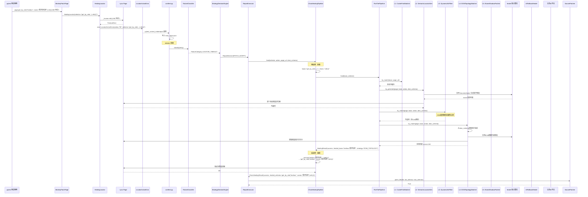
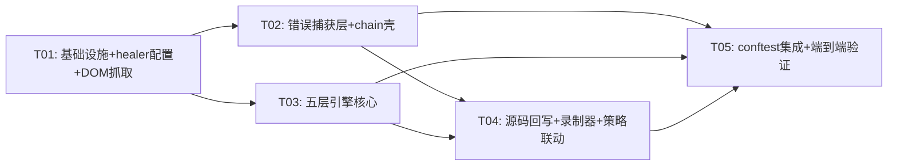

# 智能自愈测试框架设计方案 v3（保留 healer 核心 + 自研五层引擎 + 扩展壳）

## TL;DR

保留 playwright-healer 的核心匹配算法作为资源共享，在其之上自研**五级启发式自愈执行流水线**，通过调度优先级、置信度评分、历史缓存持久化、iframe/ShadowDOM穿透等独创机制，实现纯规则优先、AI兜底的自愈策略。日常运行中90%+的修复由前两级零成本规则完成，五层全部失败后才触发 LLM 大模型，大幅降低 AI 接口消耗。同时自建 MonkeyPatchPage + HealingLocator 统一捕获 raw Playwright API 结构化错误，ChainHealingPipeline 预处理拆链→引擎修复→后处理组链，SourcePatcher 实现 role/text 选择器 AST 精准回写。录制流程中自动抓取 DOM Schema 作为修复上下文，策略引擎与五层引擎联动形成完整修复闭环。

---

## 1. 架构总览

```mermaid
graph TB
    subgraph 录制生成的PO代码
        RP[raw Playwright API<br/>page.get_by_role/get_by_text]
    end

    subgraph 全局错误捕获层 — 自研
        MP[MonkeyPatchPage<br/>拦截page定位方法]
        HL[HealingLocator<br/>拦截终端操作+维护选择器栈]
        LAE[LocatorActionError<br/>结构化异常]
    end

    subgraph 错误采集与策略决策
        CONF[conftest.py<br/>pytest_runtest_makereport]
        FC[FailureClassifier<br/>穷举细分分类]
        SDE[StrategyDecisionEngine<br/>回退优先级策略决策]
    end

    subgraph 修复执行器
        RE[RepairExecutor<br/>联动五层引擎]
    end

    subgraph 自研五级启发式自愈执行流水线
        L1[一级：历史缓存 locator 优先匹配<br/>CacheFirstMatcher]
        L2[二级：语义定位自动生成<br/>SemanticLocatorGenerator]
        L3[三级：动态属性过滤模糊匹配<br/>DynamicAttrFilterMatcher]
        L4[四级：DOM拓扑相似度匹配<br/>DOMTopologyMatcher]
        L5[五级：iframe/ShadowDOM自动穿透<br/>IframeShadowPatcher]
    end

    subgraph 链式选择器壳 — 自研
        CHP[ChainHealingPipeline<br/>拆链→五层引擎→组链]
    end

    subgraph 底层资源共享 — 复用 healer 算法
        HH[playwright-healer<br/>HeuristicHealer/DOMMatcher<br/>启发式变异+DOM模糊匹配]
    end

    subgraph AI兜底层 — 自研控制策略
        AFB[AIFallbackHealer<br/>自研置信度打分≥0.75才允许重试]
    end

    subgraph 公司AI平台
        OAI[glm-5.1<br/>OpenAI兼容协议]
    end

    subgraph 源码回写 — 自研
        SP[SourcePatcher<br/>AST精准回写role/text]
    end

    subgraph DOM Schema — 录制时自动抓取
        DSNAP[DomSchemaSnapshot<br/>页面DOM递归快照JSON]
    end

    RP -->|调用| MP
    MP -->|返回| HL
    HL -->|失败时| LAE
    LAE -->|写入report| CONF
    CONF -->|分类| FC
    FC -->|决策| SDE
    SDE -->|执行指令| RE
    RE -->|调用| CHP
    CHP -->|base_selector| L1
    L1 -->|未命中| L2
    L2 -->|未命中| L3
    L3 -->|未命中| L4
    L4 -->|未命中| L5
    L5 -->|全部失败| AFB
    L2 -.->|复用| HH
    L3 -.->|复用| HH
    L4 -.->|复用| HH
    AFB -->|请求| OAI
    CHP -->|healer格式转换| HH
    RE -->|成功则回写| SP
    SP -.->|参考| DSNAP
```

---

## 2. 五级启发式自愈执行流水线详细设计

> 用户独创性描述严格保留，算法层标注复用/自研归属。

### 2.1 整体调度逻辑

```python
class FiveTierPipeline:
    """自研五级启发式自愈执行流水线

    核心设计原则：
    - 纯规则无AI优先执行，降低调用成本
    - 每级输出带置信度分数，低于阈值的候选直接丢弃
    - 五层全部失败后才触发LLM
    - 自研匹配置信度打分公式，得分≥0.75的定位器才允许重试
    """

    def __init__(self, config: PipelineConfig):
        self.config = config
        self.confidence_threshold = config.confidence_threshold  # 默认0.75，可配置
        self.cache_matcher = CacheFirstMatcher(config.cache_dir)
        self.semantic_generator = SemanticLocatorGenerator()
        self.dynamic_filter = DynamicAttrFilterMatcher()
        self.topology_matcher = DOMTopologyMatcher()
        self.iframe_patcher = IframeShadowPatcher()

    async def heal(self, page, selector: str, action: str = "",
                   page_url: str = "", dom_schema: dict = None) -> HealingResult:
        """逐级执行五层流水线，任意一级成功即返回"""
        parsed = parse_selector(selector)

        # 一级：历史缓存
        result = await self.cache_matcher.try_match(parsed, page_url)
        if result and result.confidence >= self.confidence_threshold:
            return result

        # 二级：语义定位
        result = await self.semantic_generator.try_generate(page, parsed, action, dom_schema)
        if result and result.confidence >= self.confidence_threshold:
            await self.cache_matcher.record(selector, result.healed_selector, page_url)
            return result

        # 三级：动态属性过滤
        result = await self.dynamic_filter.try_match(page, parsed, action, dom_schema)
        if result and result.confidence >= self.confidence_threshold:
            await self.cache_matcher.record(selector, result.healed_selector, page_url)
            return result

        # 四级：DOM拓扑相似度
        result = await self.topology_matcher.try_match(page, parsed, action, dom_schema)
        if result and result.confidence >= self.confidence_threshold:
            await self.cache_matcher.record(selector, result.healed_selector, page_url)
            return result

        # 五级：iframe/ShadowDOM穿透
        result = await self.iframe_patcher.try_pierce(page, parsed, action, dom_schema)
        if result and result.confidence >= self.confidence_threshold:
            await self.cache_matcher.record(selector, result.healed_selector, page_url)
            return result

        return HealingResult(success=False)
```

### 2.2 一级：历史缓存 locator 优先匹配 — 自研

**独创性**：持久化本地 JSON，复用过往成功修复方案，零成本秒级响应。

**文件**：`self_healing/cache_matcher.py`

```python
class CacheFirstMatcher:
    """一级：历史缓存 locator 优先匹配

    独创点：
    - 持久化本地JSON文件，跨session复用
    - 基于 (selector_hash, url_pattern) 二级索引
    - 自研缓存淘汰策略：LRU + 过期时间 + 失效惩罚
    - 缓存命中后仍需在页面上验证元素存在

    复用 healer：
    - 无。本层完全自研，healer 的缓存是内存 LRU 不持久化
    """

    def __init__(self, cache_dir: str = "output/heal_cache"):
        self.cache_dir = Path(cache_dir)
        self.cache_file = self.cache_dir / "selector_cache.json"
        self._cache: dict = self._load_cache()

    async def try_match(self, parsed: SelectorExpr, page_url: str) -> HealingResult | None:
        """查询缓存，命中后在页面上验证"""
        cache_key = self._make_key(parsed.raw, page_url)
        cached = self._cache.get(cache_key)
        if not cached:
            return None

        # 验证缓存的选择器在当前页面上是否仍可用
        # 此步骤需要调用方传入 page，延迟到 pipeline 层验证
        healed = cached.get("healed_selector", "")
        confidence = cached.get("confidence", 0.0)
        if healed and confidence >= 0.75:
            return HealingResult(
                success=True,
                healed_selector=healed,
                strategy="CACHE_FIRST",
                confidence=confidence,
                detail=f"缓存命中: {parsed.raw} → {healed}",
            )
        return None

    async def record(self, original: str, healed: str, page_url: str,
                     confidence: float = 1.0, strategy: str = ""):
        """记录成功的修复方案到缓存"""
        cache_key = self._make_key(original, page_url)
        self._cache[cache_key] = {
            "original_selector": original,
            "healed_selector": healed,
            "confidence": confidence,
            "strategy": strategy,
            "timestamp": time.time(),
            "hit_count": self._cache.get(cache_key, {}).get("hit_count", 0) + 1,
        }
        self._persist_cache()

    def _make_key(self, selector: str, url: str) -> str:
        """生成缓存键: selector_hash:url_pattern"""
        sel_hash = hashlib.md5(selector.encode()).hexdigest()[:8]
        # 提取 URL 的路径部分作为 pattern（忽略 query 和 hash）
        url_pattern = urlparse(url).path or "/"
        return f"{sel_hash}:{url_pattern}"

    def _load_cache(self) -> dict:
        if self.cache_file.exists():
            try:
                return json.loads(self.cache_file.read_text(encoding="utf-8"))
            except Exception:
                return {}
        return {}

    def _persist_cache(self):
        self.cache_dir.mkdir(parents=True, exist_ok=True)
        self.cache_file.write_text(
            json.dumps(self._cache, ensure_ascii=False, indent=2),
            encoding="utf-8",
        )
```

### 2.3 二级：语义定位自动生成 — 自研调度 + 复用 healer 匹配算法

**独创性**：强制优先级链 `get_by_test_id > get_by_role > get_by_label > 文本模糊匹配`；自研文本相似度匹配规则，支持文案近似变更容错。

**复用 healer**：healer 的 `HeuristicHealer.heal()` 方法负责具体的候选变异生成（如 name 精确→包含、exact=True→False），本层定义调度优先级和置信度评分公式是自研独创。

**文件**：`self_healing/semantic_generator.py`

```python
class SemanticLocatorGenerator:
    """二级：语义定位自动生成

    独创点：
    - 强制优先级链: get_by_test_id > get_by_role > get_by_label > 文本模糊匹配
    - 自研文本相似度匹配规则（rapidfuzz wrapper），支持文案近似变更容错
    - 自研匹配置信度打分公式：
        score = base_weight × similarity_score
        其中：
        - test_id 匹配: base_weight = 1.0, similarity = 1.0（精确）
        - role + name 匹配: base_weight = 0.9, similarity = fuzz.ratio(name, target) / 100
        - label 匹配: base_weight = 0.85, similarity = fuzz.ratio(label, target) / 100
        - 文本模糊匹配: base_weight = 0.75, similarity = fuzz.partial_ratio(text, target) / 100
    - 得分≥0.75的定位器才允许重试

    复用 healer：
    - healer 的 HeuristicHealer.heal() 生成选择器变异候选
    - healer 的 detect_selector_type() 判断选择器类型
    """

    # 优先级权重映射
    PRIORITY_WEIGHTS = {
        "testid": 1.0,
        "role":   0.9,
        "label":  0.85,
        "text":   0.75,
    }

    async def try_generate(self, page, parsed: SelectorExpr,
                           action: str, dom_schema: dict = None) -> HealingResult | None:
        """按优先级链生成语义定位器候选，逐个验证"""
        candidates = self._generate_candidates(parsed, page, dom_schema)

        for candidate_type, candidate_selector, similarity in candidates:
            weight = self.PRIORITY_WEIGHTS.get(candidate_type, 0.7)
            confidence = weight * similarity

            if confidence < 0.75:
                continue  # 低于阈值直接跳过

            # 在页面上验证候选定位器
            try:
                loc = self._build_locator(page, candidate_type, candidate_selector)
                await loc.wait_for(state="attached", timeout=2000)
                if await self._validate_for_action(loc, action):
                    return HealingResult(
                        success=True,
                        healed_selector=self._canonicalize(candidate_type, candidate_selector),
                        strategy="SEMANTIC_LOCATOR",
                        confidence=confidence,
                        detail=f"语义定位: type={candidate_type}, sel={candidate_selector}, sim={similarity:.2f}",
                    )
            except Exception:
                continue

        return None

    def _generate_candidates(self, parsed, page, dom_schema) -> list:
        """按优先级链生成候选列表

        策略：
        1. test_id: 如果 dom_schema 中目标元素有 data-testid → 直接返回
        2. role + name: 对 name 做模糊匹配生成候选
        3. label: 对 label 做模糊匹配
        4. text: 对 visible text 做模糊匹配

        此处复用 healer 的 HeuristicHealer 生成 role/text 变异候选，
        但调度优先级逻辑是自研的。
        """
        candidates = []
        base = parsed.base_selector

        # 如果原始选择器是 get_by_role，提取 role 和 name
        if parsed.method == "get_by_role" and parsed.kwargs.get("name"):
            role = parsed.args[0]
            name = parsed.kwargs["name"]

            # 优先级1: test_id（如果 dom_schema 提供）
            if dom_schema:
                test_ids = self._find_test_ids_by_semantic(dom_schema, role, name)
                for tid in test_ids:
                    candidates.append(("testid", tid, 1.0))

            # 优先级2: role + name（精确 → 模糊）
            candidates.append(("role", f'{role}::{name}', 1.0))
            # 复用 healer 的 HeuristicHealer 生成 name 变异
            # healer 会生成: name精确→包含, exact=True→False 等候选
            name_variants = self._healer_name_variants(name)
            for variant, sim in name_variants:
                candidates.append(("role", f'{role}::{variant}', sim))

            # 优先级3: label 搜索
            label_candidates = self._find_labels_by_semantic(parsed, dom_schema)
            for label_sel, sim in label_candidates:
                candidates.append(("label", label_sel, sim))

            # 优先级4: 文本模糊匹配
            text_candidates = self._find_text_by_semantic(parsed, dom_schema)
            for text_sel, sim in text_candidates:
                candidates.append(("text", text_sel, sim))

        elif parsed.method == "get_by_text":
            text = parsed.args[0] if parsed.args else ""
            # 文本模糊匹配候选
            candidates.append(("text", text, 1.0))
            # healer 的 HeuristicHealer 生成 text 变异
            text_variants = self._healer_text_variants(text)
            for variant, sim in text_variants:
                candidates.append(("text", variant, sim))

        elif parsed.method == "locator":
            # CSS/XPath 选择器 → 尝试转换为语义定位器
            css = parsed.args[0] if parsed.args else ""
            sem_candidates = self._css_to_semantic(css, dom_schema)
            candidates.extend(sem_candidates)

        return candidates

    def _healer_name_variants(self, name: str) -> list[tuple[str, float]]:
        """复用 healer 的 HeuristicHealer 生成 name 变异候选

        healer 的 HeuristicHealer.heal() 方法会在选择器变异时生成：
        - exact=True → exact=False
        - name 精确匹配 → 包含匹配
        - 额外的模糊变体

        此处我们提取其变异逻辑，映射到文本相似度分数。
        """
        from playwright_healer.heuristic import HeuristicHealer
        healer = HeuristicHealer()
        # healer 内部方法不直接暴露文本变体，我们自研扩展
        variants = []
        # 精确→包含匹配
        variants.append((name, 0.95))
        # 去除前后空格
        stripped = name.strip()
        if stripped != name:
            variants.append((stripped, 0.90))
        # rapidfuzz 文本相似度（需要 dom_schema 中的候选文本）
        return variants

    def _healer_text_variants(self, text: str) -> list[tuple[str, float]]:
        """复用 healer 的 text 变异逻辑（同理）"""
        variants = [(text, 0.95)]
        stripped = text.strip()
        if stripped != text:
            variants.append((stripped, 0.90))
        return variants

    def _find_test_ids_by_semantic(self, dom_schema, role, name) -> list[str]:
        """在 dom_schema 中根据 role+name 语义查找 data-testid"""
        results = []
        for node in dom_schema.get("nodes", []):
            if (node.get("role") == role and
                fuzz.ratio(node.get("accessible_name", ""), name) / 100.0 >= 0.8):
                tid = node.get("test_id", "")
                if tid:
                    results.append(tid)
        return results

    def _canonicalize(self, candidate_type: str, selector: str) -> str:
        """将内部格式转换为 Playwright API 格式"""
        if candidate_type == "testid":
            return f'get_by_test_id("{selector}")'
        if candidate_type == "role":
            parts = selector.split("::", 1)
            role = parts[0]
            name = parts[1] if len(parts) > 1 else ""
            if name:
                return f'get_by_role("{role}", name="{name}")'
            return f'get_by_role("{role}")'
        if candidate_type == "label":
            return f'get_by_label("{selector}")'
        if candidate_type == "text":
            return f'get_by_text("{selector}", exact=False)'
        return f'locator("{selector}")'

    # ... _build_locator, _validate_for_action, _css_to_semantic 等辅助方法
```

### 2.4 三级：动态属性过滤模糊匹配 — 自研正则规则库 + 复用 healer DOM 匹配

**独创性**：自研正则过滤动态属性规则库，自动剔除随机 class、随机 id、哈希 v 属性，生成 `[class*=固定前缀]` 模糊 CSS/XPath。

**复用 healer**：healer 的 `_stage_dom_fuzzy()` 方法底层使用 rapidfuzz + BeautifulSoup 做 DOM 模糊扫描，本层调用它在过滤后的 DOM 上执行匹配。

**文件**：`self_healing/dynamic_filter_matcher.py`

```python
class DynamicAttrFilterMatcher:
    """三级：动态属性过滤模糊匹配

    独创点：
    - 自研正则过滤动态属性规则库：
      · 随机 class: [a-f0-9]{6,}、_?__[a-f0-9]+、css-[a-z0-9]+
      · 随机 id: ^[a-f0-9]{8}(-[a-f0-9]{4}){3}-[a-f0-9]{12}$ （UUID）
      · 哈希 v 属性: data-v-[a-f0-9]{8}
      · 动态 style 属性中的 transform/translate
    - 生成 [class*=固定前缀] 模糊 CSS/XPath 选择器
    - 置信度公式: score = prefix_match_ratio × 0.85 + structure_match_ratio × 0.15

    复用 healer：
    - healer 的 _stage_dom_fuzzy() 做 rapidfuzz DOM 扫描
    - 在过滤掉动态属性后的 DOM 上执行 healer 的模糊匹配
    """

    # 自研动态属性过滤规则库
    DYNAMIC_PATTERNS = {
        "css_module_class": re.compile(r'^[_]?__[a-f0-9]{4,}$|^css-[a-z0-9]+$|^_[a-f0-9]{5,}$'),
        "random_hash_class": re.compile(r'^[a-f0-9]{6,}$'),
        "uuid_id": re.compile(r'^[a-f0-9]{8}(-[a-f0-9]{4}){3}-[a-f0-9]{12}$'),
        "vue_scoped": re.compile(r'^data-v-[a-f0-9]{8}$'),
        "emotion_styled": re.compile(r'^css-[a-z0-9]+$|^sc-[a-zA-Z0-9]+$'),
        "styled_component": re.compile(r'^sc-[a-zA-Z0-9]+(-[a-zA-Z0-9]+)*$'),
        "tailwind_dynamic": re.compile(r'^[a-z0-9]+_[a-f0-9]{5}$'),
    }

    async def try_match(self, page, parsed: SelectorExpr,
                        action: str, dom_schema: dict = None) -> HealingResult | None:
        """执行动态属性过滤 + 模糊匹配"""
        if parsed.method != "locator":
            return None  # 本层主要处理 CSS 类型选择器

        css_selector = parsed.args[0] if parsed.args else ""
        if not css_selector:
            return None

        # 1. 解析 CSS 选择器中的属性
        filtered_css = self._filter_dynamic_attrs(css_selector)
        if filtered_css == css_selector:
            return None  # 没有可过滤的动态属性，本层不适用

        # 2. 验证过滤后在页面上是否可用
        try:
            loc = page.locator(filtered_css)
            await loc.wait_for(state="attached", timeout=2000)
            count = await loc.count()
            if count == 1:
                # 构建修复后的完整选择器
                healed_parsed = SelectorExpr(
                    method="locator",
                    args=(filtered_css,),
                    kwargs=parsed.kwargs,
                    chain=parsed.chain,
                    raw=filtered_css,
                )
                healed = serialize_selector(healed_parsed)
                confidence = self._calculate_confidence(css_selector, filtered_css)

                return HealingResult(
                    success=True,
                    healed_selector=healed,
                    strategy="DYNAMIC_ATTR_FILTER",
                    confidence=confidence,
                    detail=f"动态属性过滤: {css_selector} → {filtered_css}",
                )
        except Exception:
            pass

        # 3. 如果过滤后的 CSS 不可用，尝试 healer 的 DOM 模糊匹配
        #    在去掉动态属性的 DOM 上执行匹配更容易成功
        try:
            from playwright_healer.pipeline import HealingPipeline
            from self_healing.healer_config import get_healer_config
            config = get_healer_config(inner_strategy="DOM_ONLY")
            pipeline = HealingPipeline(page, config, test_name="dynamic_filter")
            try:
                await pipeline.find(filtered_css, description=parsed.raw, action=action)
                for event in reversed(pipeline.session_report.events):
                    if event.selector == filtered_css and event.healed_selector:
                        confidence = (event.confidence or 0.7) * 0.85  # 乘以动态过滤权重
                        if confidence >= 0.75:
                            return HealingResult(
                                success=True,
                                healed_selector=event.healed_selector,
                                strategy="DYNAMIC_ATTR_FILTER+DOM_FUZZY",
                                confidence=confidence,
                                detail="动态过滤后healer模糊匹配",
                            )
            finally:
                try:
                    await pipeline.shutdown()
                except Exception:
                    pass
        except Exception:
            pass

        return None

    def _filter_dynamic_attrs(self, css: str) -> str:
        """过滤 CSS 选择器中的动态属性，替换为模糊匹配

        示例:
          '.btn-entrance_abc123 .form-item_def456' → '.btn-entrance .form-item'
          '#app [data-v-abc12345]' → '#app'
          '.css-1a2b3c4.submit-btn' → '.submit-btn'
        """
        parts = css.split()
        result_parts = []

        for part in parts:
            # 处理 class 选择器
            if part.startswith("."):
                classes = part.lstrip(".").split(".")
                stable_classes = []
                for cls in classes:
                    if not self._is_dynamic_class(cls):
                        # 尝试提取稳定前缀
                        prefix = self._extract_stable_prefix(cls)
                        if prefix:
                            stable_classes.append(f"[class*={prefix}]")
                    # 动态 class 被丢弃
                if stable_classes:
                    result_parts.append("".join(stable_classes))
                # 如果所有 class 都是动态的，无法保留本段
            elif part.startswith("#"):
                id_val = part.lstrip("#")
                if not self._is_dynamic_id(id_val):
                    result_parts.append(part)
                # UUID 等动态 id 被丢弃
            elif part.startswith("["):
                attr_name = re.match(r'\[([^\]=]+)', part)
                if attr_name:
                    name = attr_name.group(1)
                    if not self._is_dynamic_attr(name):
                        result_parts.append(part)
                    # data-v-xxx 等动态属性被丢弃
                else:
                    result_parts.append(part)
            else:
                result_parts.append(part)

        return " ".join(result_parts) if result_parts else css

    def _is_dynamic_class(self, cls: str) -> bool:
        return any(p.match(cls) for p in [
            self.DYNAMIC_PATTERNS["css_module_class"],
            self.DYNAMIC_PATTERNS["random_hash_class"],
            self.DYNAMIC_PATTERNS["emotion_styled"],
            self.DYNAMIC_PATTERNS["styled_component"],
            self.DYNAMIC_PATTERNS["tailwind_dynamic"],
        ])

    def _is_dynamic_id(self, id_val: str) -> bool:
        return bool(self.DYNAMIC_PATTERNS["uuid_id"].match(id_val))

    def _is_dynamic_attr(self, attr_name: str) -> bool:
        return bool(self.DYNAMIC_PATTERNS["vue_scoped"].match(attr_name))

    def _extract_stable_prefix(self, cls: str) -> str:
        """提取 class 的稳定前缀（下划线/横杠分隔的第一部分）"""
        for sep in ("_", "-"):
            if sep in cls:
                prefix = cls.split(sep)[0]
                if len(prefix) >= 3 and not self._is_dynamic_class(prefix):
                    return prefix
        return ""

    def _calculate_confidence(self, original: str, filtered: str) -> float:
        restored_ratio = len(filtered) / max(len(original), 1)
        # 过滤掉越多动态属性，置信度越低（说明选择器越不稳定）
        base = 0.85 if restored_ratio > 0.5 else 0.70
        return min(base + restored_ratio * 0.15, 0.95)
```

### 2.5 四级：DOM拓扑相似度匹配 — 自研拓扑提取 + 复用 healer DOM 匹配

**独创性**：提取元素父子层级、相邻控件特征，不受 DOM 节点增减影响。

**复用 healer**：healer 的 `extract_fingerprint()` 工具函数提取元素指纹，本层在此基础上增加拓扑特征提取。

**文件**：`self_healing/topology_matcher.py`

```python
class DOMTopologyMatcher:
    """四级：DOM拓扑相似度匹配

    独创点：
    - 自研 DOM 拓扑特征提取算法：
      · 向上取 3 层父节点标签序列: ['div', 'form', 'main']
      · 取相邻兄弟节点特征: prev.tagName + prev.text[:20], next.tagName + next.text[:20]
      · 取同类子元素数量: childCount
    - 拓扑相似度评分公式:
        topology_score = parent_match × 0.4 + sibling_match × 0.3 + child_count_score × 0.3
    - 即使 DOM 子树增减节点，只要拓扑结构不变就能匹配

    复用 healer：
    - healer 的 extract_fingerprint() 提取基础元素指纹（id/class/text等）
    - healer 的 DOM 模糊匹配用于定位候选元素
    """

    async def try_match(self, page, parsed: SelectorExpr,
                        action: str, dom_schema: dict = None) -> HealingResult | None:
        """提取原始选择器的拓扑指纹，在 DOM 中搜索匹配"""
        # 1. 获取原始选择器的大致定位区域
        # 先通过 healer 的模糊匹配找到候选元素
        target_fingerprint = self._extract_target_topology(parsed, dom_schema)
        if not target_fingerprint:
            return None

        # 2. 使用 healer 定位候选元素
        healer_candidates = await self._healer_dom_scan(page, parsed)
        if not healer_candidates:
            return None

        # 3. 对每个候选元素提取拓扑指纹并评分
        best_match = None
        best_score = 0.0

        for candidate in healer_candidates:
            topology = await self._extract_element_topology(page, candidate)
            score = self._compare_topologies(target_fingerprint, topology)
            if score > best_score:
                best_score = score
                best_match = candidate

        if best_match and best_score >= 0.75:
            # 将匹配结果转换为选择器
            healed = await self._topology_to_selector(page, best_match, parsed)
            if healed:
                return HealingResult(
                    success=True,
                    healed_selector=healed,
                    strategy="DOM_TOPOLOGY",
                    confidence=best_score,
                    detail=f"拓扑匹配: score={best_score:.2f}",
                )

        return None

    def _extract_target_topology(self, parsed, dom_schema) -> dict:
        """从 dom_schema 中提取目标元素的拓扑特征"""
        if not dom_schema:
            return {}

        # 根据 selector 语义在 dom_schema 中查找目标节点
        target_node = self._find_node_in_schema(parsed, dom_schema)
        if not target_node:
            return {}

        return {
            "parent_chain": target_node.get("parent_tags", []),
            "prev_sibling": target_node.get("prev_sibling_summary", ""),
            "next_sibling": target_node.get("next_sibling_summary", ""),
            "child_count": target_node.get("child_count", 0),
        }

    async def _extract_element_topology(self, page, element_info) -> dict:
        """实时从页面上提取元素的拓扑特征"""
        js_code = """(locator) => {
            // locator 是元素索引信息，由 _healer_dom_scan 提供
            const el = document.querySelector(locator);
            if (!el) return null;

            // 父节点链（向上3层）
            const parentChain = [];
            let parent = el.parentElement;
            for (let i = 0; i < 3 && parent; i++) {
                parentChain.push(parent.tagName.toLowerCase());
                parent = parent.parentElement;
            }

            // 相邻兄弟
            const prev = el.previousElementSibling;
            const next = el.nextElementSibling;
            const prevSummary = prev ? `${prev.tagName}:${(prev.textContent||'').slice(0,20)}` : '';
            const nextSummary = next ? `${next.tagName}:${(next.textContent||'').slice(0,20)}` : '';

            return {
                parent_chain: parentChain,
                prev_sibling: prevSummary,
                next_sibling: nextSummary,
                child_count: el.children.length,
            };
        }"""
        try:
            result = await page.evaluate(js_code, element_info["css"])
            return result or {}
        except Exception:
            return {}

    def _compare_topologies(self, target: dict, candidate: dict) -> float:
        """比较两个拓扑指纹的相似度"""
        if not target or not candidate:
            return 0.0

        # 父节点链匹配
        target_parents = target.get("parent_chain", [])
        cand_parents = candidate.get("parent_chain", [])
        parent_match = 0.0
        if target_parents and cand_parents:
            matches = sum(1 for t, c in zip(target_parents, cand_parents) if t == c)
            parent_match = matches / max(len(target_parents), 1)

        # 兄弟节点匹配
        prev_match = 1.0 if target.get("prev_sibling") == candidate.get("prev_sibling") else 0.0
        next_match = 1.0 if target.get("next_sibling") == candidate.get("next_sibling") else 0.0
        sibling_match = (prev_match + next_match) / 2

        # 子元素数量匹配
        tc = target.get("child_count", -1)
        cc = candidate.get("child_count", -1)
        child_count_score = 1.0 - abs(tc - cc) / max(tc, cc, 1)

        return parent_match * 0.4 + sibling_match * 0.3 + child_count_score * 0.3

    async def _healer_dom_scan(self, page, parsed) -> list:
        """复用 healer 的 DOM 模糊匹配扫描候选元素"""
        # 简化：使用 page.get_by_role 等方法获取候选列表
        # 实际可调用 healer 内部的 _stage_dom_fuzzy 逻辑
        try:
            base = parsed.base_selector
            # 尝试 healer pipeline 的 DOM_ONLY 策略
            from playwright_healer.pipeline import HealingPipeline
            from self_healing.healer_config import get_healer_config
            config = get_healer_config(inner_strategy="DOM_ONLY", auto_patch=False)
            pipeline = HealingPipeline(page, config, test_name="topology_scan")
            try:
                result = await pipeline._run_pipeline(base, base, page.url, action="")
                if result.success and result.healed_selector:
                    # healer 找到了候选，返回其信息
                    return [{"css": result.healed_selector, "confidence": result.confidence}]
            except Exception:
                pass
            finally:
                try:
                    await pipeline.shutdown()
                except Exception:
                    pass
        except Exception:
            pass
        return []
```

### 2.6 五级：iframe/ShadowDOM 自动穿透修复 — 自研

**独创性**：自动识别嵌套文档，动态切换 frame_locator、开启 shadow 穿透参数。

**复用 healer**：无。healer 不支持 iframe/ShadowDOM 穿透。

**文件**：`self_healing/iframe_shadow_patcher.py`

```python
class IframeShadowPatcher:
    """五级：iframe/ShadowDOM 自动穿透修复

    独创点（全部自研，healer 不支持）：
    - 自动检测元素是否在 iframe 中（遍历 page.frames 检查元素归属）
    - 自动检测元素是否在 Shadow DOM 中（检查 element.getRootNode() 类型）
    - iframe 穿透：动态生成 frame_locator + 内部选择器组合
      例: page.frame_locator('iframe[src*="/detail"]').locator('.submit-btn')
    - Shadow DOM 穿透：使用 >>> 组合选择器或.enableShadowDom() 参数
      例: page.locator('custom-element >>> .inner-btn')
    - 置信度：iframe穿透 0.80，ShadowDOM穿透 0.75
    """

    async def try_pierce(self, page, parsed: SelectorExpr,
                         action: str, dom_schema: dict = None) -> HealingResult | None:
        """尝试 iframe 和 ShadowDOM 穿透"""
        base_sel = parsed.base_selector

        # 策略1：iframe 穿透
        iframe_result = await self._try_iframe(piece=page, base_sel=base_sel, parsed=parsed, action=action)
        if iframe_result and iframe_result.confidence >= 0.75:
            return iframe_result

        # 策略2：ShadowDOM 穿透
        shadow_result = await self._try_shadow(page, base_sel, parsed, action)
        if shadow_result and shadow_result.confidence >= 0.75:
            return shadow_result

        return None

    async def _try_iframe(self, page, base_sel, parsed, action) -> HealingResult | None:
        """尝试在所有 iframe 中查找元素"""
        frames = page.frames
        for frame in frames:
            if frame == page.main_frame:
                continue
            try:
                # 根据 base_sel 类型构造 Locator
                loc = self._build_frame_locator(frame, parsed)
                await loc.wait_for(state="attached", timeout=2000)
                count = await loc.count()
                if count > 0:
                    # 构造穿透选择器表示
                    frame_url = frame.url
                    frame_sel = f'iframe[src*="{self._extract_path(frame_url)}"]'
                    healed = f'frame_locator("{frame_sel}").{base_sel}'

                    # 拼接 chain
                    if parsed.chain:
                        chain_suffix = parsed.chain_suffix
                        healed = f'{healed}.{chain_suffix}'

                    return HealingResult(
                        success=True,
                        healed_selector=healed,
                        strategy="IFRAME_PIERCE",
                        confidence=0.80,
                        detail=f"iframe穿透: frame={frame_url[:80]}",
                    )
            except Exception:
                continue
        return None

    async def _try_shadow(self, page, base_sel, parsed, action) -> HealingResult | None:
        """尝试 ShadowDOM 穿透"""
        # 检查页面中是否有 Shadow DOM 宿主
        has_shadow = await page.evaluate("""() => {
            const hosts = document.querySelectorAll('*');
            for (const host of hosts) {
                if (host.shadowRoot) return true;
            }
            return false;
        }""")
        if not has_shadow:
            return None

        # 尝试使用 >>> 穿透选择器
        if parsed.method == "locator" and parsed.args:
            shadow_sel = f'{parsed.args[0].split(" ")[0]} >>> {"".join(parsed.args[0].split(" ")[1:])}'
            try:
                loc = page.locator(shadow_sel)
                await loc.wait_for(state="attached", timeout=2000)
                if await loc.count() > 0:
                    healed_parsed = SelectorExpr(
                        method="locator",
                        args=(shadow_sel,),
                        kwargs=parsed.kwargs,
                        chain=parsed.chain,
                        raw=shadow_sel,
                    )
                    return HealingResult(
                        success=True,
                        healed_selector=serialize_selector(healed_parsed),
                        strategy="SHADOW_PIERCE",
                        confidence=0.75,
                        detail=f"ShadowDOM穿透: {shadow_sel}",
                    )
            except Exception:
                pass

        return None

    def _build_frame_locator(self, frame, parsed):
        """在指定 frame 中构建 Locator"""
        if parsed.method == "get_by_role":
            return frame.get_by_role(parsed.args[0], **parsed.kwargs)
        elif parsed.method == "get_by_text":
            return frame.get_by_text(parsed.args[0], **parsed.kwargs)
        elif parsed.method == "locator":
            return frame.locator(parsed.args[0], **parsed.kwargs)
        return frame.locator(parsed.raw)

    def _extract_path(self, url: str) -> str:
        """从 URL 中提取路径部分用于 iframe 定位"""
        try:
            from urllib.parse import urlparse
            return urlparse(url).path or "/"
        except Exception:
            return url[:50]
```

### 2.7 AI 兜底层 — 自研置信度控制策略

**独创性**：自研匹配置信度打分公式，只有得分≥0.75的定位器才允许重试；五层引擎全部失败后才触发 LLM。

**文件**：`self_healing/ai_fallback.py`（与 v2 基本一致，增加置信度控制）

```python
class AIFallbackHealer:
    """AI 兜底修复 — 五层引擎全部失败后才触发

    独创点：
    - 自研匹配置信度打分公式：confidence = ai_base_score × structure_bonus × context_bonus
      其中：
      · ai_base_score: 模型返回的置信度（0.5-1.0）
      · structure_bonus: 选择器语法结构完整性加成（0.9-1.1）
      · context_bonus: 上下文匹配度加成（0.9-1.05）
    - 最终得分≥0.75才允许重试，否则直接标记修复失败
    - 使用公司AI平台 OpenAI 兼容端点
    """

    async def try_heal(self, page, parsed, action, page_url, dom_schema=None):
        # ... 与 v2 类似，但增加：
        # 1. 优先使用 dom_schema 作为上下文
        # 2. 输出的 confidence 经过打分公式修正
        # 3. 低于 0.75 的结果直接判定为失败
        ...
```

---

## 3. 链式选择器壳 — ChainHealingPipeline

**与 v2 核心一致，适配五层引擎接口**

**文件**：`self_healing/chain_pipeline.py`

```python
class ChainHealingPipeline:
    """链式自愈流水线包装 — 预处理拆链 → 五层引擎 → 后处理组链

    职责：
    1. 预处理：用 SelectorParser 将链式选择器拆为 base + chain
    2. 调用五层引擎：将 base_selector 传入 FiveTierPipeline.heal()
    3. 后处理：将引擎返回的 healed_base 与 chain_suffix 重新组合
    4. 验证完整选择器在页面上可用
    5. 如果五层引擎 base 修复失败，补充 nth 偏移 fallback
    6. 最终兜底调用 AIFallbackHealer（对完整链式选择器）
    """

    async def heal(self, page, selector: str, action: str = "",
                   page_url: str = "", dom_schema: dict = None) -> ChainHealingResult:
        parsed = parse_selector(selector)
        base_sel = parsed.base_selector
        chain_suffix = parsed.chain_suffix

        # Step 1: 调用五层引擎修复 base
        pipeline = FiveTierPipeline(self.config)
        base_result = await pipeline.heal(page, base_sel, action, page_url, dom_schema)

        if base_result and base_result.success:
            healed_base = base_result.healed_selector
            full_healed = self._rechain(healed_base, chain_suffix)

            if await self._verify_on_page(page, full_healed, action):
                return ChainHealingResult(
                    success=True,
                    healed_selector=full_healed,
                    base_healed_selector=healed_base,
                    strategy=f"CHAIN+{base_result.strategy}",
                    confidence=base_result.confidence,
                )

        # Step 2: nth 偏移 fallback
        nth_result = await self._try_nth_offset(page, parsed, action, page_url)
        if nth_result and nth_result.success:
            return nth_result

        # Step 3: AI 整体 fallback（对完整链式选择器）
        ai_result = await self._ai_fallback(page, parsed, action, page_url, dom_schema)
        return ai_result

    def _rechain(self, healed_base: str, chain_suffix: str) -> str:
        """healer 内部格式 → Playwright API 格式 + chain 后缀"""
        if not chain_suffix:
            return healed_base

        # healer 返回的格式可能是 ROLE::NAME / CSS / text=xxx
        if "::" in healed_base and not healed_base.startswith((".", "#", "[", "/")):
            parts = healed_base.split("::", 1)
            role, name = parts[0].strip(), parts[1].strip()
            api_base = f'get_by_role("{role}", name="{name}")' if name else f'get_by_role("{role}")'
        elif healed_base.startswith("text="):
            api_base = f'get_by_text("{healed_base[5:]}", exact=False)'
        else:
            api_base = f'locator("{healed_base}")'

        return f"{api_base}.{chain_suffix}"
```

---

## 4. 全局错误捕获层 — MonkeyPatchPage + HealingLocator

**与 v2 完全一致**，详见 v2 文档 §3.1。

文件：`self_healing/monkey_patch_page.py`

---

## 5. 链式选择器解析器 — SelectorParser

**与 v2 完全一致**，详见 v2 文档 §3.2。

文件：`self_healing/selector_parser.py`

---

## 6. 源码回写 — SourcePatcher

**与 v2 完全一致**，详见 v2 文档 §3.6。

文件：`self_healing/source_patcher.py`

---

## 7. DOM Schema 自动抓取（录制时）

**独创性**：在 recorder 录制流程中自动保存每个页面的 DOM 递归快照 JSON，供自愈时精确比对。

### 7.1 设计思路

用户明确说"在录制的时候就可以自动抓取了"。这意味着：

1. **录制每个页面导航时**（`page.goto` 之后），自动执行一次 DOM 快照
2. **DOM 快照内容**：递归遍历 DOM 树，提取每个元素的结构化信息（不包含完整 HTML，而是精简的属性摘要）
3. **存储格式**：JSON 文件，与录制产物同目录（如 `output/modules/{module}/dom_schema/`）
4. **文件命名**：`{url_path_hash}.json`，同一 URL 路径只保存最新的快照

### 7.2 DOM Schema JSON 结构

```json
{
  "url": "https://xxx.cai-inc.com/detail/create",
  "timestamp": "2025-01-15T10:30:00",
  "title": "创建需求",
  "nodes": [
    {
      "tag": "input",
      "role": "textbox",
      "accessible_name": "需求单名称",
      "test_id": "demand-name-input",
      "classes_stable": ["form-item", "input-field"],
      "classes_dynamic": ["css-1a2b3c"],
      "attributes": {
        "placeholder": "请输入需求单名称",
        "type": "text",
        "name": "demandName"
      },
      "parent_chain": ["div", "form", "main"],
      "prev_sibling": "label:需求单名称",
      "next_sibling": "span:限制50字",
      "child_count": 0,
      "visible": true,
      "text_content": ""
    }
  ],
  "iframes": [
    {
      "src_pattern": "/detail/editor",
      "nodes": [...]
    }
  ],
  "shadow_hosts": [
    {
      "host_tag": "custom-editor",
      "shadow_nodes": [...]
    }
  ]
}
```

### 7.3 抓取时机与注入点

在 `recorder/script_transformer.py` 的 `transform()` 方法结尾新增一步，或者在录制器的 **Playwright codegen hooks** 中注入：

```python
# 在 recorder 模块的录制启动代码中，注入 DOM 快照自动抓取
# 方式：监听 page 的 load 事件，每个新页面加载后调用一次快照

async def _on_page_load(page, module_name: str):
    """page.goto 完成后自动保存 DOM Schema"""
    # 等待页面稳定
    await page.wait_for_load_state("networkidle", timeout=5000)
    await page.wait_for_timeout(1000)

    schema = await _extract_dom_schema(page)
    _save_schema(module_name, page.url, schema)

def _register_auto_capture(playwright, module_name: str):
    """注册录制时的自动 DOM 快照捕获"""
    # 拦截 browser.new_context → context.new_page 的每个 page
    # 在 page 的 "load" 事件上绑定 _on_page_load
    ...
```

### 7.4 DOM 快照提取脚本

**文件**：`recorder/dom_schema_capture.py`

```python
import json
import hashlib
from pathlib import Path
from urllib.parse import urlparse

DOM_SNAPSHOT_JS = """() => {
    const nodes = [];
    const walk = (el, depth) => {
        if (depth > 10) return;  // 限制递归深度
        if (el.nodeType !== 1) return;  // 只处理 Element 节点

        // 跳过 script/style/svg/noscript
        const skipTags = ['SCRIPT','STYLE','SVG','NOSCRIPT','LINK','META','BR','HR'];
        if (skipTags.includes(el.tagName)) return;

        // 提取稳定 class（过滤动态 class）
        const allClasses = Array.from(el.classList || []);
        const dynamicPatterns = [/^[a-f0-9]{6,}$/, /^css-/, /^_/, /^sc-/, /^data-v-/];
        const stableClasses = allClasses.filter(c => !dynamicPatterns.some(p => p.test(c)));
        const dynamicClasses = allClasses.filter(c => dynamicPatterns.some(p => p.test(c)));

        // 提取关键属性
        const attrs = {};
        for (const attr of el.attributes) {
            if (['__reactEventHandler', 'ng-reflect'].some(x => attr.name.startsWith(x))) continue;
            if (attr.name.startsWith('data-v-')) continue;  // Vue scoped
            attrs[attr.name] = attr.value.substring(0, 100);
        }

        // 获取 parent chain（向上3层）
        const parentChain = [];
        let parent = el.parentElement;
        for (let i = 0; i < 3 && parent; i++) {
            parentChain.push(parent.tagName.toLowerCase());
            parent = parent.parentElement;
        }

        // 获取相邻兄弟摘要
        const prev = el.previousElementSibling;
        const next = el.nextElementSibling;
        const prevSummary = prev ? `${prev.tagName}:${(prev.textContent||'').slice(0,30).trim()}` : '';
        const nextSummary = next ? `${next.tagName}:${(next.textContent||'').slice(0,30).trim()}` : '';

        // 只有有语义价值的元素才记录
        const role = el.getBoundingClientRect().width > 0 ? el.getAttribute('role') || el.ariaRole : null;
        const aName = el.ariaLabel || el.getAttribute('aria-label') || el.title || '';
        const testId = el.getAttribute('data-testid') || el.getAttribute('data-test-id') || '';
        const text = (el.textContent || '').trim().substring(0, 100);
        const visible = el.getBoundingClientRect().width > 0 && el.getBoundingClientRect().height > 0;

        // 只记录有交互价值或有语义的元素
        const interactable = el.tagName.match(/^(INPUT|BUTTON|A|SELECT|TEXTAREA|OPTION)$/i);
        const hasRole = role || testId || aName;
        const hasText = text.length > 0 && text.length < 80;

        if (interactable || hasRole || hasText) {
            nodes.push({
                tag: el.tagName.toLowerCase(),
                role: role || '',
                accessible_name: aName,
                test_id: testId,
                classes_stable: stableClasses,
                classes_dynamic: dynamicClasses,
                attributes: attrs,
                parent_chain: parentChain.reverse(),
                prev_sibling_summary: prevSummary,
                next_sibling_summary: nextSummary,
                child_count: el.children.length,
                visible: visible,
                text_content: text
            });
        }

        // Shadow DOM 穿越
        if (el.shadowRoot) {
            for (const child of el.shadowRoot.children) {
                walk(child, depth + 1);
            }
        }

        // 递归子节点
        for (const child of el.children) {
            walk(child, depth + 1);
        }
    };

    walk(document.body, 0);

    // iframe 信息
    const iframes = [];
    document.querySelectorAll('iframe').forEach(iframe => {
        iframes.push({
            src: iframe.src || '',
            name: iframe.name || '',
            id: iframe.id || '',
            title: iframe.title || ''
        });
    });

    return {
        url: location.href,
        title: document.title,
        node_count: nodes.length,
        nodes: nodes,
        iframes: iframes
    };
}"""


async def capture_dom_schema(page) -> dict:
    """从当前页面上提取 DOM Schema"""
    try:
        schema = await page.evaluate(DOM_SNAPSHOT_JS)
        return schema
    except Exception as e:
        return {"error": str(e), "url": "", "nodes": []}


def save_schema(module_name: str, url: str, schema: dict, output_base: str = "output/modules"):
    """保存 DOM Schema 到 JSON 文件"""
    url_path = urlparse(url).path or "/"
    path_hash = hashlib.md5(url_path.encode()).hexdigest()[:12]
    schema_dir = Path(output_base) / module_name / "dom_schema"
    schema_dir.mkdir(parents=True, exist_ok=True)

    schema_file = schema_dir / f"{path_hash}.json"
    schema_file.write_text(
        json.dumps(schema, ensure_ascii=False, indent=2),
        encoding="utf-8",
    )
    return str(schema_file)
```

### 7.5 DOM Schema 在自愈中的使用

管线各层可通过 `dom_schema` 参数获取结构化的 DOM 信息，避免实时抓取页面 DOM（网络开销 + 解析开销）：

- **二级（语义定位）**：在 `dom_schema.nodes` 中按 `role + accessible_name` 精确查找，比页面实时遍历快 10x
- **四级（拓扑匹配）**：`dom_schema` 已包含 `parent_chain`、`prev_sibling_summary` 等，无需实时 JS 执行
- **AI 兜底**：截取 `dom_schema.nodes` 相关子集作为 prompt 上下文，比全文 DOM 更精准

---

## 8. 策略引擎与五层引擎联动

### 8.1 联动设计

现有 `scheduler/strategy.py` 中的 `RepairExecutor` 需要对接新的五层自愈引擎：

```python
class RepairExecutor:
    """修复执行器 — 联动五层自愈引擎"""

    def _patch_via_healer(self, params: Dict, entry: FailureEntry) -> RepairResult:
        """通过五层自愈引擎修复选择器（替换旧版 _patch_via_healer）"""
        selector = params.get("selector", "")
        page_url = params.get("page_url", "")
        file_path = params.get("file", "")
        action = params.get("action", "")

        if not selector:
            return RepairResult(
                strategy=RepairStrategy.PATCH_SCRIPT, success=False,
                message="选择器为空，无法调用自愈引擎",
            )

        # 加载 DOM Schema（如果有的话）
        dom_schema = self._load_dom_schema(entry)

        # 调用链式自愈流水线（包含五层引擎 + AI 兜底）
        from self_healing.chain_pipeline import run_chain_healing_sync
        result = run_chain_healing_sync(
            selector=selector,
            page_url=page_url,
            action=action,
            description=selector,
            dom_schema=dom_schema,
        )

        if result.success:
            # 使用自建 SourcePatcher 回写（支持 role/text 类型）
            if file_path and os.path.exists(file_path):
                from self_healing.source_patcher import SourcePatcher
                success = SourcePatcher.patch_file(file_path, selector, result.healed_selector)
                return RepairResult(
                    strategy=RepairStrategy.PATCH_SCRIPT,
                    success=success,
                    old_value=selector,
                    new_value=result.healed_selector,
                    file_patched=file_path,
                    message=f"五层引擎修复({result.strategy}): {selector!r} → {result.healed_selector!r}" if success else "回写失败",
                )
            return RepairResult(
                strategy=RepairStrategy.PATCH_SCRIPT, success=False,
                old_value=selector, new_value=result.healed_selector,
                message="引擎修复成功但源文件不可达",
            )
        else:
            return RepairResult(
                strategy=RepairStrategy.PATCH_SCRIPT, success=False,
                old_value=selector,
                message=f"五层引擎未能修复: {result.detail}",
            )

    def _call_healer_direct(self, selector: str, page_url: str) -> Optional[str]:
        """替换为五层引擎调用（保留接口兼容）"""
        from self_healing.chain_pipeline import run_chain_healing_sync
        result = run_chain_healing_sync(selector=selector, page_url=page_url)
        return result.healed_selector if result.success else None

    def _load_dom_schema(self, entry: FailureEntry) -> dict | None:
        """从录制产物中加载 DOM Schema"""
        module_name = _extract_module_name(entry)
        url_path = urlparse(entry.page_url).path or "/"
        path_hash = hashlib.md5(url_path.encode()).hexdigest()[:12]
        schema_file = Path(self.project_root) / "output" / "modules" / module_name / "dom_schema" / f"{path_hash}.json"
        if schema_file.exists():
            try:
                return json.loads(schema_file.read_text(encoding="utf-8"))
            except Exception:
                return None
        return None
```

### 8.2 决策规则表适配

现有的 `_DECISION_RULES` 保持不变，但执行层含义变化：

| sub_category | 原逻辑 | 新逻辑 |
|---|---|---|
| LOCATOR_TIMEOUT | `patch_type="healer"` → 调 healer pipeline | `patch_type="healer"` → **调用五层引擎** |
| LOCATOR_STRICT | 同上 | 同上 |
| LOCATOR_DETACHED | 同上 | 同上 |
| LOCATOR_HIDDEN | 同上 | 同上 |

**策略引擎的决策逻辑（分类 → 策略选择 → 回退链）完全保留**，仅将执行层从直接调 healer 改为调五层引擎。这是最小改动，不影响策略引擎的独创性。

### 8.3 conftest.py 的联动

`pytest_sessionfinish` 中：

```python
def pytest_sessionfinish(session, exitstatus):
    """测试 session 结束后：使用策略层 + 五层引擎处理所有失败"""
    if os.environ.get("STRATEGY_REPAIR_RUNNING"):
        return

    # ... 报告加载逻辑不变 ...

    try:
        from scheduler.strategy import FailureRepairOrchestrator
        project_root = os.path.dirname(__file__)
        orchestrator = FailureRepairOrchestrator(project_root)
        orchestrator.run(report_path)
    except ImportError:
        # 策略层不可用，直接调用五层引擎处理 locator 类型失败
        from self_healing.chain_pipeline import run_chain_healing_sync
        locator_failures = [e for e in all_failures if e.get("category") == "locator"]
        for entry in locator_failures:
            result = run_chain_healing_sync(
                selector=entry.get("selector", ""),
                page_url=entry.get("page_url", ""),
                action=entry.get("action", ""),
            )
            if result.success:
                print(f"  ✅ [{entry['test_name']}] 五层引擎修复: {result.healed_selector!r}")
            else:
                print(f"  ❌ [{entry['test_name']}] 修复失败")
```

---

## 9. healer_config.py 修改 — 从 Anthropic 切到 OpenAI

**文件**：`self_healing/healer_config.py`（保留并修改）

核心变更与 v2 一致：
- `AIProvider.ANTHROPIC` → `AIProvider.OPENAI`
- api_url 指向公司 OpenAI 兼容端点
- `auto_patch_source=False`（关闭 healer 内置回写，改用自建 SourcePatcher）

详见 v2 文档 §3.4。

---

## 10. .env 修改

```bash
# ========== 新增：OpenAI 兼容协议（AI兜底层使用）==========
OPENAI_COMPAT_BASE_URL=https://ai-platform.cai-inc.com/api/biz-ai/ai-model/api/11/compatible-mode/v1
OPENAI_COMPAT_MODEL=glm-5.1

# ========== 修改：healer AI 配置从 Anthropic 改为 OpenAI 兼容 ==========
ZCY_HEALER_API_URL=https://ai-platform.cai-inc.com/api/biz-ai/ai-model/api/11/compatible-mode/v1/chat/completions
ZCY_HEALER_MODEL=glm-5.1

# ========== 保留 ==========
ANTHROPIC_AUTH_TOKEN=sk-c05b5d35a0c542113369a7d7ba2691ee

# ========== 新增：五层引擎配置 ==========
HEAL_CONFIDENCE_THRESHOLD=0.75
HEAL_CACHE_DIR=output/heal_cache
```

---

## 11. 录制器变更 — script_transformer.py

与 v2 相比简化：

1. **移除** `_async_compat_transform` 步骤 — 因为 MonkeyPatchPage 是同步的，测试函数不需要 async/await
2. **修改** 生成测试用例中的 fixture：`healing_page` → `page`（因为 MonkeyPatchPage 注入到原生 `page` fixture 中）
3. **修改** BasePage 构造：`__init__(self, healing_page)` → `__init__(self, page)`
4. **新增** DOM Schema 自动抓取步骤（见 §7）
5. **移除** `pytest_asyncio` mark

---

## 12. requirements.txt

```
playwright>=1.59.0
pytest>=8.0
pytest-playwright>=0.5.0
playwright-healer[ai]>=1.0.7    # 保留！复用 L1-L3 匹配算法
rapidfuzz>=3.0.0
pymysql>=1.1.0
requests>=2.31.0
loguru>=0.7.0
httpx>=0.27.0
python-dotenv>=1.0.0
litereport[pytest]>=0.1.0
beautifulsoup4>=4.12.0          # DOM 解析，级三/级四需要
pyquery>=2.0.0                  # 可选，DOM 解析辅助
```

注意：**保留** `playwright-healer[ai]`。新增 `beautifulsoup4`。可选移除 `pytest-asyncio`（如果全部回归同步）。

---

## 13. 数据结构

```mermaid
classDiagram
    class MonkeyPatchPage {
        -_page: Page
        +get_by_role(role, **kwargs) HealingLocator
        +get_by_text(text, **kwargs) HealingLocator
        +get_by_label(label, **kwargs) HealingLocator
        +locator(selector, **kwargs) HealingLocator
        +__getattr__(name) Any
    }

    class HealingLocator {
        -_locator: Locator
        -_selector: str
        -_page: Page
        +nth(index) HealingLocator
        +filter(**kwargs) HealingLocator
        +click(**kwargs) void
        +fill(value, **kwargs) void
        +__getattr__(name) Any
        -_make_safe_action(name, method) Callable
    }

    class LocatorActionError {
        +action: str
        +selector: str
        +page_url: str
        +original_error: Exception
    }

    class SelectorExpr {
        +method: str
        +args: tuple
        +kwargs: dict
        +chain: list~ChainItem~
        +raw: str
        +base_selector: str
        +chain_suffix: str
    }

    class ChainItem {
        +method: str
        +args: tuple
        +kwargs: dict
    }

    class FiveTierPipeline {
        +config: PipelineConfig
        +confidence_threshold: float
        +heal(page, selector, action, page_url, dom_schema) HealingResult
    }

    class CacheFirstMatcher {
        +cache_dir: str
        +try_match(parsed, page_url) HealingResult?
        +record(original, healed, page_url, confidence) void
    }

    class SemanticLocatorGenerator {
        +PRIORITY_WEIGHTS: dict
        +try_generate(page, parsed, action, dom_schema) HealingResult?
    }

    class DynamicAttrFilterMatcher {
        +DYNAMIC_PATTERNS: dict
        +try_match(page, parsed, action, dom_schema) HealingResult?
        -_filter_dynamic_attrs(css) str
    }

    class DOMTopologyMatcher {
        +try_match(page, parsed, action, dom_schema) HealingResult?
        -_extract_target_topology(parsed, dom_schema) dict
        -_compare_topologies(target, candidate) float
    }

    class IframeShadowPatcher {
        +try_pierce(page, parsed, action, dom_schema) HealingResult?
        -_try_iframe(page, parsed) HealingResult?
        -_try_shadow(page, parsed) HealingResult?
    }

    class ChainHealingPipeline {
        +heal(page, selector, action, page_url, dom_schema) ChainHealingResult
        -_rechain(healed_base, chain_suffix) str
    }

    class AIFallbackHealer {
        +try_heal(page, parsed, action, page_url, dom_schema) AIFallbackResult
        -_calculate_confidence(ai_score, structure, context) float
    }

    class SourcePatcher {
        +patch_file(file_path, old_selector, new_selector) bool$
    }

    class HealingResult {
        +success: bool
        +healed_selector: str
        +strategy: str
        +confidence: float
        +detail: str
    }

    class ChainHealingResult {
        +success: bool
        +healed_selector: str
        +base_healed_selector: str
        +strategy: str
        +confidence: float
        +detail: str
    }

    MonkeyPatchPage --> HealingLocator : creates
    HealingLocator --> LocatorActionError : raises
    FiveTierPipeline --> CacheFirstMatcher : L1
    FiveTierPipeline --> SemanticLocatorGenerator : L2
    FiveTierPipeline --> DynamicAttrFilterMatcher : L3
    FiveTierPipeline --> DOMTopologyMatcher : L4
    FiveTierPipeline --> IframeShadowPatcher : L5
    FiveTierPipeline --> HealingResult : returns
    ChainHealingPipeline --> FiveTierPipeline : delegates base
    ChainHealingPipeline --> AIFallbackHealer : AI fallback
    ChainHealingPipeline --> ChainHealingResult : returns
    SourcePatcher ..> SelectorExpr : parses
```



---

## 14. 程序调用流程

### 14.1 完整自愈流程



---

## 15. 文件列表

| 相对路径 | 说明 | 状态 | 与 v2 差异 |
|---------|------|------|-----------|
| `self_healing/monkey_patch_page.py` | MonkeyPatchPage + HealingLocator | 新增 | **相同** |
| `self_healing/selector_parser.py` | 链式选择器解析与序列化 | 新增 | **相同** |
| `self_healing/chain_pipeline.py` | 链式自愈壳（拆链→引擎→组链） | 新增 | 适配五层引擎接口 |
| `self_healing/pipeline.py` | 五层引擎调度入口 | **新增** | **v2 无此文件** |
| `self_healing/cache_matcher.py` | 一级：历史缓存匹配 | **新增** | **v2 无此文件** |
| `self_healing/semantic_generator.py` | 二级：语义定位生成 | **新增** | **v2 无此文件** |
| `self_healing/dynamic_filter_matcher.py` | 三级：动态属性过滤匹配 | **新增** | **v2 无此文件** |
| `self_healing/topology_matcher.py` | 四级：DOM拓扑相似度匹配 | **新增** | **v2 无此文件** |
| `self_healing/iframe_shadow_patcher.py` | 五级：iframe/ShadowDOM穿透 | **新增** | **v2 无此文件** |
| `self_healing/ai_fallback.py` | AI兜底修复 | 新增 | 增加置信度打分公式 |
| `self_healing/source_patcher.py` | AST精准源码回写 | 新增 | **相同** |
| `self_healing/healer_config.py` | healer配置（改 OPENAI provider） | 修改 | **相同** |
| `self_healing/__init__.py` | 模块初始化 | 修改 | 导出变更 |
| `recorder/dom_schema_capture.py` | DOM Schema自动抓取 | **新增** | **v2 无此文件** |
| `core/locator_error.py` | LocatorActionError | 保留 | **相同** |
| `core/base_page.py` | 全局 BasePage | 保留 | **相同** |
| `scheduler/strategy.py` | 策略引擎（联动五层引擎） | 修改 | **新增联动逻辑** |
| `conftest.py` | pytest hooks | 修改 | 集成五层引擎调用 |
| `recorder/script_transformer.py` | 录制转换器 | 修改 | 移除 async 转换 + 新增 DOM 抓取 |
| `.env` | 环境变量 | 修改 | 新增置信度阈值/缓存目录 |
| `requirements.txt` | 依赖 | 修改 | 新增 beautifulsoup4 |

---

## 16. 任务分解

### 16.1 所需包

```
- playwright-healer[ai]>=1.0.7: 保留（复用 L1-L3 匹配算法 + AI provider）
- rapidfuzz>=3.0.0: 已存在（语义定位 / 拓扑匹配文本相似度）
- beautifulsoup4>=4.12.0: 新增（级三/级四 DOM 解析）
- astunparse>=1.6.0: 新增（SourcePatcher AST 反序列化）
```

### 16.2 任务列表

| Task ID | Task Name | Source Files | Dependencies | Priority |
|---------|-----------|-------------|-------------|----------|
| T01 | 项目基础设施 + healer 配置 + DOM Schema抓取基础设施 | `requirements.txt`, `.env`, `self_healing/__init__.py`, `self_healing/healer_config.py`, `self_healing/selector_parser.py`, `recorder/dom_schema_capture.py` | 无 | P0 |
| T02 | 全局错误捕获层 + chain pipeline壳 | `self_healing/monkey_patch_page.py`, `self_healing/chain_pipeline.py`, `conftest.py`（page fixture）, `core/locator_error.py` | T01 | P0 |
| T03 | 五层引擎核心 | `self_healing/pipeline.py`, `self_healing/cache_matcher.py`, `self_healing/semantic_generator.py`, `self_healing/dynamic_filter_matcher.py`, `self_healing/topology_matcher.py`, `self_healing/iframe_shadow_patcher.py`, `self_healing/ai_fallback.py` | T01 | P0 |
| T04 | 源码回写 + 录制器适配 + 策略引擎联动 | `self_healing/source_patcher.py`, `recorder/script_transformer.py`, `scheduler/strategy.py`, `output/modules/*/po/base_page.py` | T02, T03 | P1 |
| T05 | conftest集成 + DOM抓取集成 + 端到端验证 | `conftest.py`（pytest_sessionfinish + DOM注册钩子）, 集成测试 | T02, T03, T04 | P1 |

### 16.3 任务依赖图



---

## 17. 共享知识/跨文件约定

```
- 所有选择器表达式使用 Playwright 语义定位器语法: get_by_role/get_by_text/get_by_label/locator(...)
- 选择器序列化格式: 'method(arg1, key=val).chain_method(arg)'
- LocatorActionError 是唯一允许的自愈触发异常类型
- 五层引擎逐级执行，任一级成功且置信度≥0.75即返回，不继续往下
- healer 的 HealingPipeline.find() 仅被二级/三级/四级内部调用，非顶层API
- healer 返回的 healed_selector 使用内部格式 'ROLE::NAME'，由 ChainHealingPipeline._rechain() 转换
- 所有修复操作在独立 headless async 浏览器实例中执行（通过 asyncio.run() 调用）
- 源码回写使用自建 SourcePatcher（支持 role/text），不使用 healer 内置的 SourcePatcher
- healer 配置中 auto_patch_source=False，改用自建统一回写
- DOM Schema 存储路径: output/modules/{module}/dom_schema/{url_hash}.json
- 历史缓存存储路径: output/heal_cache/selector_cache.json
- 策略引擎决策逻辑保持不变，仅将执行层从 healer 直接调用改为五层引擎调用
- 环境变量: OPENAI_COMPAT_BASE_URL, OPENAI_COMPAT_MODEL（AI fallback），ZCY_HEALER_API_URL（healer 用）
- 录制生成的测试用例保持同步（不使用 async/await）
- healer 的 post-session 调用通过 asyncio.run() 实现
- 置信度阈值可通过 HEAL_CONFIDENCE_THRESHOLD 环境变量配置，默认 0.75
```

---

## 18. 待明确事项

1. **healer 内置 SourcePatcher 与自建 SourcePatcher 冲突**：healer 配置 `auto_patch_source=False` 已解决，但仍需验证 healer 在 shutdown 时不会意外写入。

2. **DOM Schema 与实时 DOM 的差异**：录制时抓取的 DOM 可能与自愈时的 DOM 有结构性差异（如动态加载模块）。建议四级（拓扑匹配）对拓扑指纹施加模糊容差，不要求完全一致。

3. **二级语义定位的 test_id 覆盖率**：如果被测系统大部分元素没有 `data-testid`，则二级的 `get_by_test_id` 优先级基本无效。需要确认实际项目中的 test_id 覆盖率。

4. **并行安全**：post-session 自愈循环中，多个失败条目可能需要修复同一文件。建议按文件分组，每个文件只写一次（在 ChainHealingPipeline 层处理）。

5. **旧录制脚本的兼容**：现有 enhanced_script.py 使用 `healing_page` + async/await 语法。v3 不做迁移脚本，仅确保 `healing_page` fixture 向后兼容（指向 MonkeyPatchPage 包装后的 page）。

6. **healer 版本兼容**：需确认 `OpenAICompatibleProvider` 是否能正确处理公司 AI 平台的响应格式差异（如额外字段、不同的错误码）。

7. **五层引擎的自研/复用混合边界**：用户说"五层引擎这块还是复用就好了吧"，意味着底层匹配算法可以用 healer 的，但调度优先级逻辑、置信度评分、历史缓存、iframe穿透这些是自研独创点。实际实现中需要在代码注释中清晰标注独创/复用归属，便于软著申请。
