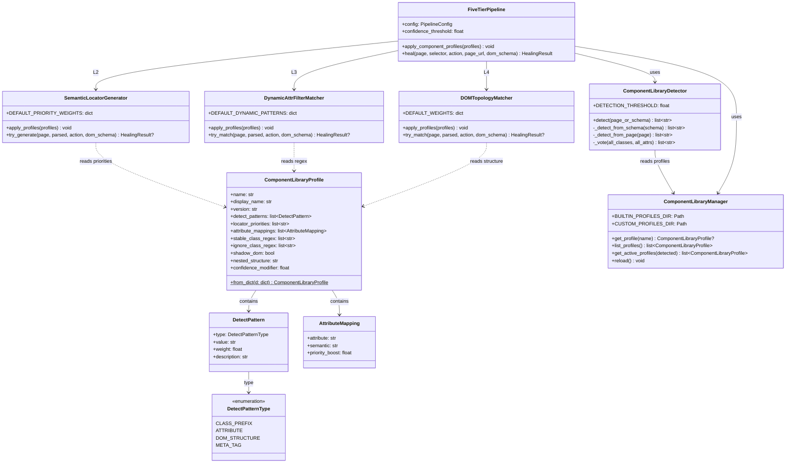

# 智能自愈测试框架设计方案 v4（保留 healer 核心 + 自研五层引擎 + 组件库感知 + 扩展壳）

## TL;DR

在 v3 五级启发式自愈引擎的基础上，新增第 7 项独创特性：**组件库感知的自适应定位策略系统**。该系统通过组件库配置档案定义推荐定位优先级、识别特征与属性映射，自动识别当前页面使用的 UI 组件库（Ant Design / Element UI / Material UI / 自研组件库），并据此动态调整五层引擎的策略优先级与过滤规则。通用组件库档案内置，自研组件库档案由用户通过 JSON 配置文件自定义。此特性使自愈管线从"通用规则驱动"进化为"业务组件感知驱动"，显著提升自研组件库场景下的修复命中率。

---

## 1. 架构总览

```mermaid
graph TB
    subgraph 录制生成的PO代码
        RP[raw Playwright API<br/>page.get_by_role/get_by_text]
    end

    subgraph 全局错误捕获层 — 自研
        MP[MonkeyPatchPage]
        HL[HealingLocator]
        LAE[LocatorActionError]
    end

    subgraph 错误采集与策略决策
        CONF[conftest.py]
        FC[FailureClassifier]
        SDE[StrategyDecisionEngine]
        RE[RepairExecutor]
    end

    subgraph 组件库感知层 — 自研独创
        CLD[ComponentLibraryDetector<br/>自动识别组件库]
        CLP[ComponentLibraryProfile<br/>配置档案系统]
        CLM[ComponentLibraryManager<br/>档案缓存+分发]
    end

    subgraph 自研五级启发式自愈执行流水线
        L1[一级：历史缓存优先匹配<br/>CacheFirstMatcher]
        L2[二级：语义定位自动生成<br/>SemanticLocatorGenerator]
        L3[三级：动态属性过滤模糊匹配<br/>DynamicAttrFilterMatcher]
        L4[四级：DOM拓扑相似度匹配<br/>DOMTopologyMatcher]
        L5[五级：iframe/ShadowDOM穿透<br/>IframeShadowPatcher]
    end

    subgraph 链式选择器壳 — 自研
        CHP[ChainHealingPipeline<br/>拆链→五层引擎→组链]
    end

    subgraph 底层资源共享 — 复用 healer 算法
        HH[playwright-healer<br/>HeuristicHealer/DOMMatcher]
    end

    subgraph AI兜底层 — 自研控制策略
        AFB[AIFallbackHealer]
    end

    subgraph 公司AI平台
        OAI[glm-5.1]
    end

    subgraph 源码回写 — 自研
        SP[SourcePatcher]
    end

    subgraph DOM Schema — 录制时自动抓取
        DSNAP[DomSchemaSnapshot]
    end

    RP -->|调用| MP
    MP -->|返回| HL
    HL -->|失败时| LAE
    LAE -->|写入report| CONF
    CONF -->|分类| FC
    FC -->|决策| SDE
    SDE -->|执行| RE
    RE -->|读取档案| CLM
    CLM -->|检测组件库| CLD
    CLD -->|加载档案| CLP
    CLP -->|调整优先级| L2
    CLP -->|调整过滤规则| L3
    CLP -->|调整拓扑权重| L4
    RE -->|调用| CHP
    CHP -->|base_selector| L1
    L1 -->|未命中| L2
    L2 -->|未命中| L3
    L3 -->|未命中| L4
    L4 -->|未命中| L5
    L5 -->|全部失败| AFB
    L2 -.->|复用| HH
    L3 -.->|复用| HH
    L4 -.->|复用| HH
    AFB -->|请求| OAI
    RE -->|成功则回写| SP
    SP -.->|参考| DSNAP
    DSNAP -.->|记录组件库| CLD
```

---

## 2. 组件库感知的自适应定位策略系统 — 新增独创特性

> 用户原话："因为现在前端很多公司是自研的组件，对不同的组件形成推荐的元素定位方式，包含通用和自研的配置"

### 2.1 核心概念

**痛点**：通用自愈规则（如 data-testid 优先、CSS class 过滤动态哈希）对自研组件库效果打折——

| 问题 | Ant Design | 自研组件库 xxx |
|------|-----------|---------------|
| 稳定属性 | `data-testid`, `aria-label` 较完善 | 可能有 `data-field`, `data-cid` 等自定义属性 |
| class 特征 | `.ant-btn`, `.ant-input` 前缀明确 | `xxx-btn-primary`, `xxx-input-search` 自定义前缀 |
| 动态 class | `css-xxxxx` (emotion) | `xxx-[hash6]` (自研样式方案) |
| DOM 结构 | 标准的 Ant 嵌套模式 | 可能多层 div 包裹（deep_wrapper） |
| Shadow DOM | 不常用 | 自研组件可能大量封装 |

**方案**：引入组件库配置档案（ComponentLibraryProfile），定义每种组件库的推荐定位策略优先级、识别特征、特殊属性映射和过滤规则。自愈引擎根据识别到的组件库动态调整行为。

### 2.2 数据结构 — ComponentLibraryProfile

**文件**：`self_healing/component_profile.py`

```python
from dataclasses import dataclass, field
from typing import Optional
from enum import Enum


class DetectPatternType(str, Enum):
    """组件库识别模式类型"""
    CLASS_PREFIX = "class_prefix"       # CSS class 前缀匹配
    ATTRIBUTE = "attribute"             # 属性存在性检测
    DOM_STRUCTURE = "dom_structure"     # 特定 DOM 结构特征
    META_TAG = "meta_tag"              # <meta> 标签检测


@dataclass
class DetectPattern:
    """组件库识别模式"""
    type: DetectPatternType
    value: str                           # 匹配值
    weight: float = 1.0                  # 权重（多模式投票制）
    description: str = ""


@dataclass
class AttributeMapping:
    """属性映射：自定义属性 → 语义说明"""
    attribute: str                       # 属性名，如 "data-field"
    semantic: str                        # 语义说明，如 "业务字段名"
    priority_boost: float = 0.0          # 使用该属性时的优先级提升


@dataclass
class ComponentLibraryProfile:
    """组件库配置档案

    独创点（全部自研）：
    - 定义推荐定位策略优先级链（覆盖通用默认值）
    - 定义识别特征模式（支持多模式加权投票检测）
    - 定义特殊属性映射和数据属性语义
    - 定义稳定/动态 class 的正则规则（覆盖通用规则）
    - 定义嵌套结构特征（影响拓扑匹配权重）
    - 支持 Shadow DOM 开关
    """
    name: str                                    # 档案名，如 "ant_design", "custom_lib_xxx"
    display_name: str = ""                       # 显示名
    version: str = ""                            # 适用的组件库版本

    # ── 识别特征 ──
    detect_patterns: list[DetectPattern] = field(default_factory=list)

    # ── 推荐定位策略优先级链 ──
    # 覆盖二级语义定位生成器的默认 PRIORITY_WEIGHTS
    locator_priorities: list[str] = field(default_factory=lambda: [
        "data-testid", "aria-label", "role+name", "css_stable", "text"
    ])

    # ── 特殊属性映射 ──
    attribute_mappings: list[AttributeMapping] = field(default_factory=list)

    # ── 稳定 class 正则（优先匹配，不会被过滤）──
    stable_class_regex: list[str] = field(default_factory=list)

    # ── 动态 class 正则（会被三级过滤掉）──
    # 覆盖三级 DynamicAttrFilterMatcher 的通用 DYNAMIC_PATTERNS
    ignore_class_regex: list[str] = field(default_factory=list)

    # ── DOM 嵌套特征 ──
    # 影响四级 DOMTopologyMatcher 的权重系数
    shadow_dom: bool = False               # 是否常见 Shadow DOM
    nested_structure: str = "standard"     # standard / deep_wrapper / flat

    # ── 自定义置信度系数 ──
    confidence_modifier: float = 1.0       # 全局置信度修正系数

    @staticmethod
    def from_dict(d: dict) -> "ComponentLibraryProfile":
        """从 JSON dict 构建 Profile"""
        detect_patterns = [
            DetectPattern(
                type=DetectPatternType(p.get("type", "class_prefix")),
                value=p.get("value", ""),
                weight=p.get("weight", 1.0),
                description=p.get("description", ""),
            )
            for p in d.get("detect_patterns", [])
        ]
        attribute_mappings = [
            AttributeMapping(
                attribute=m.get("attribute", ""),
                semantic=m.get("semantic", ""),
                priority_boost=m.get("priority_boost", 0.0),
            )
            for m in d.get("attribute_mappings", [])
        ]
        return ComponentLibraryProfile(
            name=d.get("name", ""),
            display_name=d.get("display_name", ""),
            version=d.get("version", ""),
            detect_patterns=detect_patterns,
            locator_priorities=d.get("locator_priorities", [
                "data-testid", "aria-label", "role+name", "css_stable", "text"
            ]),
            attribute_mappings=attribute_mappings,
            stable_class_regex=d.get("stable_class_regex", []),
            ignore_class_regex=d.get("ignore_class_regex", []),
            shadow_dom=d.get("shadow_dom", False),
            nested_structure=d.get("nested_structure", "standard"),
            confidence_modifier=d.get("confidence_modifier", 1.0),
        )
```

### 2.3 内置组件库档案

**文件**：`self_healing/profiles/ant_design.json`

```json
{
  "name": "ant_design",
  "display_name": "Ant Design",
  "version": "4.x/5.x",
  "detect_patterns": [
    {"type": "class_prefix", "value": "ant-", "weight": 1.0, "description": "Ant Design CSS class 前缀"},
    {"type": "attribute", "value": "data-rc-order", "weight": 0.5, "description": "Ant Design 5.x 动态样式标记"}
  ],
  "locator_priorities": [
    "data-testid",
    "aria-label",
    "role+name",
    "ant_component_role",
    "css_stable",
    "text"
  ],
  "attribute_mappings": [
    {"attribute": "data-testid", "semantic": "测试标识", "priority_boost": 0.0},
    {"attribute": "aria-label", "semantic": "无障碍标签", "priority_boost": 0.0}
  ],
  "stable_class_regex": [
    "ant-btn(-[a-z]+)*",
    "ant-input(-[a-z]+)*",
    "ant-select(-[a-z]+)*",
    "ant-form-item(-[a-z]+)*",
    "ant-table(-[a-z]+)*",
    "ant-modal(-[a-z]+)*"
  ],
  "ignore_class_regex": [
    "css-[a-z0-9]+",
    "ant-[a-z]+-[a-f0-9]{6,}"
  ],
  "shadow_dom": false,
  "nested_structure": "standard",
  "confidence_modifier": 1.0
}
```

**文件**：`self_healing/profiles/element_ui.json`

```json
{
  "name": "element_ui",
  "display_name": "Element Plus / Element UI",
  "version": "2.x/3.x",
  "detect_patterns": [
    {"type": "class_prefix", "value": "el-", "weight": 1.0, "description": "Element UI CSS class 前缀"}
  ],
  "locator_priorities": [
    "data-testid",
    "aria-label",
    "role+name",
    "el_component_role",
    "css_stable",
    "text"
  ],
  "stable_class_regex": [
    "el-button(-[a-z]+)*",
    "el-input(-[a-z]+)*",
    "el-select(-[a-z]+)*",
    "el-form-item(-[a-z]+)*",
    "el-table(-[a-z]+)*"
  ],
  "ignore_class_regex": [],
  "shadow_dom": false,
  "nested_structure": "standard",
  "confidence_modifier": 1.0
}
```

**文件**：`self_healing/profiles/material_ui.json`

```json
{
  "name": "material_ui",
  "display_name": "Material UI (MUI)",
  "version": "5.x",
  "detect_patterns": [
    {"type": "class_prefix", "value": "Mui", "weight": 1.0, "description": "MUI CSS class 前缀"},
    {"type": "attribute", "value": "data-mui-", "weight": 0.8, "description": "MUI data 属性标记"}
  ],
  "locator_priorities": [
    "data-testid",
    "aria-label",
    "role+name",
    "mui_component_role",
    "css_stable",
    "text"
  ],
  "stable_class_regex": [
    "MuiButton-[a-zA-Z]+",
    "MuiInputBase-[a-zA-Z]+",
    "MuiSelect-[a-zA-Z]+"
  ],
  "ignore_class_regex": [
    "MuiButton-root-[a-zA-Z0-9]+",
    "css-[a-z0-9]+"
  ],
  "shadow_dom": false,
  "nested_structure": "deep_wrapper",
  "confidence_modifier": 0.95
}
```

### 2.4 自研组件库配置示例

**文件**：`self_healing/profiles/custom_lib_example.json`（用户自定义，可选覆盖）

```json
{
  "name": "custom_lib_xxx",
  "display_name": "XXX自研组件库",
  "version": "1.x",
  "detect_patterns": [
    {"type": "class_prefix", "value": "xxx-", "weight": 1.0},
    {"type": "attribute", "value": "data-field", "weight": 0.8},
    {"type": "attribute", "value": "data-component", "weight": 0.6}
  ],
  "locator_priorities": [
    "data-field",
    "data-testid",
    "aria-label",
    "role+name",
    "css_stable",
    "text"
  ],
  "attribute_mappings": [
    {"attribute": "data-field", "semantic": "业务字段名", "priority_boost": 0.15},
    {"attribute": "data-component", "semantic": "组件类型", "priority_boost": 0.10}
  ],
  "stable_class_regex": [
    "xxx-btn-[a-z]+",
    "xxx-input-[a-z]+",
    "xxx-form-[a-z]+",
    "xxx-table-[a-z]+"
  ],
  "ignore_class_regex": [
    "xxx-[a-f0-9]{6,}"
  ],
  "shadow_dom": true,
  "nested_structure": "deep_wrapper",
  "confidence_modifier": 0.90
}
```

关键设计点：
- `data-field` 被提到 `locator_priorities` 最前面，意味着检测到此组件库时，会优先用 `data-field` 属性定位
- `priority_boost: 0.15` 意味着用 `data-field` 成功定位时置信度额外提升 15%
- `ignore_class_regex` 中 `xxx-[a-f0-9]{6,}` 覆盖了该组件库的哈希 class
- `shadow_dom: true` 告知五级引擎此组件库常见 Shadow DOM 封装
- `nested_structure: "deep_wrapper"` 告知四级引擎调整拓扑权重（深度包裹结构下 parent_chain 权重降低、sibling 权重提升）

### 2.5 组件库自动识别 — ComponentLibraryDetector

**独创性**：多模式加权投票自动识别，支持混合组件库场景。

**文件**：`self_healing/component_detector.py`

```python
import re
from typing import Optional


class ComponentLibraryDetector:
    """组件库自动识别器

    独创点（全部自研）：
    - 多模式加权投票机制：同时运行 class_prefix / attribute / dom_structure / meta_tag 四种探测
    - 每种模式命中则累加对应 weight，总分超过阈值（默认 0.6）即判定为该组件库
    - 支持混合组件库：一个页面可能同时使用 Ant Design + 自研组件库
    - DOM Schema 可用于离线检测（无需实时打开浏览器）
    - 检测结果缓存到 DOM Schema JSON 的 component_libraries 字段
    """

    DETECTION_THRESHOLD = 0.6

    async def detect(self, page_or_schema) -> list[str]:
        """检测当前页面使用的组件库

        Args:
            page_or_schema: async Page 对象 或 DOM Schema dict

        Returns:
            识别到的组件库名称列表（可能为空或多个）
        """
        if isinstance(page_or_schema, dict):
            return self._detect_from_schema(page_or_schema)
        return await self._detect_from_page(page_or_schema)

    def _detect_from_schema(self, schema: dict) -> list[str]:
        """从 DOM Schema JSON 中离线识别组件库"""
        # 如果 schema 已记录了检测结果，直接返回
        cached = schema.get("component_libraries", [])
        if cached:
            return cached

        # 收集所有 class 和 attribute 用于投票
        all_classes = []
        all_attrs = set()
        for node in schema.get("nodes", []):
            all_classes.extend(node.get("classes_stable", []))
            all_classes.extend(node.get("classes_dynamic", []))
            for attr_name in node.get("attributes", {}):
                all_attrs.add(attr_name)

        return self._vote(all_classes, all_attrs)

    async def _detect_from_page(self, page) -> list[str]:
        """从实时页面上识别组件库"""
        js_code = """() => {
            const classes = new Set();
            const attrs = new Set();
            document.querySelectorAll('*').forEach(el => {
                for (const cls of el.classList || []) {
                    classes.add(cls);
                }
                for (const attr of el.attributes) {
                    attrs.add(attr.name);
                }
            });
            return {
                classes: Array.from(classes),
                attributes: Array.from(attrs)
            };
        }"""
        try:
            result = await page.evaluate(js_code)
            return self._vote(result.get("classes", []), result.get("attributes", []))
        except Exception:
            return []

    def _vote(self, all_classes: list, all_attrs: list | set) -> list[str]:
        """加权投票识别组件库"""
        from self_healing.component_profile import ComponentLibraryProfile

        # 加载所有可用的 Profile
        profiles = ComponentLibraryManager().list_profiles()
        results = {}

        for profile in profiles:
            score = 0.0
            for pattern in profile.detect_patterns:
                if pattern.type == "class_prefix":
                    # 检查是否有 class 以该前缀开头
                    matching = [c for c in all_classes if c.startswith(pattern.value)]
                    if matching:
                        score += pattern.weight * min(len(matching) / 5.0, 1.0)
                elif pattern.type == "attribute":
                    if pattern.value in all_attrs:
                        score += pattern.weight
                elif pattern.type == "meta_tag":
                    # 特殊处理 meta 标签检测
                    pass  # 需要 page 级别检测，暂略

            if score >= self.DECTION_THRESHOLD:
                results[profile.name] = score

        # 按得分排序返回
        return sorted(results.keys(), key=lambda x: -results[x])
```

### 2.6 档案管理器 — ComponentLibraryManager

**文件**：`self_healing/component_manager.py`

```python
import json
from pathlib import Path
from typing import Optional


class ComponentLibraryManager:
    """组件库档案管理器

    职责：
    - 加载内置档案（self_healing/profiles/ 目录下的 JSON 文件）
    - 加载用户自定义档案（config/component_profiles/ 目录）
    - 缓存已加载的 Profile 实例
    - 提供按名称检索 Profile 能力
    - 档案合并：用户自定义同名档案可覆盖内置档案
    """

    BUILTIN_PROFILES_DIR = Path(__file__).parent / "profiles"
    CUSTOM_PROFILES_DIR = Path("config/component_profiles")

    _instance: Optional["ComponentLibraryManager"] = None
    _profiles: dict[str, "ComponentLibraryProfile"] = {}

    def __new__(cls):
        if cls._instance is None:
            cls._instance = super().__new__(cls)
            cls._instance._load_all()
        return cls._instance

    def _load_all(self):
        """加载所有档案：先内置，再自定义（覆盖同名）"""
        from self_healing.component_profile import ComponentLibraryProfile

        # 内置档案
        if self.BUILTIN_PROFILES_DIR.exists():
            for f in self.BUILTIN_PROFILES_DIR.glob("*.json"):
                try:
                    d = json.loads(f.read_text(encoding="utf-8"))
                    profile = ComponentLibraryProfile.from_dict(d)
                    self._profiles[profile.name] = profile
                except Exception:
                    pass

        # 用户自定义档案（覆盖同名内置）
        if self.CUSTOM_PROFILES_DIR.exists():
            for f in self.CUSTOM_PROFILES_DIR.glob("*.json"):
                try:
                    d = json.loads(f.read_text(encoding="utf-8"))
                    profile = ComponentLibraryProfile.from_dict(d)
                    self._profiles[profile.name] = profile
                except Exception:
                    pass

    def get_profile(self, name: str) -> Optional["ComponentLibraryProfile"]:
        """按名称获取组件库档案"""
        return self._profiles.get(name)

    def list_profiles(self) -> list["ComponentLibraryProfile"]:
        """列表所有可用档案"""
        return list(self._profiles.values())

    def get_active_profiles(self, detected_libraries: list[str]) -> list["ComponentLibraryProfile"]:
        """获取当前页面激活的档案列表"""
        return [self._profiles[name] for name in detected_libraries if name in self._profiles]

    def reload(self):
        """重新加载所有档案（热更新用）"""
        self._profiles.clear()
        self._load_all()
```

### 2.7 与五层引擎的联动

#### 2.7.1 二级语义定位 — 策略优先级动态调整

**文件**：修改 `self_healing/semantic_generator.py`

```python
class SemanticLocatorGenerator:
    """二级：语义定位自动生成

    v4 变更：支持组件库感知的动态优先级调整
    """

    # 通用默认优先级权重
    DEFAULT_PRIORITY_WEIGHTS = {
        "testid": 1.0,
        "role":   0.9,
        "label":  0.85,
        "text":   0.75,
    }

    # 组件库特定的优先级权重（运行时动态生成）
    _active_weights: dict = {}

    def apply_profiles(self, profiles: list[ComponentLibraryProfile]):
        """根据识别到的组件库档案动态调整优先级链

        策略：
        1. 从第一个 profile 的 locator_priorities 构建 priority→weight 映射
        2. 如果有 attribute_mappings 且 priority_boost > 0，提升对应策略的权重
        3. 多个 profile 时，取并集，冲突取最高 boost
        """
        weights = dict(self.DEFAULT_PRIORITY_WEIGHTS)

        for profile in profiles:
            # 按 locator_priorities 列表顺序重新分配权重
            for i, priority_key in enumerate(profile.locator_priorities):
                # 越靠前权重越高，按 1.0 - 0.05 × index 计算
                base_weight = max(1.0 - 0.05 * i, 0.7)
                weights[priority_key] = max(weights.get(priority_key, 0), base_weight)

            # 应用 attribute_mappings 的 priority_boost
            for mapping in profile.attribute_mappings:
                attr_key = mapping.attribute  # 如 "data-field"
                if attr_key not in weights:
                    weights[attr_key] = weights.get("testid", 1.0) + mapping.priority_boost
                else:
                    weights[attr_key] += mapping.priority_boost

        # 归一化到 [0.7, 1.0]
        max_w = max(weights.values()) if weights else 1.0
        self._active_weights = {k: v / max_w for k, v in weights.items()}

    async def try_generate(self, page, parsed, action, dom_schema=None):
        """按动态优先级链生成语义定位器候选"""
        weights = self._active_weights or self.DEFAULT_PRIORITY_WEIGHTS
        candidates = self._generate_candidates(parsed, page, dom_schema, weights)
        # ... 后续逻辑不变，但使用动态 weights 替代硬编码的 PRIORITY_WEIGHTS
```

#### 2.7.2 三级动态属性过滤 — 组件库特定过滤规则

**文件**：修改 `self_healing/dynamic_filter_matcher.py`

```python
class DynamicAttrFilterMatcher:
    """三级：动态属性过滤模糊匹配

    v4 变更：支持组件库特定的 ignore_class_regex 和 stable_class_regex
    """

    # 通用动态属性过滤规则库
    DEFAULT_DYNAMIC_PATTERNS = { ... }  # 与 v3 相同

    # 当前生效的过滤规则（运行时动态生成）
    _active_ignore_patterns: list[re.Pattern] = []
    _active_stable_patterns: list[re.Pattern] = []

    def apply_profiles(self, profiles: list[ComponentLibraryProfile]):
        """根据组件库档案动态调整过滤规则

        策略：
        - 合并所有 profile 的 ignore_class_regex 到屏蔽列表
        - 合并所有 profile 的 stable_class_regex 到优先保留列表
        - 通用规则与组件库规则取并集
        """
        ignore_patterns = []
        stable_patterns = []

        # 先加载通用规则
        for p in self.DEFAULT_DYNAMIC_PATTERNS.values():
            if isinstance(p, re.Pattern):
                ignore_patterns.append(p)

        # 再叠加组件库特定规则
        for profile in profiles:
            for regex_str in profile.ignore_class_regex:
                try:
                    ignore_patterns.append(re.compile(regex_str))
                except re.error:
                    pass
            for regex_str in profile.stable_class_regex:
                try:
                    stable_patterns.append(re.compile(regex_str))
                except re.error:
                    pass

        self._active_ignore_patterns = ignore_patterns
        self._active_stable_patterns = stable_patterns

    def _is_dynamic_class(self, cls: str) -> bool:
        """检查 class 是否为动态（应该被过滤）"""
        # 组件库 stable class 优先：如果匹配 stable 规则，则不算动态
        for p in self._active_stable_patterns:
            if p.match(cls):
                return False
        # 否则检查 ignore 规则
        for p in self._active_ignore_patterns:
            if p.match(cls):
                return True
        return False
```

#### 2.7.3 四级DOM拓扑匹配 — 嵌套结构权重调整

**文件**：修改 `self_healing/topology_matcher.py`

```python
class DOMTopologyMatcher:
    """四级：DOM拓扑相似度匹配

    v4 变更：嵌套结构特征影响权重系数
    """

    # 默认权重
    DEFAULT_WEIGHTS = {"parent": 0.4, "sibling": 0.3, "child": 0.3}

    def apply_profiles(self, profiles: list[ComponentLibraryProfile]):
        """根据嵌套结构特征调整权重

        策略：
        - deep_wrapper: parent 权重降低（多层包裹使父链不可靠），sibling 提升
        - flat: parent 权重提升（扁平结构下父标签区分度高）
        """
        self._active_weights = dict(self.DEFAULT_WEIGHTS)

        nested_types = [p.nested_structure for p in profiles]
        if "deep_wrapper" in nested_types:
            self._active_weights = {"parent": 0.25, "sibling": 0.45, "child": 0.30}
        elif "flat" in nested_types:
            self._active_weights = {"parent": 0.50, "sibling": 0.20, "child": 0.30}

    def _compare_topologies(self, target, candidate) -> float:
        """使用动态权重比较拓扑"""
        w = self._active_weights or self.DEFAULT_WEIGHTS
        # parent_match × w["parent"] + sibling_match × w["sibling"] + child × w["child"]
        ...
```

### 2.8 与 DOM Schema 的联动

**文件**：修改 `recorder/dom_schema_capture.py`

DOM Schema JSON 结构新增 `component_libraries` 字段：

```json
{
  "url": "https://xxx.cai-inc.com/detail/create",
  "timestamp": "2025-01-15T10:30:00",
  "title": "创建需求",
  "component_libraries": ["ant_design", "custom_lib_xxx"],
  "nodes": [
    {
      "tag": "input",
      "role": "textbox",
      "accessible_name": "需求单名称",
      "test_id": "demand-name-input",
      "custom_attributes": {
        "data-field": "demandName",
        "data-component": "XxxInput"
      },
      ...
    }
  ],
  ...
}
```

录制时自动识别组件库并记录到 DOM Schema：

```python
async def capture_dom_schema(page) -> dict:
    """从当前页面上提取 DOM Schema（v4 增加组件库检测）"""
    schema = await page.evaluate(DOM_SNAPSHOT_JS)

    # v4 新增：检测组件库
    detector = ComponentLibraryDetector()
    detected = await detector.detect(page)
    schema["component_libraries"] = detected

    # v4 新增：提取自定义属性（来自识别到的组件库档案）
    if detected:
        manager = ComponentLibraryManager()
        profiles = manager.get_active_profiles(detected)
        custom_attrs = set()
        for p in profiles:
            for m in p.attribute_mappings:
                custom_attrs.add(m.attribute)
        if custom_attrs:
            # 重新扫描 DOM，提取自定义属性值
            schema = await _enrich_with_custom_attrs(page, schema, custom_attrs)

    return schema
```

### 2.9 与 PO 映射的联动

PO 扫描器（当实现后）在扫描页面元素时，除了记录 selector/action/description 外，还需记录 `component_library` 字段：

```json
{
  "page": "CreateDemandPage",
  "selectors": [
    {
      "name": "demand_name_input",
      "selector": "get_by_role('textbox', name='需求单名称')",
      "action": "fill",
      "component_library": "ant_design",
      "custom_attributes": {"data-field": "demandName"}
    }
  ]
}
```

这将使未来扩展（如基于 PO 选择器反向查询推荐定位策略）成为可能。

---

## 3. 五级启发式自愈执行流水线（完整）

与 v3 设计一致，此处仅标注 v4 新增的组件库感知接口：

```python
class FiveTierPipeline:
    """自研五级启发式自愈执行流水线

    v4 变更：新增 apply_component_profiles() 入口，在 heal() 调用前一次性注入组件库档案
    """

    def __init__(self, config: PipelineConfig):
        self.config = config
        self.confidence_threshold = config.confidence_threshold
        self.cache_matcher = CacheFirstMatcher(config.cache_dir)
        self.semantic_generator = SemanticLocatorGenerator()
        self.dynamic_filter = DynamicAttrFilterMatcher()
        self.topology_matcher = DOMTopologyMatcher()
        self.iframe_patcher = IframeShadowPatcher()
        self._active_profiles: list[ComponentLibraryProfile] = []

    def apply_component_profiles(self, profiles: list[ComponentLibraryProfile]):
        """注入组件库档案，动态调整各层行为（v4 新增）"""
        self._active_profiles = profiles
        self.semantic_generator.apply_profiles(profiles)
        self.dynamic_filter.apply_profiles(profiles)
        self.topology_matcher.apply_profiles(profiles)

    async def heal(self, page, selector, action="", page_url="", dom_schema=None):
        parsed = parse_selector(selector)

        # v4: 如果 dom_schema 中有 component_libraries，自动注入
        if dom_schema and not self._active_profiles:
            detected = dom_schema.get("component_libraries", [])
            if detected:
                manager = ComponentLibraryManager()
                profiles = manager.get_active_profiles(detected)
                self.apply_component_profiles(profiles)

        # 后续五层逻辑不变
        result = await self.cache_matcher.try_match(parsed, page_url)
        if result and result.confidence >= self.confidence_threshold:
            return result

        result = await self.semantic_generator.try_generate(page, parsed, action, dom_schema)
        if result and result.confidence >= self.confidence_threshold:
            await self.cache_matcher.record(selector, result.healed_selector, page_url)
            return result

        # ... L3/L4/L5 同 v3
```

---

## 4. 策略引擎联动更新

在 `RepairExecutor._patch_via_healer()` 中增加组件库档案注入：

```python
def _patch_via_healer(self, params: Dict, entry: FailureEntry) -> RepairResult:
    """通过五层自愈引擎修复选择器（v4 含组件库感知）"""
    selector = params.get("selector", "")
    page_url = params.get("page_url", "")
    file_path = params.get("file", "")
    action = params.get("action", "")

    # 加载 DOM Schema
    dom_schema = self._load_dom_schema(entry)

    # v4: 从 dom_schema 提取组件库信息，注入到管线
    from self_healing.chain_pipeline import ChainHealingPipeline, PipelineConfig
    config = PipelineConfig.from_env()
    pipeline = ChainHealingPipeline(config)

    # 自动注入组件库档案
    if dom_schema:
        detected = dom_schema.get("component_libraries", [])
        if detected:
            from self_healing.component_manager import ComponentLibraryManager
            manager = ComponentLibraryManager()
            profiles = manager.get_active_profiles(detected)
            pipeline.five_tier.apply_component_profiles(profiles)

    result = run_chain_healing_sync(
        selector=selector,
        page_url=page_url,
        action=action,
        description=selector,
        dom_schema=dom_schema,
    )
    # ... 后续回写逻辑不变
```

---

## 5. .env 更新

```bash
# ========== 新增：组件库档案配置 ==========
# 用户自定义组件库档案目录（可选，默认 config/component_profiles/）
COMPONENT_PROFILES_DIR=config/component_profiles

# ========== 已有配置保持不变 ==========
OPENAI_COMPAT_BASE_URL=https://ai-platform.cai-inc.com/api/biz-ai/ai-model/api/11/compatible-mode/v1
OPENAI_COMPAT_MODEL=glm-5.1
ZCY_HEALER_API_URL=https://ai-platform.cai-inc.com/api/biz-ai/ai-model/api/11/compatible-mode/v1/chat/completions
ZCY_HEALER_MODEL=glm-5.1
ANTHROPIC_AUTH_TOKEN=sk-c05b5d35a0c542113369a7d7ba2691ee
HEAL_CONFIDENCE_THRESHOLD=0.75
HEAL_CACHE_DIR=output/heal_cache
```

---

## 6. 文件列表更新

| 相对路径 | 说明 | 状态 | 与 v3 差异 |
|---------|------|------|-----------|
| `self_healing/component_profile.py` | ComponentLibraryProfile 数据结构 | **新增** | **v3 无** |
| `self_healing/component_detector.py` | 组件库自动识别器 | **新增** | **v3 无** |
| `self_healing/component_manager.py` | 档案管理器 | **新增** | **v3 无** |
| `self_healing/profiles/ant_design.json` | Ant Design 内置档案 | **新增** | **v3 无** |
| `self_healing/profiles/element_ui.json` | Element UI 内置档案 | **新增** | **v3 无** |
| `self_healing/profiles/material_ui.json` | Material UI 内置档案 | **新增** | **v3 无** |
| `config/component_profiles/` | 用户自定义档案目录 | **新增** | **v3 无** |
| `self_healing/semantic_generator.py` | 二级语义定位 | 修改 | v4 增加 apply_profiles |
| `self_healing/dynamic_filter_matcher.py` | 三级动态属性过滤 | 修改 | v4 增加 apply_profiles |
| `self_healing/topology_matcher.py` | 四级DOM拓扑匹配 | 修改 | v4 增加 apply_profiles |
| `self_healing/pipeline.py` | 五层引擎入口 | 修改 | v4 增加 apply_component_profiles |
| `recorder/dom_schema_capture.py` | DOM Schema 抓取 | 修改 | v4 增加组件库检测+自定义属性提取 |

其余文件与 v3 一致，不再重复。

---

## 7. 数据结构更新（类图）



---

## 8. 任务分解更新

| Task ID | Task Name | Source Files | Dependencies | Priority |
|---------|-----------|-------------|-------------|----------|
| T01 | 项目基础设施 + healer 配置 + DOM抓取 + 组件库档案基础设施 | `requirements.txt`, `.env`, `self_healing/__init__.py`, `self_healing/healer_config.py`, `self_healing/selector_parser.py`, `self_healing/component_profile.py`, `self_healing/component_detector.py`, `self_healing/component_manager.py`, `self_healing/profiles/*.json`, `recorder/dom_schema_capture.py` | 无 | P0 |
| T02 | 全局错误捕获层 + chain pipeline壳 | `self_healing/monkey_patch_page.py`, `self_healing/chain_pipeline.py`, `conftest.py`, `core/locator_error.py` | T01 | P0 |
| T03 | 五层引擎核心（含组件库感知接口） | `self_healing/pipeline.py`, `self_healing/cache_matcher.py`, `self_healing/semantic_generator.py`, `self_healing/dynamic_filter_matcher.py`, `self_healing/topology_matcher.py`, `self_healing/iframe_shadow_patcher.py`, `self_healing/ai_fallback.py` | T01 | P0 |
| T04 | 源码回写 + 录制器适配 + 策略引擎联动 | `self_healing/source_patcher.py`, `recorder/script_transformer.py`, `scheduler/strategy.py`, `output/modules/*/po/base_page.py` | T02, T03 | P1 |
| T05 | conftest集成 + DOM抓取集成(含组件库检测) + 端到端验证 | `conftest.py`, `recorder/dom_schema_capture.py`, 集成测试 | T02, T03, T04 | P1 |

任务依赖图同 v3，此处省略。

---

## 9. 共享知识/跨文件约定更新

在 v3 基础上新增：

```
- 组件库档案目录: self_healing/profiles/(内置), config/component_profiles/(用户自定义)
- DOM Schema JSON 新增 component_libraries 字段和 custom_attributes 子字段
- 五层引擎通过 apply_component_profiles() 接口接受组件库档案，运行时动态调整行为
- 自定义档案同名覆盖内置档案（用户优先）
- 组件库检测阈值 DETECTION_THRESHOLD = 0.6，即至少 60% 投票权重才判定
- 支持混合组件库场景（返回多个 profile），按投票得分排序
- locator_priorities 中的自定义键（如 data-field）在 SemanticLocatorGenerator 中自动映射为 locator 方法
```

---

## 10. 待明确事项（在 v3 基础上新增）

8. **组件库检测准确性**：纯 class_prefix 检测在某些混淆/压缩场景下可能失效（如 `ant-btn` 被压缩为 `a-b`）。建议增加更稳健的检测维度（如特定的 DOM 结构特征节点）。

9. **混合组件库优先级冲突**：当页面同时使用 Ant Design 和自研组件库时，两者的 `locator_priorities` 可能冲突（如 Ant 说 aria-label 优先，自研说 data-field 优先）。当前策略是按投票得分排序取最高分的 profile 优先，但复杂的混合场景需要用户手动调整自定义档案的 `confidence_modifier`。

10. **自定义档案热更新**：`ComponentLibraryManager` 单例模式在首次加载后缓存 profiles。修改自定义档案后需调用 `reload()` 或重启 pytest session 才能生效。
