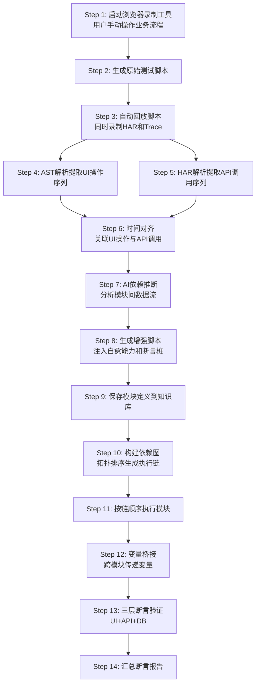

# 技术交底书

**案件名称**：一种基于AI推断的端到端自动化测试生成编排与多层验证方法及系统

**技术联系人**：
- 姓名：待填写
- 电话：待填写
- 邮箱：待填写

**专利类型**：发明

---

## 注意事项

（1）交底书应使代理人能看懂，尤其是背景技术和详细技术方案，一定要写得全面、清楚、完整；
（2）技术的公开程度，应以本领域普通技术人员不需付出创造性劳动即可进行实施为准。
（3）在与代理人沟通时，对于代理人咨询的技术问题，应给予回答并认真讲解，并且按要求及时正确地补充相应技术材料。

---

## 一、介绍相关技术背景，描述与本发明技术最相近的现有技术，并说明该现有技术存在的缺点

### 1.1 现有技术

检索说明：在**国家知识产权局专利公布公告系统**及 **Google Patents** 中，以"自动化测试录制""AI测试编排""跨模块依赖推断""多层断言验证"等为检索词进行检索；部分条目的公开文本与著录项以 Google Patents 页面复核。

#### 方向一：AI驱动的自动化测试脚本生成

**（1）US10204035B2 — Systems, methods and devices for AI-driven automatic test generation（Appvance Inc.）**

该专利提出基于主密钥文件（master key file）自动生成测试脚本的方法。主密钥文件包含客户端对被测应用的所有可能交互请求，系统基于该文件和可选的用户日志自动生成可执行测试脚本。

来源链接：https://patents.justia.com/patent/10204035

局限性：依赖预构建的完整交互脚本库（master key file），需要事先穷举所有可能的交互，无法从实际用户操作中动态录制和捕获数据；不涉及UI操作与API数据的关联分析，也不支持跨模块的自动编排。

**（2）US20190384699A1 — AI Software Testing System and Method（Appdiff Inc.）**

该专利提出使用机器学习从应用UI中提取特征，分类屏幕类型和屏幕元素，通过Q-learning学习应用状态图并导航执行测试序列。系统可跨应用、跨平台复用分类器。

来源链接：https://uspto.report/patent/app/20190384699

局限性：聚焦于UI层的状态机遍历测试，通过ML分类屏幕和Q-learning导航，但完全不涉及API层的数据捕获与分析，无法验证后端接口和数据库状态；也未涉及跨模块的依赖推断和变量传递。

**（3）CN121958130A — 一种基于知识增强大模型的业务测试用例自动生成方法（信华信技术股份有限公司等）**

该专利提出通过构建业务知识体系（文档解析、图谱构建）、对设计文档进行流程解析和逻辑重构、对大模型进行增量预训练和指令微调，从而生成贴合业务逻辑的测试用例。

来源链接：https://patents.google.com/patent/CN121958130A/zh

局限性：面向测试用例文本的生成（如测试步骤描述），属于用例设计层面的AI辅助，不涉及UI操作录制、API数据捕获、自动化脚本执行和跨模块编排。

#### 方向二：录制回放与RPA驱动的自动化测试

**（4）CN113886262A — 软件自动化测试方法、装置、计算机设备和存储介质（平安不动产有限公司）**

该专利提出基于RPA（机器人流程自动化）测试执行脚本执行软件测试，在执行过程中根据测试场景调用对应的人工智能组件（如OCR识别、智能比对等），辅助模拟人工测试过程。

来源链接：https://patentimages.storage.googleapis.com/d3/10/9c/d777bb5eeda052/CN113886262A.pdf

局限性：依赖预设的RPA脚本库，需要人工预先编写和维护测试执行脚本；不涉及从录制到编排的自动化链路，也不支持跨模块依赖推断和动态变量传递。

#### 方向三：多层验证与数据驱动测试

**（5）CN111026645B — 用户界面自动化测试方法、装置、存储介质及电子设备（航天信息股份有限公司）**

该专利提出在UI自动化测试中，将服务端返回的应答报文解析得到响应字段数据，同时获取UI显示的元素字段数据，将二者分别与预设期望字段数据进行一致性比对，根据比对结果确定测试异常来源（客户端或服务端）。

来源链接：https://patents.google.com/patent/CN111026645B/zh

局限性：仅做UI显示数据和服务端响应数据的两层比对，不涉及数据库层的验证；比对方式为静态期望值对比，不支持动态变量的模板注入和跨模块变量传递；也不涉及测试用例的自动生成和编排。

**（6）US07664989B2 — Automated software testing architecture using a multi-level framework（Infosys Technologies Limited）**

该专利提出三级测试框架：第一级定义测试页面，第二级定义测试用例，第三级定义测试数据，通过中间实体数据源在不同测试阶段之间传递状态。

来源链接：https://patexia.com/us/patent/07664989

局限性：采用静态数据驱动方式，测试页面、用例和数据均需人工预定义；中间实体的传递为固定数据映射，不支持AI驱动的动态依赖推断；框架侧重测试组织架构，不涉及录制、断言和自愈能力。

#### 现有技术总结与本发明的本质区别

现有技术在自动化测试领域各有侧重：方向一侧重AI生成测试脚本但不涉及录制与API关联；方向二侧重RPA执行但不支持自动编排；方向三侧重多层验证但缺乏全链路自动化能力。**本发明与上述现有技术的本质区别在于**：提出了一种从"两步录制（UI+API时间对齐）→ AI依赖推断与拓扑编排 → UI/API/DB三层联动验证"的端到端闭环方法，将测试生成、编排和验证三个阶段有机结合，并通过前端知识增强和变量桥接机制实现了跨模块的自动化测试链执行。

### 1.2 现有技术存在的缺点

综合以上分析，现有技术存在以下核心缺点：

**缺点一：UI操作与API数据的信息割裂**

现有录制工具（如Selenium IDE、Playwright codegen）只能录制UI操作序列，无法同时捕获后端API请求和响应数据；而抓包工具（如Charles、Fiddler）只能捕获API数据，无法关联具体的UI操作步骤。二者之间存在信息割裂，测试人员需要手动对照时间戳关联UI操作和API调用，效率低下且容易出错。

**缺点二：跨模块测试编排依赖人工定义**

复杂业务流程（如采购需求的创建→审核→确认）涉及多个测试模块的顺序执行和变量传递。现有测试框架（如Pytest fixture、TestNG依赖）需要人工声明模块间依赖关系和变量映射，当模块数量增加时维护成本急剧上升。

**缺点三：验证维度单一，无法同时覆盖多层**

传统UI自动化测试通常只验证界面表现（元素是否可见、文本是否正确），无法同时验证后端API返回数据和数据库存储状态。部分方案（如CN111026645B）做到了UI+响应两层比对，但缺乏数据库层的验证能力，且无法处理数据库不可达的降级场景。

---

## 二、针对上述缺点，说明本发明所要解决的技术问题

针对缺点一，本发明所要解决的技术问题是：如何实现UI操作录制与API数据捕获的时间对齐关联，使测试系统能够自动建立"用户操作→接口调用→数据产出"的完整映射关系。

针对缺点二，本发明所要解决的技术问题是：如何通过AI自动分析模块间API数据流，推断跨模块的依赖关系和变量映射，并通过拓扑排序自动编排执行链路。

针对缺点三，本发明所要解决的技术问题是：如何在单一测试执行过程中同时进行UI层、API层和DB层的联动断言验证，并支持DB层不可达时的优雅降级。

---

## 三、本发明技术方案的详细阐述

### 3.1 背景

在Web应用自动化测试场景中，测试人员需要对业务流程进行端到端验证。一个典型的业务流程（如"创建采购需求→审核→确认"）涉及多个页面的UI操作、多个后端API接口调用以及数据库中的数据变更。本发明提出一种基于AI推断的端到端自动化测试方法，通过两步录制法实现UI操作与API数据的自动关联，通过AI依赖推断实现跨模块测试链的自动编排，并通过三层断言引擎实现多维度的联动验证。

### 3.2 系统框图

```mermaid
flowchart TB
  subgraph user_layer["用户交互层"]
    CLI["命令行接口<br/>record/run/compose"]
  end

  subgraph engine_layer["智慧编排引擎"]
    REC["两步录制器"]
    AST_PARSER["AST解析器"]
    HAR_PARSER["HAR解析器"]
    AI_INF["AI依赖推断器"]
    GRAPH["依赖图引擎"]
    COMP["执行计划编排器"]
    VAR["变量桥接器"]
  end

  subgraph assert_layer["三层断言引擎"]
    UI_A["UI层断言"]
    API_A["API层断言"]
    DB_A["DB层断言"]
    RPT["报告生成器"]
  end

  subgraph knowledge_layer["知识管理层"]
    MOD_DEF["模块定义存储"]
    DEP_GRAPH["依赖图存储"]
    FE_DOC["前端知识文档"]
  end

  REC --> AST_PARSER
  REC --> HAR_PARSER
  AST_PARSER --> AI_INF
  HAR_PARSER --> AI_INF
  FE_DOC --> AI_INF
  AI_INF --> GRAPH
  GRAPH --> COMP
  COMP --> VAR
  VAR --> UI_A
  VAR --> API_A
  VAR --> DB_A
  UI_A --> RPT
  API_A --> RPT
  DB_A --> RPT
  AI_INF --> MOD_DEF
  AI_INF --> DEP_GRAPH
```

### 3.3 模块功能说明

**两步录制器**：负责编排两步录制流程。Step 1调用浏览器录制工具（如Playwright codegen）录制用户的UI操作，生成原始测试脚本；Step 2自动回放该脚本，同时在浏览器上下文中注入HAR录制和Trace追踪，捕获完整的API请求/响应数据和DOM快照。两步录制法的核心价值在于将UI操作（来自Step 1）和API数据（来自Step 2）通过时间戳自动对齐。

**AST解析器**：通过抽象语法树（AST）分析原始测试脚本，提取结构化的UI操作序列。与简单的正则匹配不同，AST解析能够准确识别链式调用（如`page.get_by_role('button', name='提交').click()`），提取选择器类型（role/text/css等）、操作动作（click/fill/select等）和操作值，并支持多层嵌套调用链的解包。

**HAR解析器**：解析HAR（HTTP Archive）格式的标准JSON文件，提取API调用序列。支持URL模式过滤（只提取业务API，排除静态资源），支持大JSON响应体的递归截断保护（限制列表元素数量和嵌套深度），确保后续AI分析的输入可控。

**AI依赖推断器**：分析模块间API数据流的依赖关系。核心逻辑为：提取模块A的API响应中产出的变量（如`demand_id`），与模块B的API请求中需要的参数进行语义匹配，推断出A→B的依赖关系和变量映射。推断策略包括：规则匹配（ID字段递归提取+值匹配，高置信度）和AI语义分析（利用大语言模型理解API语义，补充隐含依赖）。同时支持将前端开发团队沉淀的接口文档作为AI上下文注入，提升推断准确率。

**依赖图引擎**：将模块和依赖关系构建为有向图，支持通过深度优先搜索（DFS）进行拓扑排序，自动计算从根模块到目标模块的前置执行链。支持循环依赖检测，并持久化到JSON文件供后续加载。

**执行计划编排器**：根据依赖图的前置链生成执行计划，为每个执行步骤标注所需变量来源和产出变量，管理外部注入参数。

**变量桥接器**：管理跨模块的变量传递。支持从模块执行结果中提取变量值，通过模板变量机制（`{{var_name}}`）将变量注入到后续模块的执行上下文、SQL查询和断言期望值中。支持递归替换嵌套结构（字典、列表）中的模板变量。

**三层断言引擎**：统一调度UI层、API层和DB层的断言验证。UI层断言支持元素可见性、文本内容、URL匹配、数量统计和可用性检查；API层断言支持HTTP状态码、业务code、响应字段值（含变量模板）和响应头验证；DB层断言支持SQL查询结果的记录存在性、字段值匹配和数量验证，且在数据库不可达时自动跳过（优雅降级）。

### 3.4 系统流程说明

#### 流程图

#### 流程说明

**阶段一：两步录制（Step 1-3）**

测试人员通过命令行启动模块录制，指定模块名称和目标URL。系统首先调用浏览器录制工具（如Playwright codegen）打开目标页面，测试人员在浏览器中手动完成业务操作（如填写表单、点击提交），关闭浏览器后系统自动保存原始测试脚本。随后系统自动进入Step 2：在无头浏览器中回放该脚本，同时注入HAR录制上下文（捕获所有API请求/响应）和Trace追踪（记录DOM快照和操作截图），回放完成后保存HAR文件和Trace文件。

**阶段二：智能分析与增强（Step 4-9）**

系统对录制产物进行解析：通过AST解析器从原始脚本中提取结构化UI操作序列，通过HAR解析器从HAR文件中提取业务API调用序列，并按时间戳将UI操作与API调用对齐。随后AI依赖推断器分析API响应中的可提取变量（如`demand_id`）和请求中需要的外部参数，推断与已录制模块之间的依赖关系。系统基于分析结果生成增强脚本（将`page`替换为自愈兼容的`healing_page`，注入三层断言桩和变量提取桩），并将模块定义保存到知识库。

**阶段三：编排与执行（Step 10-14）**

当测试人员指定目标模块执行测试时，系统从知识库加载所有模块定义，构建依赖有向图，通过拓扑排序计算从根模块到目标模块的前置执行链。然后按链顺序逐模块执行：每个模块执行完成后，变量桥接器从执行结果中提取变量值并注入到上下文中；后续模块执行时，自动将上下文变量替换到脚本模板、API断言和SQL查询中。每个模块执行过程中，三层断言引擎同时对UI层、API层和DB层进行验证。最终汇总所有模块的断言结果生成完整报告。

### 3.5 关键技术参数

| 参数 | 含义 | 取值范围/说明 |
|------|------|--------------|
| HAR URL过滤模式 | 控制HAR解析时提取哪些API请求 | 字符串模式，如`**/api/**`；为空时提取全部请求 |
| AI推断置信度阈值 | AI依赖推断结果的最低可信度 | 0.0-1.0，低于阈值的结果需人工确认 |
| 依赖图DFS最大深度 | 拓扑排序时防止循环依赖的递归深度限制 | 正整数，默认为模块总数 |
| 变量模板格式 | 跨模块变量传递的模板标记 | `{{var_name}}`格式，支持嵌套结构递归替换 |
| DB断言降级策略 | 数据库不可达时的处理方式 | 自动跳过（SKIPPED状态），不影响UI/API断言 |
| HAR响应体截断阈值 | 防止大JSON响应撑爆AI prompt的最大字符数 | 正整数，默认20000字符 |
| HAR列表截断条数 | API响应中列表类型最多保留的元素数 | 正整数，默认20条 |
| 录制回放超时时间 | Step 2自动回放的最大等待时间 | 秒，默认300秒 |

---

## 四、与现有技术相比，本发明具有哪些优点？

**优点一：实现UI操作与API数据的自动关联**

本发明通过两步录制法（先录制UI操作，再回放同时录制HAR），在无需额外配置的情况下自动实现UI操作序列与API调用序列的时间对齐关联。相比现有技术中需要人工对照时间戳或依赖预构建交互库（如US10204035）的方式，本方案实现了零配置的UI-API自动关联。

**优点二：AI驱动的跨模块依赖自动推断**

本发明通过分析API数据流自动推断模块间依赖关系和变量映射，结合前端知识文档增强推断准确率，并通过依赖图的拓扑排序自动计算执行链路。相比现有技术中需要人工声明依赖关系（如US07664989的静态三级框架）的方式，本方案大幅降低了多模块测试编排的维护成本。

**优点三：三层联动的断言验证与优雅降级**

本发明在单一测试执行过程中同时对UI层、API层和DB层进行断言验证，且通过变量模板机制实现跨层的数据关联（如将API响应中提取的动态ID注入到DB查询SQL中）。DB断言在数据库不可达时自动跳过，不阻塞其他层的验证。相比现有技术中最多做到UI+响应两层比对（如CN111026645B）的方式，本方案提供了更全面的验证覆盖。

**优点四：AST解析与智能噪音清洗提升脚本质量**

本发明通过AST解析（而非简单正则）精确提取UI操作语义，并自动清洗录制噪音（如聚焦输入框的冗余click、重复fill操作），生成精简可维护的增强脚本。相比现有录制工具直接输出原始脚本的方式，本方案显著降低了脚本的后续维护成本。

---

## 五、本发明的技术关键点和欲保护点是什么？

**保护点1：两步录制法实现UI操作与API数据的时间对齐关联方法**

通过分两步执行（第一步录制UI操作生成脚本，第二步回放脚本同时录制HAR和Trace），自动建立UI操作序列与API调用序列的映射关系，无需人工配置或预构建交互库。

**保护点2：基于AI分析的跨模块依赖自动推断方法**

通过分析模块间API数据流（上游模块的响应变量与下游模块的请求参数的语义匹配），自动推断跨模块的依赖关系和变量映射，并结合前端知识文档增强推断准确率，替代人工声明依赖关系。

**保护点3：基于依赖图拓扑排序的测试链自动编排方法**

将模块和依赖关系构建为有向图，通过DFS拓扑排序自动计算前置执行链，并生成包含变量来源和产出信息的执行计划。

**保护点4：跨模块变量桥接与模板注入方法**

通过模板变量机制（`{{var_name}}`）实现模块间的变量自动传递，支持递归替换嵌套数据结构中的变量，将运行时动态值注入到后续模块的脚本、API断言和SQL查询中。

**保护点5：UI/API/DB三层联动断言与优雅降级方法**

在单一执行引擎中统一调度三层断言验证，通过变量模板实现跨层数据关联，DB层在不可达时自动跳过而不影响其他层验证。

---

## 六、其它

### 实施例

以某采购管理系统的"采购需求全流程"测试场景为例：

**场景描述**：采购需求的完整业务流程包括三个模块——创建采购需求（create_demand）、审核采购需求（audit_demand）、确认采购需求（confirm_demand）。其中，创建模块产出需求编号（demand_id），审核模块需要该编号作为入参并产出审核结果（audit_result），确认模块需要需求编号和审核结果作为入参。

**录制阶段**：测试人员分别录制三个模块，每个模块执行两步录制法。以创建模块为例：
- Step 1：打开采购需求页面，填写需求名称、选择品类、添加商品、点击提交，关闭浏览器，生成原始脚本
- Step 2：自动回放脚本，HAR录制捕获到`POST /demand/create`接口及其响应`{"code":0, "data":{"id":"XQ-2026-00518964", "status":"draft"}}`

**AI分析阶段**：系统从创建模块的API响应中自动提取变量`demand_id = "XQ-2026-00518964"`（来源：`POST /demand/create`的`data.id`字段），发现审核模块的`POST /audit/submit`请求体中包含`demandId`参数，推断出创建→审核的依赖关系（置信度0.85）。

**编排执行阶段**：系统构建依赖图`create_demand → audit_demand → confirm_demand`，按拓扑排序顺序执行。创建模块执行完成后，变量桥接器将`demand_id`注入上下文；审核模块执行时，SQL查询`SELECT * FROM demand WHERE id='{{demand_id}}'`中的模板变量被自动替换为实际值。

**三层断言验证**：
- UI层：验证"提交成功"提示文本可见
- API层：验证`POST /demand/create`返回状态码200且业务code为0
- DB层：验证`SELECT status FROM demand WHERE id='XQ-2026-00518964'`查询结果为`draft`（若数据库不可达则自动跳过）

**技术效果**：
- 录制效率：每个模块录制时间约5-10分钟（含手动操作），相比手工编写脚本节省约70%时间
- 编排效率：3个模块的依赖关系和执行链路由AI自动推断，无需人工配置
- 验证覆盖：单次执行同时覆盖UI、API、DB三个层面，相比仅UI验证的方案提升了缺陷检出率
- 维护成本：增强脚本具备自愈能力，前端CSS重构等变更导致的脚本失效可自动修复

### 参数设置示例

以下参数为上述实施例中的典型取值，不作为权利要求限制：

| 参数 | 实施例取值 | 说明 |
|------|-----------|------|
| HAR URL过滤模式 | `**/api/**` | 只捕获API路径下的请求 |
| AI推断置信度阈值 | 0.8 | 低于0.8的推断结果标记为待确认 |
| DB断言降级 | 自动跳过 | MySQL连接失败时断言状态为SKIPPED |
| HAR响应体截断阈值 | 20000字符 | 超过此大小的响应体截断处理 |
| 录制回放超时 | 300秒 | 适应业务操作较长的场景 |
